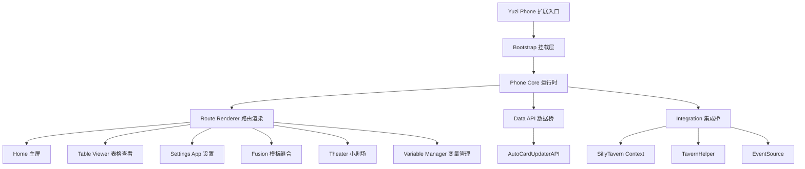
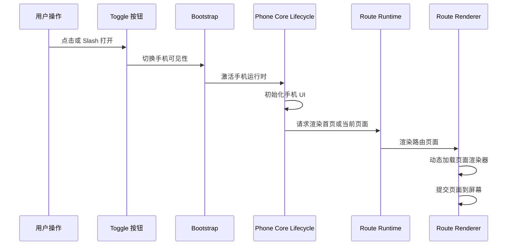
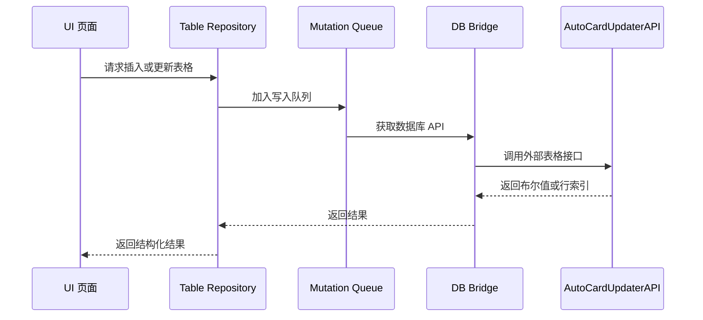
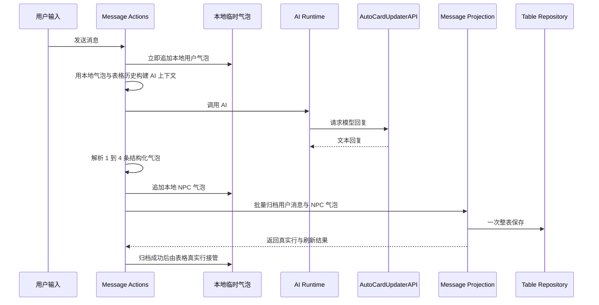
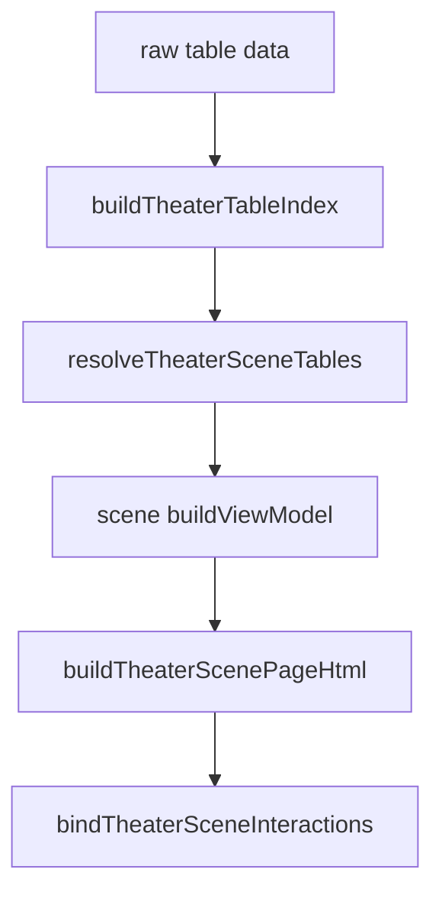
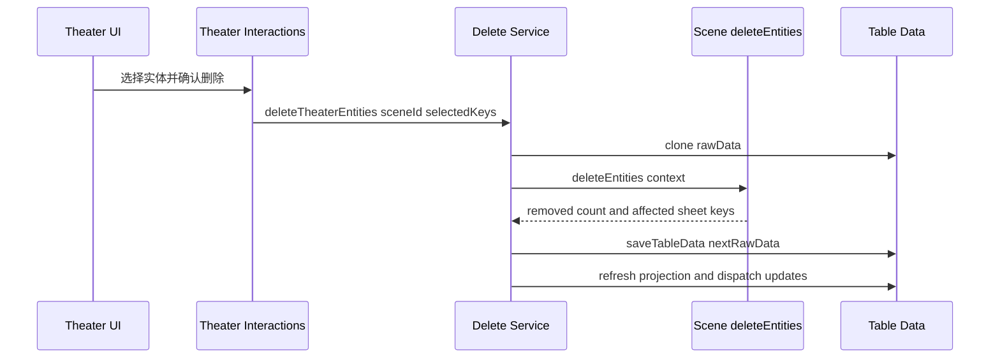
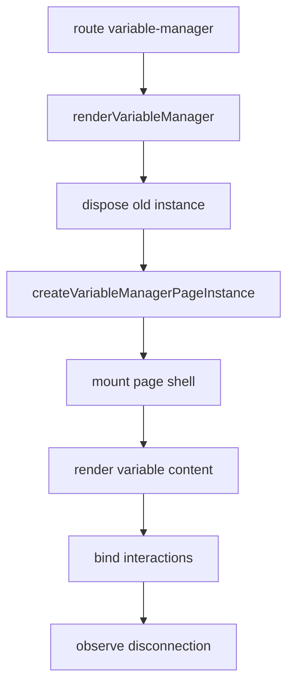
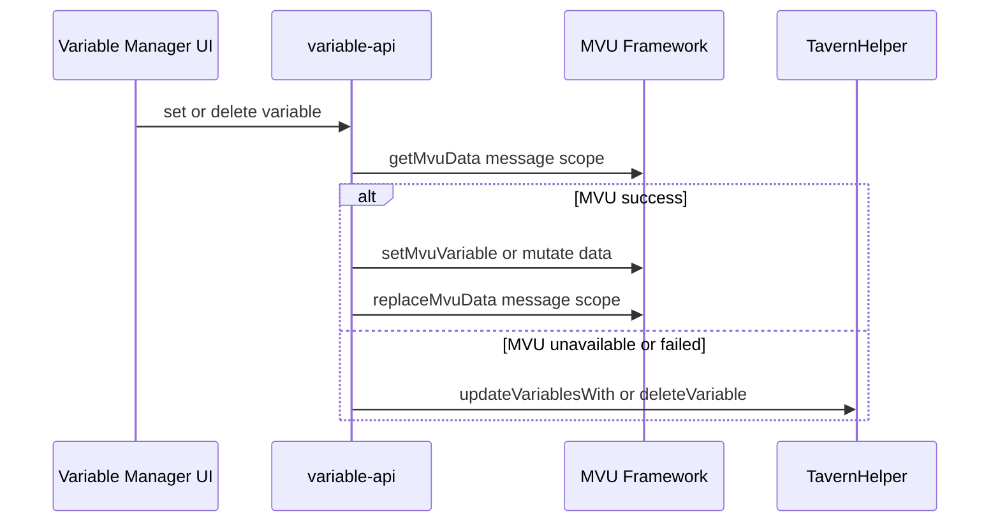
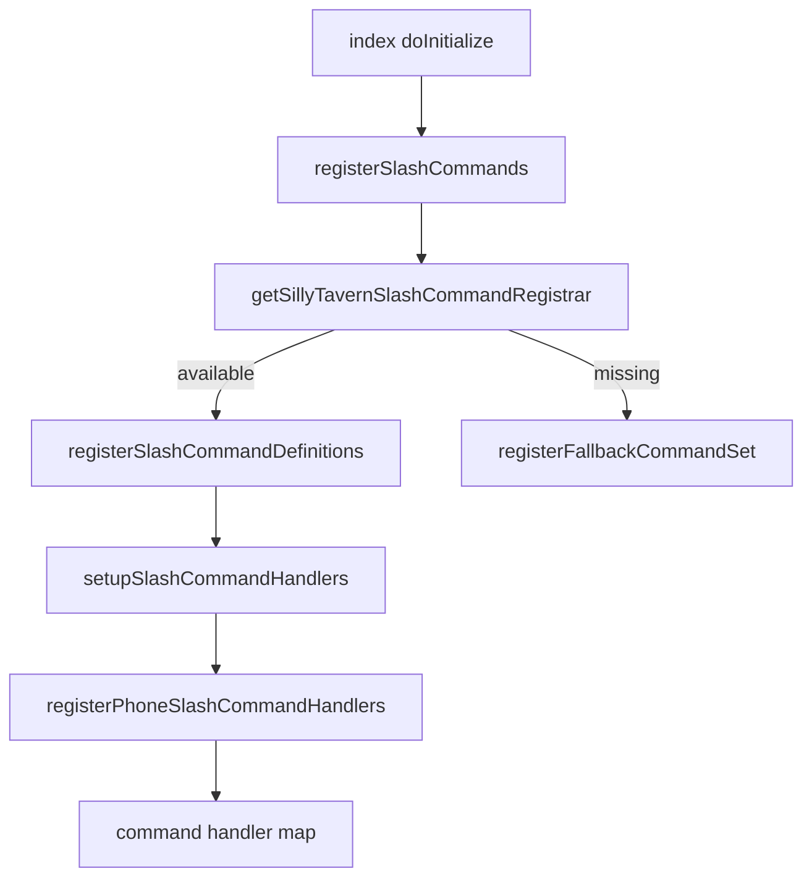
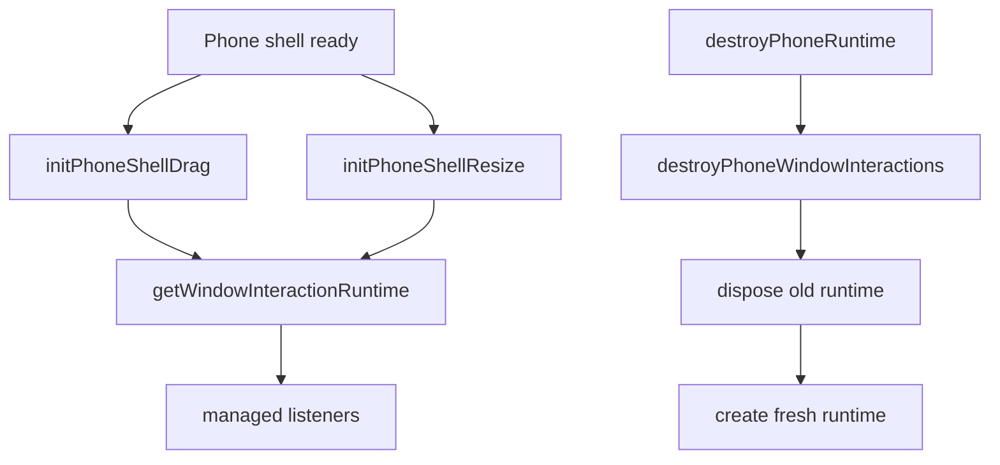

# Yuzi Phone 玉子手机架构说明

> 面向未来 AI 与开发者。目标：新增功能时，不需要重新从零理解项目结构，而是先遵守这里的模块边界、调用链、数据契约与维护规则。

## 1. 项目定位

Yuzi Phone 是 SillyTavern 第三方扩展，提供一个“小手机”样式的前端 UI。它不是独立后端，也不是数据源本身；它主要作为 SillyTavern 页面中的可视化前端壳层，依赖宿主和数据库插件暴露的 API。

已确认入口：

- 扩展 manifest 指向打包产物：[`manifest.json`](../manifest.json:6) 的 JS 是 [`dist/yuzi-phone.bundle.js`](../dist/yuzi-phone.bundle.js)，CSS 是 [`dist/yuzi-phone.bundle.css`](../dist/yuzi-phone.bundle.css)。
- 源码入口：[`index.js`](../index.js:12)。
- 源码样式入口：[`style.css`](../style.css:15)。
- 构建脚本：[`package.json`](../package.json:7) 提供构建、检查与 lint 脚本。

## 2. 顶层模块分层

### 2.1 入口层

[`index.js`](../index.js:12) 是扩展生命周期入口，负责：

- 配置错误处理：[`configureErrorHandler()`](../index.js:218)。
- 绑定全局 window 事件：[`bindPhoneBootstrapWindowEvents()`](../index.js:224)。
- DOM 就绪后执行初始化：[`ensureInitialized()`](../index.js:131)。
- 挂载 bootstrap UI：[`doInitialize()`](../index.js:169)。
- 注册 Slash 命令：[`registerSlashCommands()`](../index.js:189)。
- 卸载清理：[`destroy()`](../index.js:269)。

维护规则：

- [`index.js`](../index.js:12) 不应承载业务页面逻辑。
- 新增全局生命周期资源时，必须能被 [`destroy()`](../index.js:269) 清理。
- 所有初始化失败必须通过 [`handleError()`](../index.js:238) 或 [`Logger`](../modules/error-handler.js:34) 进入统一错误系统。

### 2.2 Bootstrap 层

主要文件：

- [`app-bootstrap.js`](../modules/bootstrap/app-bootstrap.js:13)：创建 root、container、toggle，初始化设置面板与事件监听。
- [`toggle-button.js`](../modules/bootstrap/toggle-button.js:14)：定义 DOM ID、toggle 视觉、位置、拖拽。
- [`event-registry.js`](../modules/bootstrap/event-registry.js:21)：注册 SillyTavern 事件桥。
- [`command-registry.js`](../modules/bootstrap/command-registry.js:14)：注册 phone 相关 Slash 命令 handler。

边界：

- Bootstrap 只负责挂载与入口交互，不直接渲染业务页面。
- 手机开关通过 [`togglePhoneBootstrapVisibility()`](../modules/bootstrap/app-bootstrap.js:54) 调用 [`onPhoneActivated()`](../modules/phone-core/lifecycle.js:255) 或 [`onPhoneDeactivated()`](../modules/phone-core/lifecycle.js:272)。

## 3. Phone Core 生命周期

核心状态在 [`state.js`](../modules/phone-core/state.js:7) 创建，关键字段包括：

- [`currentRoute`](../modules/phone-core/state.js:9)
- [`routeHistory`](../modules/phone-core/state.js:10)
- [`phoneContainer`](../modules/phone-core/state.js:11)
- [`isPhoneUiInitialized`](../modules/phone-core/state.js:13)
- [`isPhoneActive`](../modules/phone-core/state.js:14)
- [`isDestroying`](../modules/phone-core/state.js:15)
- [`routeRenderToken`](../modules/phone-core/state.js:20)
- [`currentViewingSheetKey`](../modules/phone-core/state.js:26)

### 3.1 激活流程

对应代码：

- [`onPhoneActivated()`](../modules/phone-core/lifecycle.js:255)
- [`initPhoneUI()`](../modules/phone-core/lifecycle.js:220)
- [`requestPhoneRuntimeActivationRoute()`](../modules/phone-core/lifecycle.js:165)
- [`requestPhoneRouteRender()`](../modules/phone-core/route-runtime.js:74)
- [`renderPhoneRoute()`](../modules/phone-core/route-renderer.js:245)

### 3.2 路由系统

路由状态由 [`routing.js`](../modules/phone-core/routing.js:52) 管理：

- [`navigateTo()`](../modules/phone-core/routing.js:52)：写入当前 route，并触发 route change callbacks。
- [`navigateBack()`](../modules/phone-core/routing.js:67)：从 routeHistory 回退。
- [`onRouteChange()`](../modules/phone-core/routing.js:76)：注册 route change 回调。

渲染由 [`route-runtime.js`](../modules/phone-core/route-runtime.js:74) 和 [`route-renderer.js`](../modules/phone-core/route-renderer.js:25) 执行。

已确认路由：

- home route -> [`renderHomeScreen()`](../modules/phone-home/render.js:121)
- table app route -> [`renderTableViewer()`](../modules/table-viewer/render.js:20)
- theater route -> [`renderTheaterScene()`](../modules/phone-theater/render.js:58)
- settings route -> [`renderSettings()`](../modules/settings-app/render.js:79)
- fusion route -> [`renderFusion()`](../modules/phone-fusion/render.js:80)
- variable manager route -> [`renderVariableManager()`](../modules/variable-manager/index.js:145)

维护规则：

- 新增 route 必须同步改 [`loadRouteRenderer()`](../modules/phone-core/route-renderer.js:25)。
- 如果希望首开不白屏，还要同步维护 [`ROUTE_MODULES`](../modules/phone-core/preload.js:32)。
- 异步渲染必须尊重 [`routeRenderToken`](../modules/phone-core/state.js:20)，不能绕开现有 token 防护。

## 4. SillyTavern 集成层

集成层职责是把宿主环境的不稳定全局对象隔离在少数桥接模块里。

文件职责：

- [`context-bridge.js`](../modules/integration/context-bridge.js:5)：获取并缓存 SillyTavern context。
- [`event-bridge.js`](../modules/integration/event-bridge.js:66)：初始化 eventSource，提供 [`onEvent()`](../modules/integration/event-bridge.js:126)、[`triggerEvent()`](../modules/integration/event-bridge.js:183)、[`waitForEvent()`](../modules/integration/event-bridge.js:205)。
- [`tavern-helper-bridge.js`](../modules/integration/tavern-helper-bridge.js:27)：获取 TavernHelper，包装聊天消息、变量、世界书、角色数据等 API。
- [`toast-bridge.js`](../modules/integration/toast-bridge.js:3)：封装 toastr，并注册错误处理通知回调。
- [`cleanup.js`](../modules/integration/cleanup.js:17)：清理 context、event、TavernHelper 缓存。

维护规则：

- 新增对 SillyTavern 全局对象的访问，不要散落到页面模块里，应放入 integration 或 phone-core 数据桥。
- 任何桥接 API 都要返回可降级值，例如空数组、空对象、false，而不是把宿主异常直接抛进 UI。
- 集成层的事件、定时器、订阅与异步等待必须纳入 runtime 或等价 cleanup 机制，不能把宿主事件监听留在页面模块中裸绑。

## 5. 数据流与存储契约

### 5.1 表格数据 API

关键文件：

- [`db-bridge.js`](../modules/phone-core/db-bridge.js:6)：解析 [`AutoCardUpdaterAPI`](../modules/phone-core/db-bridge.js:8)。
- [`table-repository.js`](../modules/phone-core/data-api/table-repository.js:389)：读取、写入、插入、更新、删除表格。
- [`mutation-queue.js`](../modules/phone-core/data-api/mutation-queue.js:9)：串行化表格写入任务。
- [`lock-repository.js`](../modules/phone-core/data-api/lock-repository.js:81)：封装行、列、单元格锁。
- [`config-repository.js`](../modules/phone-core/data-api/config-repository.js:51)：数据库配置读写。
- [`preset-repository.js`](../modules/phone-core/data-api/preset-repository.js:6)：API 预设桥接。

外部 API 契约来自文档：

- [`importTableAsJson()`](api.md:177) 返回 [`Promise<boolean>`](api.md:186)。
- [`updateRow()`](api.md:234) 返回 [`Promise<boolean>`](api.md:245)。
- [`insertRow()`](api.md:269) 成功返回 rowIndex，失败返回 [`-1`](api.md:279)。
- [`deleteRow()`](api.md:301) 返回 [`Promise<boolean>`](api.md:311)。

维护规则：

- 表格写入必须走 [`enqueueTableMutation()`](../modules/phone-core/data-api/mutation-queue.js:9)，不要绕过队列并发写入。
- 成功判定必须严格遵守外部 API 契约：布尔接口只接受 `true`，插入接口只接受有效行号。
- UI 层不要直接调用 [`AutoCardUpdaterAPI`](../modules/phone-core/db-bridge.js:8)，应经 [`data-api.js`](../modules/phone-core/data-api.js:1) 或更具体 repository。

### 5.2 消息记录实时回复数据流

关键文件：

- [`message-viewer-actions.js`](../modules/table-viewer/special/message-viewer-actions.js:317)：发送消息主流程，负责本地临时气泡、AI 调用、归档失败当前页重试。
- [`parseStructuredAiReply()`](../modules/table-viewer/special/message-viewer-actions.js:153)：解析多气泡结构化回复，最多保留 4 条。
- [`message-projection.js`](../modules/phone-core/chat-support/message-projection.js:81)：把领域消息映射到表格字段，并提供批量追加归档。
- [`settings-context.js`](../modules/phone-core/chat-support/settings-context.js:116)：读取聊天设置、世界书、故事上下文。
- [`ai-instruction-store.js`](../modules/phone-core/chat-support/ai-instruction-store.js:124)：AI 指令预设与多气泡输出协议。
- [`ai-runtime.js`](../modules/phone-core/chat-support/ai-runtime.js:14)：调用数据库插件 AI 接口。

维护规则：

- 消息记录表是最终一致的聊天仓库，不再承担发送中、生成中、归档失败等 UI 临时状态。
- 实时回复必须先写本地临时气泡，再在 AI 成功后批量归档；禁止回退成“用户行写表 → 助手占位写表 → 多次更新”的中转链路。
- 一条气泡一行；多气泡回复必须写入多行，不能把多条气泡塞进同一个消息内容字段。
- 删除按钮只能删除表格真实行；归档失败的临时气泡只存在当前页面，返回、刷新或重进会话后直接消失。
- 消息字段绑定属于运行时协议，应由共享契约维护；新增候选字段时必须同步写入、读取、列表渲染、详情渲染、AI prompt 历史消息。
- 修改 AI 结构化回复格式时，必须同步提示词、[`parseStructuredAiReply()`](../modules/table-viewer/special/message-viewer-actions.js:153)、表格投影和历史消息构造。

## 6. UI 模块职责

### 6.1 Home 主屏

- [`renderHomeScreen()`](../modules/phone-home/render.js:121)：主屏入口。
- [`buildHomeScreenViewModel()`](../modules/phone-home/view-model.js:17)：把 rawData 与 settings 转成 app 列表。
- [`patchHomeGrid()`](../modules/phone-home/render.js:70)、[`patchHomeDock()`](../modules/phone-home/render.js:103)：局部更新 DOM。
- [`bindHomeGridInteractions()`](../modules/phone-home/interactions.js:37)、[`bindHomeDockInteractions()`](../modules/phone-home/interactions.js:82)：绑定点击交互。

维护规则：

- 新增系统 App 应进入 view-model，并提供 route。
- home 渲染应继续使用 view-model 与 patch 模式，不要退回整页重建。

### 6.2 Table Viewer 表格查看器

- [`renderTableViewer()`](../modules/table-viewer/render.js:20)：根据 sheetKey 解析上下文，判断专属模板或通用模板。
- [`createViewerRuntime()`](../modules/table-viewer/runtime.js:60)：管理 viewer 生命周期、外部表更新监听、草稿预览。
- [`renderGenericListPage()`](../modules/table-viewer/list-page-renderer.js:352)：通用表列表页渲染和局部 patch。
- [`bindGenericListPageController()`](../modules/table-viewer/list-page-controller.js:248)：通用表列表事件委托。

#### 6.2.1 Table Viewer 入口分流

[`renderTableViewer()`](../modules/table-viewer/render.js:20) 是 Table Viewer 唯一入口。流程固定为：

1. 创建 viewer runtime：[`createViewerRuntime()`](../modules/table-viewer/runtime.js:60)。
2. 解析表格上下文：[`resolveTableViewerContext()`](../modules/table-viewer/context.js:1)。
3. 启动 viewer session：[`startViewerSession()`](../modules/table-viewer/runtime.js:182)。
4. 先调用 [`detectSpecialTemplateForTable()`](../modules/phone-beautify-templates/matcher.js:37) 判断专属模板。
5. 如果命中专属类型，进入 [`createSpecialTableViewerRuntime()`](../modules/table-viewer/special/runtime.js:149)。
6. 否则调用 [`detectGenericTemplateForTable()`](../modules/phone-beautify-templates/matcher.js:142)，并进入 [`renderGenericTableViewer()`](../modules/table-viewer/generic-viewer.js:3)。

新增表格视觉能力时，必须从模板检测或 special runtime 扩展，不要在 [`renderTableViewer()`](../modules/table-viewer/render.js:20) 内堆业务条件。

#### 6.2.2 Viewer runtime 生命周期

[`createViewerRuntime()`](../modules/table-viewer/runtime.js:60) 会在 container 上挂载当前 viewer 的 cleanup 与 runtime 引用：

- cleanup key：[`VIEWER_INSTANCE_CLEANUP_KEY`](../modules/table-viewer/runtime.js:7)。
- runtime key：[`VIEWER_RUNTIME_INSTANCE_KEY`](../modules/table-viewer/runtime.js:8)。
- 草稿预览 cleanup key：[`DRAFT_PREVIEW_CLEANUP_KEY`](../modules/table-viewer/runtime.js:9)。

创建新 viewer 前会先执行旧实例 cleanup；dispose 时会释放 runtime scope、清理新增行 modal、清理模板草稿预览，并把当前 viewing sheet 置空。

viewer runtime 对外提供：

- DOM 事件：[`addEventListener()`](../modules/table-viewer/runtime.js:216)。
- cleanup：[`registerCleanup()`](../modules/table-viewer/runtime.js:219)。
- DOM 断连观察：[`observeDisconnection()`](../modules/table-viewer/runtime.js:222)。
- RAF 与 timeout：[`requestAnimationFrame()`](../modules/table-viewer/runtime.js:225)、[`setTimeout()`](../modules/table-viewer/runtime.js:231)。
- 外部表更新监听：[`bindExternalTableUpdate()`](../modules/table-viewer/runtime.js:159)。
- 本地写入期间抑制外部刷新：[`setSuppressExternalTableUpdate()`](../modules/table-viewer/runtime.js:237)。

页面内事件、modal、局部 controller 应优先使用 viewer runtime；裸 `addEventListener` 只应作为无 runtime fallback。

#### 6.2.3 通用表 runtime 与状态

通用表 runtime 由 [`createGenericTableViewerRuntime()`](../modules/table-viewer/generic-runtime.js:23) 创建。它接收 sheetKey、tableName、headers、rawHeaders、rows 和 genericMatch，并创建 [`createTableViewerState()`](../modules/table-viewer/state.js:422)。

通用表 state 字段包括：

- 页面模式：[`mode`](../modules/table-viewer/state.js:424)，值为 `list` 或 `detail`。
- 当前详情行：[`rowIndex`](../modules/table-viewer/state.js:425)。
- 编辑态：[`editMode`](../modules/table-viewer/state.js:426)、[`draftValues`](../modules/table-viewer/state.js:428)、[`saving`](../modules/table-viewer/state.js:430)。
- 锁管理：[`lockState`](../modules/table-viewer/state.js:429)、[`lockManageMode`](../modules/table-viewer/state.js:431)、[`cellLockManageMode`](../modules/table-viewer/state.js:427)。
- 删除管理：[`deleteManageMode`](../modules/table-viewer/state.js:432)、[`deletingRowIndex`](../modules/table-viewer/state.js:433)。
- 列表 UI：[`listScrollTop`](../modules/table-viewer/state.js:434)、[`listSearchQuery`](../modules/table-viewer/state.js:435)、[`listSortDescending`](../modules/table-viewer/state.js:436)。

[`TableViewerState`](../modules/table-viewer/state.js:48) 通过 allowedKeys 限制未知字段写入，并通过 [`subscribe()`](../modules/table-viewer/state.js:167) 通知局部刷新。列表模式下 [`createGenericTableViewerRuntime()`](../modules/table-viewer/generic-runtime.js:70) 只对搜索、排序、锁、删除等列表相关字段触发局部刷新。

#### 6.2.4 通用表列表页

[`renderGenericListPage()`](../modules/table-viewer/list-page-renderer.js:352) 使用 [`buildGenericListPageViewModel()`](../modules/table-viewer/list-page-renderer.js:29) 构建列表视图模型。核心规则：

- 每行由 [`buildGenericRowViewModel()`](../modules/table-viewer/row-view-model.js:199) 生成标题、状态、时间、摘要、搜索索引。
- 模板字段绑定来自 [`createGenericTemplateStylePayload()`](../modules/table-viewer/generic-style-payload.js:96) 输出的 `fieldBindings`。
- 列表 patch 使用 `rowKey` 与 `rowVersion`，见 [`buildGenericListRowRenderVersion()`](../modules/table-viewer/list-page-renderer.js:166)。
- 搜索基于 [`searchText`](../modules/table-viewer/row-view-model.js:240)，排序通过 [`listSortDescending`](../modules/table-viewer/state.js:436) 控制。
- 新增、锁定、删除按钮是否显示由模板 `structureOptions.bottomBar` 影响，最终进入 [`buildGenericListBottomBarHtml()`](../modules/table-viewer/list-page-template.js:1)。

列表页事件由 [`bindGenericListPageController()`](../modules/table-viewer/list-page-controller.js:248) 委托处理。新增行弹窗入口是 [`showGenericAddRowModal()`](../modules/table-viewer/add-row-modal.js:126)。删除入口由 [`createRowDeleteController()`](../modules/table-viewer/row-delete-controller.js:93) 生成。

#### 6.2.5 通用表详情页与编辑保存

[`renderGenericDetailPage()`](../modules/table-viewer/detail-page-renderer.js:7) 会先同步锁状态，再通过 [`buildGenericDetailRowPayload()`](../modules/table-viewer/detail-row-payload.js:1) 生成字段详情 payload，最后调用 [`bindGenericDetailEditController()`](../modules/table-viewer/detail-edit-controller.js:45) 绑定详情页交互。

详情页编辑规则：

- [`setEditMode()`](../modules/table-viewer/state.js:267) 进入或退出编辑态。
- [`updateDraftValue()`](../modules/table-viewer/state.js:305) 按列索引记录草稿。
- [`setCellLockManageMode()`](../modules/table-viewer/state.js:281) 进入字段锁管理态，并关闭编辑态。
- 保存时 [`handleSaveRow()`](../modules/table-viewer/detail-edit-controller.js:201) 从 draftValues 构造 updateData，并通过 [`saveTableData()`](../modules/table-viewer/detail-edit-controller.js:260) 持久化整表快照。

详情页 controller 每次绑定前会执行旧 cleanup，标识是 [`DETAIL_CONTROLLER_CLEANUP_KEY`](../modules/table-viewer/detail-edit-controller.js:4)。这是通用表详情页避免 per-render 事件泄漏的基本机制。

#### 6.2.6 通用模板 style payload

[`createGenericTemplateStylePayload()`](../modules/table-viewer/generic-style-payload.js:96) 是 generic 模板进入 DOM 的桥：

- 若没有有效 generic template，返回默认 layoutOptions 和默认字段绑定。
- 若有模板，则读取 `styleTokens` 生成 CSS 变量、读取 `fieldBindings` 生成字段绑定、读取 `layoutOptions` 生成 data attributes。
- data attributes 包括 [`data-layout-page-mode`](../modules/table-viewer/generic-style-payload.js:171)、[`data-layout-nav-mode`](../modules/table-viewer/generic-style-payload.js:172)、[`data-layout-list-container-mode`](../modules/table-viewer/generic-style-payload.js:173)、[`data-layout-detail-field-layout`](../modules/table-viewer/generic-style-payload.js:177)、[`data-layout-density`](../modules/table-viewer/generic-style-payload.js:182) 等。
- 自定义 CSS 通过 [`buildScopedCustomCss()`](../modules/table-viewer/template-runtime.js:72) 包裹到 `.phone-generic-template-*` 作用域下。

CSS 层读取这些 data attributes 和 CSS 变量，见 [`styles/05-phone-generic-template.css`](../styles/05-phone-generic-template.css:7)。

#### 6.2.7 专属消息表 runtime

专属表由 [`createSpecialTableViewerRuntime()`](../modules/table-viewer/special/runtime.js:149) 创建。目前稳定 special type 是 `message`，表名直判入口为 [`detectSpecialTableType()`](../modules/table-viewer/special/runtime.js:21)，模板匹配入口为 [`detectSpecialTemplateForTable()`](../modules/phone-beautify-templates/matcher.js:37)。

专属模板 style payload 由 [`createSpecialTemplateStylePayload()`](../modules/table-viewer/special/runtime.js:26) 生成：

- class scope：`phone-special-template-scope`。
- style tokens：转成 `--sp*` CSS 变量。
- style options：经 [`normalizeSpecialStyleOptionsForViewer()`](../modules/table-viewer/special/field-reader.js:1) 归一化。
- structureOptions、typographyOptions、motionOptions 会转成 data attributes 或 CSS 变量。
- 自定义 CSS 通过 [`buildScopedCustomCss()`](../modules/table-viewer/template-runtime.js:72) 包裹到 `.phone-special-template-*` 作用域。

#### 6.2.8 专属消息表状态与会话模型

[`renderMessageTable()`](../modules/table-viewer/special/message-viewer.js:44) 创建本地 state。关键字段包括：

- 页面模式：[`mode`](../modules/table-viewer/special/message-viewer.js:59)，`conversation` 或 `detail`。
- 当前会话：[`conversationId`](../modules/table-viewer/special/message-viewer.js:60)。
- 当前行数据副本：[`rowsData`](../modules/table-viewer/special/message-viewer.js:62)。
- 会话草稿：[`draftByConversation`](../modules/table-viewer/special/message-viewer.js:63)。
- AI 发送状态：[`sending`](../modules/table-viewer/special/message-viewer.js:64)、[`statusText`](../modules/table-viewer/special/message-viewer.js:65)、[`errorText`](../modules/table-viewer/special/message-viewer.js:66)。
- 联系人选择：[`selectedTarget`](../modules/table-viewer/special/message-viewer.js:68)、[`contactPickerVisible`](../modules/table-viewer/special/message-viewer.js:69)。
- 删除管理：[`deleteManageMode`](../modules/table-viewer/special/message-viewer.js:70)、[`deletingSelection`](../modules/table-viewer/special/message-viewer.js:71)、[`selectedMessageRowIndexes`](../modules/table-viewer/special/message-viewer.js:72)。

会话行聚合由 [`getConversationRows()`](../modules/table-viewer/special/message-viewer-helpers.js:37) 和 [`getConversationRowEntries()`](../modules/table-viewer/special/message-viewer-helpers.js:41) 负责。默认消息字段绑定会为 [`threadId`](../modules/table-viewer/special/field-reader-config.js:3) 提供 [`@const:default_thread`](../modules/table-viewer/special/field-reader-config.js:3)；[`createSpecialFieldReader()`](../modules/table-viewer/special/field-reader-runtime.js:37) 会优先返回该常量，因此在默认绑定存在且行内没有会话 ID 时，多行会合并到同一个 `default_thread` 会话。只有当字段绑定没有返回有效值时，[`getConversationRowEntries()`](../modules/table-viewer/special/message-viewer-helpers.js:43) 的 `default_thread_${rowIndex + 1}` 才作为最后兜底，按行生成临时会话 id。

#### 6.2.9 专属消息表 AI 数据流

消息发送与重试逻辑由 [`createMessageViewerActions()`](../modules/table-viewer/special/message-viewer-actions.js:45) 生成。依赖通过 `actionDeps` 注入，默认依赖包括：

- 表格投影：[`insertPhoneMessageRecord()`](../modules/table-viewer/special/message-viewer-actions.js:31)、[`updatePhoneMessageRecord()`](../modules/table-viewer/special/message-viewer-actions.js:33)、[`refreshPhoneMessageProjection()`](../modules/table-viewer/special/message-viewer-actions.js:32)。
- AI 设置与上下文：[`getCurrentPhoneAiInstructionPreset()`](../modules/table-viewer/special/message-viewer-actions.js:26)、[`getPhoneChatSettings()`](../modules/table-viewer/special/message-viewer-actions.js:28)、[`getPhoneChatWorldbookContext()`](../modules/table-viewer/special/message-viewer-actions.js:29)、[`getPhoneStoryContext()`](../modules/table-viewer/special/message-viewer-actions.js:30)。
- AI 调用：[`callPhoneChatAI()`](../modules/table-viewer/special/message-viewer-actions.js:25)。
- prompt 构造：[`buildPhoneChatSystemMessages()`](../modules/table-viewer/special/message-viewer-helpers.js:79)、[`buildPhoneChatConversationMessages()`](../modules/table-viewer/special/message-viewer-helpers.js:52)。

AI 回复解析协议由 [`parseStructuredAiReply()`](../modules/table-viewer/special/message-viewer-actions.js:175) 定义。推荐回复字段为“正文”、“图片描述”、“视频描述”。历史消息构造会通过 [`resolvePhoneAiInstructionMediaMarkers()`](../modules/table-viewer/special/message-viewer-helpers.js:53) 把媒体描述拼入 prompt。

AI 指令预设的 `mediaMarkers.imagePrefix` 与 `mediaMarkers.videoPrefix` 是历史 prompt 协议字段，不是单纯 UI 显示文案。默认值来自 [`DEFAULT_PHONE_AI_MEDIA_MARKERS`](../modules/phone-core/chat-support/ai-instruction-store.js:147)，当前为 `[图片]` 与 `[视频]`；设置页会把这两个字段作为预设草稿保存，见 [`buildPresetPayload()`](../modules/settings-app/pages/ai-instruction-presets/draft-helpers.js:100)。实时回复构造历史消息时，[`buildPhoneChatConversationMessages()`](../modules/table-viewer/special/message-viewer-helpers.js:52) 会读取当前指令预设并将媒体描述拼成 `${imagePrefix} ${imageDesc}` / `${videoPrefix} ${videoDesc}` 后交给 AI。因此修改这两个前缀会改变 AI 读取历史媒体描述的格式。

维护规则：新增媒体描述字段或调整媒体标记格式时，必须同步 [`normalizeMediaMarkers()`](../modules/phone-core/chat-support/ai-instruction-store.js:168)、AI 指令预设页编辑入口、[`buildPromptContentFromRow()`](../modules/table-viewer/special/message-viewer-helpers.js:88)、媒体标记合同脚本和本架构说明。空字符串前缀是合法协议值，表示只把媒体描述本身写入历史 prompt，不应被运行时强制回退成默认标记。

#### 6.2.10 模板草稿预览与自定义 CSS

[`bindTemplateDraftPreviewForViewer()`](../modules/table-viewer/template-runtime.js:260) 为 Table Viewer 接收模板草稿预览事件。草稿模板会先经过 [`resolveTemplateWithDraftForViewer()`](../modules/table-viewer/template-runtime.js:50) 去掉 annotated wrapper，并把 advanced customCss 合并到运行时结构。

自定义 CSS 统一走 [`buildScopedCustomCss()`](../modules/table-viewer/template-runtime.js:72)：先调用 [`sanitizeCSS()`](../modules/utils/sanitize.js:1)，再把普通 selector 加上模板 scope；`:root` 会被替换为当前 scope。

维护规则：

- 新增专属表类型必须走 special runtime，不要在通用表里塞条件分支。
- 列表页 patch 依赖 rowKey 和 rowVersion，改 row view model 时要维护版本字段。
- 通用表新增字段展示能力时，应优先扩展模板 fieldBindings 和 row view model，不要硬编码某个表头。
- 专属消息表新增字段时，要同步 field reader、message projection、AI prompt 构造、列表/详情渲染和模板默认绑定。
- 所有数据写入都应经 phone-core data-api 或 chat-support 投影层，不要在 UI 控制器里直接访问宿主全局 API。
- 任何异步写入、AI 调用、删除或导入完成后，都必须确认 viewer runtime 仍有效再写 DOM 或 state。

### 6.3 Settings App

- [`renderSettings()`](../modules/settings-app/render.js:79)：设置 App 总入口。
- [`createSettingsAppState()`](../modules/settings-app/state-machine.js:18)：集中定义设置页 state。
- [`createPageRuntimeManager()`](../modules/settings-app/page-runtime.js:30)：管理每个 mode 的页面 runtime。
- [`createSettingsPageRenderers()`](../modules/settings-app/page-renderers.js:111)：组合 personalization、dataConfig、editor 三类渲染器。

#### 6.3.1 Settings App 渲染主循环

[`renderSettings()`](../modules/settings-app/render.js:79) 的主流程是：创建 state、消费 settings intent、创建 page runtime 管理器、创建 renderer 依赖、执行按 mode 分发的页面渲染。外部路由只需要调用 [`renderSettings()`](../modules/settings-app/render.js:79)，不要直接调用设置页子页面。

页面切换时，设置 App 采用“页面对象 + page runtime”的生命周期模型：

1. [`render()`](../modules/settings-app/render.js:157) 读取 [`state.mode`](../modules/settings-app/state-machine.js:21)。
2. 若当前页面不能原地更新，则 [`disposeCurrentPageSession()`](../modules/settings-app/render.js:97) 先调用旧页面的 [`dispose()`](../modules/settings-app/render.js:99)，再释放旧 page runtime。
3. [`createCurrentPageRuntime()`](../modules/settings-app/page-runtime.js:41) 为新 mode 创建新的 runtime scope。
4. 页面定义通过 [`createPage()`](../modules/settings-app/page-renderers/data-config-renderers.js:49) / [`createPage()`](../modules/settings-app/page-renderers/editor-renderers.js:39) / [`createPage()`](../modules/settings-app/page-renderers/personalization-renderers.js:43) 返回页面对象。
5. 页面对象可提供 [`mount()`](../modules/settings-app/render.js:94)、[`update()`](../modules/settings-app/render.js:94)、[`dispose()`](../modules/settings-app/render.js:94) 三类生命周期入口。

#### 6.3.2 Settings state 契约

[`createSettingsAppState()`](../modules/settings-app/state-machine.js:18) 是设置页 state 的默认事实源。当前 state 包括：

- 页面 mode：[`mode`](../modules/settings-app/state-machine.js:21)。
- 各页面滚动位置：[`databaseScrollTop`](../modules/settings-app/state-machine.js:24)、[`appearanceScrollTop`](../modules/settings-app/state-machine.js:25)、[`beautifyScrollTop`](../modules/settings-app/state-machine.js:26)、[`buttonStyleScrollTop`](../modules/settings-app/state-machine.js:27)、[`apiPromptConfigScrollTop`](../modules/settings-app/state-machine.js:28)。
- Prompt Editor 状态：[`promptEditorName`](../modules/settings-app/state-machine.js:31)、[`promptEditorContent`](../modules/settings-app/state-machine.js:32)、[`promptEditorIsNew`](../modules/settings-app/state-machine.js:33)、[`promptEditorOriginalName`](../modules/settings-app/state-machine.js:34)。
- AI 指令预设草稿状态：[`aiInstructionSelectedPresetName`](../modules/settings-app/state-machine.js:37)、[`aiInstructionDraftName`](../modules/settings-app/state-machine.js:38)、[`aiInstructionDraftOriginalName`](../modules/settings-app/state-machine.js:39)、[`aiInstructionDraftImagePrefix`](../modules/settings-app/state-machine.js:40)、[`aiInstructionDraftVideoPrefix`](../modules/settings-app/state-machine.js:41)、[`aiInstructionDraftPromptGroup`](../modules/settings-app/state-machine.js:42)。
- API Prompt 与世界书工作台状态：[`worldbookLoading`](../modules/settings-app/state-machine.js:46)、[`worldbookError`](../modules/settings-app/state-machine.js:47)、[`worldbookList`](../modules/settings-app/state-machine.js:48)、[`currentWorldbook`](../modules/settings-app/state-machine.js:49)、[`worldbookSourceMode`](../modules/settings-app/state-machine.js:50)、[`boundWorldbookNames`](../modules/settings-app/state-machine.js:51)、[`worldbookEntries`](../modules/settings-app/state-machine.js:52)、[`worldbookSearchQuery`](../modules/settings-app/state-machine.js:53)。

新增 state 字段时，必须先进入 [`createSettingsAppState()`](../modules/settings-app/state-machine.js:18)，再同步 intent、context builder、页面 renderer 和类型声明。不要在某个页面局部临时塞匿名字段，否则下一次切页、滚动保留或 intent 投影会找不到它。

#### 6.3.3 AI 指令预设主槽位协议

AI 指令预设的 `promptGroup[].mainSlot` 是运行时排序协议，不是单纯 UI 字段。主槽位事实源在 [`ai-instruction-slots.js`](../modules/phone-core/chat-support/ai-instruction-slots.js:1)：

- [`PHONE_AI_INSTRUCTION_MAIN_SLOT_OPTIONS`](../modules/phone-core/chat-support/ai-instruction-slots.js:5) 定义设置页下拉框可选项，当前为普通片段、主槽位 A、主槽位 B。
- [`normalizePhoneAiInstructionMainSlot()`](../modules/phone-core/chat-support/ai-instruction-slots.js:23) 负责把输入归一为 `A`、`B` 或空字符串。
- [`normalizePhoneAiInstructionSegmentMainSlot()`](../modules/phone-core/chat-support/ai-instruction-slots.js:28) 负责兼容旧字段 `isMain` / `isMain2`，显式 `mainSlot` 优先于旧字段。
- [`resolvePhoneAiInstructionMainSlotOrder()`](../modules/phone-core/chat-support/ai-instruction-slots.js:37) 负责运行时排序，当前顺序是 A 槽、B 槽、普通片段。

设置页通过 [`draft-helpers.js`](../modules/settings-app/pages/ai-instruction-presets/draft-helpers.js:1) 和 [`template-builders.js`](../modules/settings-app/pages/ai-instruction-presets/template-builders.js:1) 消费共享协议；运行时通过 [`ai-instruction-store.js`](../modules/phone-core/chat-support/ai-instruction-store.js:1) 消费同一协议。新增 C 槽或调整排序时，必须先改 [`ai-instruction-slots.js`](../modules/phone-core/chat-support/ai-instruction-slots.js:1)，再同步 UI 文案、合同脚本与本扩展架构说明，不要修改外部数据库 API 文档 [`reference/API_DOCUMENTATION.md`](reference/API_DOCUMENTATION.md) 来描述本扩展内部协议，也不要在页面或 store 中新增局部硬编码。

AI 指令预设正文支持 `{{placeholderName}}` 形式的运行时占位符。当前实时回复链路只从 [`buildPhoneChatSystemMessages()`](../modules/table-viewer/special/message-viewer-helpers.js:79) 向 [`materializePhoneAiInstructionPresetMessages()`](../modules/phone-core/chat-support/ai-instruction-store.js:735) 传入以下变量：

- `targetCharacterName`：当前聊天目标角色名。
- `conversationTitle`：当前消息会话标题。
- `worldbookText`：当前启用的世界书上下文汇总。
- `storyContext`：正文最近剧情上下文。

[`materializePhoneAiInstructionPresetMessages()`](../modules/phone-core/chat-support/ai-instruction-store.js:735) 会先提取每个片段引用的占位符；只要某个片段引用的任意占位符在本次 variables 中缺失、为 `null`、为空字符串或 trim 后为空，该片段会整段跳过，不会进入最终 AI messages。这个策略是 prompt 协议的一部分，不是 UI 提示文案。新增占位符时，必须同步完成三件事：在实时回复调用链中提供对应变量、在 AI 指令预设页的“可用占位符”说明中列出含义、在占位符合同脚本中增加非空/空值行为验证。否则新增占位符会让整段 prompt 在运行时静默消失，问题表现会很隐蔽。

#### 6.3.4 Page runtime 稳定代理

[`createPageRuntimeManager()`](../modules/settings-app/page-runtime.js:30) 返回的 [`pageRuntime`](../modules/settings-app/page-runtime.js:63) 是稳定代理对象。页面 renderer 可以长期持有它，因为每个方法都会转发到当前 mode 对应的 runtime scope。

稳定代理提供以下能力：

- 定时器：[`setTimeout()`](../modules/settings-app/page-runtime.js:64)、[`setInterval()`](../modules/settings-app/page-runtime.js:76)。
- 动画帧：[`requestAnimationFrame()`](../modules/settings-app/page-runtime.js:88)。
- 事件委托：[`addEventListener()`](../modules/settings-app/page-runtime.js:100)。
- DOM 观察：[`observeMutation()`](../modules/settings-app/page-runtime.js:103)、[`observeDisconnection()`](../modules/settings-app/page-runtime.js:109)。
- 清理注册：[`registerCleanup()`](../modules/settings-app/page-runtime.js:115)。
- 生命周期判断：[`isDisposed()`](../modules/settings-app/page-runtime.js:118)。

页面内异步回调在 await、FileReader、图片裁剪、外部 API 读取之后，应读取 [`isDisposed()`](../modules/settings-app/page-runtime.js:118) 决定是否继续写 state 或 DOM。

#### 6.3.5 Renderer 分组与依赖注入

[`createSettingsPageRenderers()`](../modules/settings-app/page-renderers.js:111) 先通过 [`validateSettingsRendererDeps()`](../modules/settings-app/page-renderers.js:21) 校验依赖，再构造 services 与 page contexts。页面分为三组：

- Personalization：[`createPersonalizationPageRenderers()`](../modules/settings-app/page-renderers/personalization-renderers.js:16)，包含 home、appearance、button style。
- Data Config：[`createDataConfigPageRenderers()`](../modules/settings-app/page-renderers/data-config-renderers.js:22)，包含 database、api prompt config、AI instruction presets。
- Editor：[`createEditorPageRenderers()`](../modules/settings-app/page-renderers/editor-renderers.js:17)，包含 beautify、prompt editor。

[`createSettingsPageContexts()`](../modules/settings-app/page-renderers/page-context-builders.js:253) 是页面上下文聚合入口。各子 context 只暴露页面需要的 service 子集，例如 [`buildDatabasePageContextFromServices()`](../modules/settings-app/page-renderers/page-context-builders.js:139) 暴露数据库配置服务， [`buildAiInstructionPresetsPageContextFromServices()`](../modules/settings-app/page-renderers/page-context-builders.js:183) 暴露 AI 指令预设服务。

维护规则：

- 新增设置页面 mode 时，需要同步 state、page renderer、layout builder、入口导航和 context builder。
- 页面内部事件要通过 [`pageRuntime.addEventListener()`](../modules/settings-app/page-runtime.js:100) 或 [`pageRuntime.registerCleanup()`](../modules/settings-app/page-runtime.js:115) 注册。
- 页面 renderer 不直接 import 顶层 phone-core service；应通过 [`page-context-builders.js`](../modules/settings-app/page-renderers/page-context-builders.js:1) 注入所需能力。
- 兼容型页面可以保留旧函数式 renderer 出口，但新增页面应优先提供页面对象生命周期。

### 6.4 Beautify 模板系统

Beautify 模板系统负责把“某张表该用什么视觉模板、字段绑定、布局 token、导入导出协议”统一封装，避免 Table Viewer 在渲染阶段直接硬编码每张表的样式规则。

#### 6.4.1 模板类型与包协议

核心常量在 [`constants.js`](../modules/phone-beautify-templates/constants.js:1)：

- 专属模板类型：[`PHONE_TEMPLATE_TYPE_SPECIAL`](../modules/phone-beautify-templates/constants.js:1)，值为 `special_app_template`。
- 通用模板类型：[`PHONE_TEMPLATE_TYPE_GENERIC`](../modules/phone-beautify-templates/constants.js:2)，值为 `generic_table_template`。
- 导入导出包格式：[`PHONE_BEAUTIFY_TEMPLATE_FORMAT`](../modules/phone-beautify-templates/constants.js:4)，值为 `yuzi-phone-style-pack`。
- 当前 schema：[`PHONE_BEAUTIFY_TEMPLATE_SCHEMA_VERSION`](../modules/phone-beautify-templates/constants.js:5)。
- 最小兼容 schema：[`PHONE_BEAUTIFY_TEMPLATE_MIN_COMPAT_SCHEMA_VERSION`](../modules/phone-beautify-templates/constants.js:6)。
- 导出模式：[`PHONE_BEAUTIFY_TEMPLATE_EXPORT_MODE_RUNTIME`](../modules/phone-beautify-templates/constants.js:10) 与 [`PHONE_BEAUTIFY_TEMPLATE_EXPORT_MODE_ANNOTATED`](../modules/phone-beautify-templates/constants.js:11)。

[`exportPhoneBeautifyPack()`](../modules/phone-beautify-templates/import-export.js:33) 输出统一包结构：`format`、`schemaVersion`、`packMeta`、`templates`。导入入口是 [`importPhoneBeautifyPackFromData()`](../modules/phone-beautify-templates/import-export.js:78)，它会解析输入、校验模板、处理内置 ID 冲突、按 overwrite 规则导入用户模板，然后调用 [`saveTemplateStore()`](../modules/phone-beautify-templates/store.js:86) 持久化。

#### 6.4.2 默认模板与 store

默认模板由 [`defaults.js`](../modules/phone-beautify-templates/defaults.js:18) 聚合：

- 专属字段绑定与默认 style options：[`special-field-bindings.js`](../modules/phone-beautify-templates/defaults/special-field-bindings.js:1)。
- 通用布局与摘要字段绑定：[`generic-field-bindings.js`](../modules/phone-beautify-templates/defaults/generic-field-bindings.js:1)。
- 内置模板清单：[`BUILTIN_TEMPLATES`](../modules/phone-beautify-templates/defaults/builtin-templates.js:19)。

用户模板 store 使用设置字段 [`PHONE_BEAUTIFY_STORE_KEY`](../modules/phone-beautify-templates/constants.js:8)。[`readTemplateStore()`](../modules/phone-beautify-templates/store.js:93) 从 settings 读取并归一化；[`saveTemplateStore()`](../modules/phone-beautify-templates/store.js:86) 会重新 normalize、写入 [`schemaVersion`](../modules/phone-beautify-templates/store.js:79)、更新时间戳，并保存到 settings。

store 中的 [`bindings`](../modules/phone-beautify-templates/store.js:82) 是“单表绑定”映射：key 是 sheetKey，value 是 templateId。这个绑定优先级高于全局 active 模板。

#### 6.4.3 normalize 入口与模板字段契约

模板归一化入口是 [`normalizeTemplate()`](../modules/phone-beautify-templates/normalize.js:1)。该模块负责：

- templateType 校验：[`normalizeTemplateType()`](../modules/phone-beautify-templates/normalize.js:117)。
- rendererKey 默认推断：[`defaultRendererKeyByType()`](../modules/phone-beautify-templates/normalize.js:122)。
- 通用布局枚举：[`GENERIC_LAYOUT_ALLOWED_VALUES`](../modules/phone-beautify-templates/normalize.js:70)。
- 专属字段绑定允许键：[`SPECIAL_FIELD_BINDING_ALLOWED_KEYS`](../modules/phone-beautify-templates/normalize.js:31)。
- 通用摘要字段绑定允许键：[`GENERIC_FIELD_BINDING_ALLOWED_KEYS`](../modules/phone-beautify-templates/normalize.js:87)。
- 旧 style token alias 到新 token 的映射：[`GENERIC_STYLE_TOKEN_ALIAS_MAP`](../modules/phone-beautify-templates/normalize.js:95)、[`SPECIAL_STYLE_TOKEN_ALIAS_MAP`](../modules/phone-beautify-templates/normalize.js:105)。

模板字段绑定的值统一经过 [`normalizeFieldBindingCandidates()`](../modules/phone-beautify-templates/core.js:142) 处理：候选字段会去空、去重，并过滤明显危险字符串。

#### 6.4.4 缓存与读取模型

[`cache.js`](../modules/phone-beautify-templates/cache.js:9) 有三类缓存：

- storeCache：缓存 settings 中的用户模板 store。
- builtinCache：缓存内置模板深拷贝。
- derivedCache：缓存 all templates、by type、by id、source runtime。

缓存版本由 [`getStoreVersion()`](../modules/phone-beautify-templates/cache.js:32) 基于 updatedAt、模板数量和绑定数量生成。任何写入模板 store 或绑定后，都必须调用 [`invalidatePhoneBeautifyTemplateCache()`](../modules/phone-beautify-templates/cache.js:119)。

#### 6.4.5 active 模板与匹配优先级

全局 active 模板设置字段：

- 专属模板 map：[`BEAUTIFY_ACTIVE_TEMPLATE_IDS_SETTING_KEY_SPECIAL`](../modules/phone-beautify-templates/constants.js:22)。
- 通用模板 id：[`BEAUTIFY_ACTIVE_TEMPLATE_ID_SETTING_KEY_GENERIC`](../modules/phone-beautify-templates/constants.js:23)。

读取 active 模板的入口：

- [`getActiveBeautifyTemplateIdsForSpecial()`](../modules/phone-beautify-templates/repository.js:282)。
- [`getActiveBeautifyTemplateIdByType()`](../modules/phone-beautify-templates/repository.js:264)。
- [`setActiveBeautifyTemplateIdByType()`](../modules/phone-beautify-templates/repository.js:306)。

匹配入口在 [`matcher.js`](../modules/phone-beautify-templates/matcher.js:37)：

1. 单表绑定优先：[`store.bindings`](../modules/phone-beautify-templates/matcher.js:55) / [`store.bindings`](../modules/phone-beautify-templates/matcher.js:163) 命中后直接返回 `manual_binding`。
2. active 模板次之：专属表按表名推断 rendererKey 后读取 active map；通用表读取 active generic id。
3. matcher score 最后：通过 [`scoreTemplateMatcher()`](../modules/phone-beautify-templates/matcher-helpers.js:1) 根据表名和表头计算分数，并按 score、sourcePriority、updatedAt 排序。

新增模板能力时，必须维护这个优先级，不要在 Table Viewer 内部额外绕一套“临时模板选择”。

#### 6.4.6 source mode

模板 source mode 设置字段：

- 专属模板 source mode：[`BEAUTIFY_SOURCE_MODE_SETTING_KEY_SPECIAL`](../modules/phone-beautify-templates/constants.js:13)。
- 通用模板 source mode：[`BEAUTIFY_SOURCE_MODE_SETTING_KEY_GENERIC`](../modules/phone-beautify-templates/constants.js:14)。
- 允许值：[`BEAUTIFY_SOURCE_MODE_BUILTIN`](../modules/phone-beautify-templates/constants.js:15)、[`BEAUTIFY_SOURCE_MODE_USER`](../modules/phone-beautify-templates/constants.js:16)。

[`getEffectiveTemplatesBySourceMode()`](../modules/phone-beautify-templates/repository.js:210) 的规则是：builtin 模式只使用内置模板；user 模式优先用户模板，如果没有用户模板则 fallback 到内置模板。运行时读取通过 [`getBeautifyTemplateSourceModeRuntime()`](../modules/phone-beautify-templates/repository.js:359) 形成 sourceRuntime，Table Viewer matcher 会把 `sourceMode`、`sourceModePreferred`、`sourceModeFallbackApplied` 写入检测结果。

维护规则：

- 模板系统是 Table Viewer 样式与字段绑定的事实源；不要在渲染器里复制模板字段候选列表。
- 新增模板字段必须同步 normalize、内置模板、CSS token 或 data attribute 消费端。
- 新增模板导入导出字段必须保持 runtime export 与 annotated export 两种模式可读。
- 单表绑定优先级高于 active 模板，高于 matcher score。
- 模板写入后必须使缓存失效。

### 6.5 Fusion 模板缝合

- [`renderFusion()`](../modules/phone-fusion/render.js:80)：页面入口。
- [`createFusionPageRuntime()`](../modules/phone-fusion/runtime.js:36)：页面 runtime 与下载 URL 清理。
- [`createFusionInteractionController()`](../modules/phone-fusion/interactions.js:16)：交互控制器。

维护规则：

- Object URL 必须通过 [`revokeFusionDownloadUrl()`](../modules/phone-fusion/runtime.js:7) 清理。
- 页面切换前必须走 [`cleanupFusionPageResources()`](../modules/phone-fusion/runtime.js:23)。

### 6.5 Theater 小剧场

Theater 是“多表投影成场景页面”的子系统。它不是 Table Viewer 的换皮，也不是给每张表单独写页面分支；它通过 scene registry 把若干固定表名组合成一个虚拟 App，并通过 `theater:` 路由进入对应场景。

核心入口：

- [`renderTheaterScene()`](../modules/phone-theater/render.js:58)：场景页面入口，负责读取当前场景状态、拉取 raw table data、构建 view model、生成页面 HTML 并绑定交互。
- [`buildTheaterSceneViewModel()`](../modules/phone-theater/data.js:117)：把 raw data 和 scene definition 转成渲染用 view model。
- [`bindTheaterSceneInteractions()`](../modules/phone-theater/interactions.js:195)：绑定通用删除管理态，并把 scene 专属交互委托给 scene definition。
- [`deleteTheaterEntities()`](../modules/phone-theater/delete-service.js:72)：执行跨表级联删除、保存整表数据、刷新投影并派发表更新事件。
- [`theaterRenderKit`](../modules/phone-theater/core/render-kit.js:62)：提供 scene 渲染共享 helper，例如转义、标签、meta line、删除选择按钮。
- 场景扩展规范参考 [`theater-scene-extension-spec.md`](reference/theater-scene-extension-spec.md:1)。

#### 6.5.1 scene registry 与路由

scene registry 位于 [`modules/phone-theater/scenes/index.js`](../modules/phone-theater/scenes/index.js:1)。注册表当前聚合三个内置 scene：[`squareScene`](../modules/phone-theater/scenes/square.js:189)、[`forumScene`](../modules/phone-theater/scenes/forum.js:273)、[`liveScene`](../modules/phone-theater/scenes/live.js:322)。

注册流程：

1. [`RAW_THEATER_SCENES`](../modules/phone-theater/scenes/index.js:7) 收集原始 scene definition。
2. [`normalizeSceneDefinition()`](../modules/phone-theater/scenes/index.js:44) 补齐并校验 `id`、`appKey`、`route`、`tables`、`primaryTableRole`、hook 等字段。
3. [`buildRegistry()`](../modules/phone-theater/scenes/index.js:89) 构建按 `id`、`appKey`、`route`、`tableName` 查询的索引，并强制唯一。
4. [`buildTheaterRoute()`](../modules/phone-theater/scenes/index.js:24) 生成 `theater:${id}` 路由；[`isTheaterRoute()`](../modules/phone-theater/scenes/index.js:29) 用于路由识别。

注册表公开查询函数：

- [`getTheaterSceneDefinition()`](../modules/phone-theater/scenes/index.js:126)：按 scene id 查询。
- [`getTheaterSceneDefinitionByAppKey()`](../modules/phone-theater/scenes/index.js:131)：按首页虚拟 app key 查询。
- [`getTheaterSceneDefinitionByRoute()`](../modules/phone-theater/scenes/index.js:135)：按路由查询。
- [`getTheaterSceneDefinitionByTableName()`](../modules/phone-theater/scenes/index.js:139)：按真实表名反查 scene。
- [`getTheaterChildTableNames()`](../modules/phone-theater/scenes/index.js:143)：列出所有被 theater 接管的表名。

维护规则：

- 新增 scene 必须加入 [`RAW_THEATER_SCENES`](../modules/phone-theater/scenes/index.js:7)，不要在路由渲染器、数据层或模板层加 scene id 分支。把分支塞进核心层，漏洞明显得像是故意写给事故看的。
- `id`、`appKey`、`route`、真实表名必须全局唯一；同一真实表不能同时属于两个 scene。
- `appKey` 是首页虚拟 App 的标识，不能与真实 sheetKey 混用。

#### 6.5.2 scene definition 契约

每个 scene definition 是冻结对象，至少应包含：

- `id`：scene 唯一标识，会映射到 `theater:${id}`。
- `appKey`：Home 主屏使用的虚拟 App key。
- `name`、`title`、`subtitle`、`emptyText`、`iconText`、`iconColors`、`orderNo`：展示元数据。
- `styleScope`：写入页面根节点 [`data-theater-style-scope`](../modules/phone-theater/templates.js:43)。
- `primaryTableRole`：主表 role，决定 scene 是否可用。
- `tables`：role 到真实表名的映射。
- `fieldSchema`：字段身份与外键说明，用于文档、契约检查和维护者理解。
- `contract`：样式文件与关键 class 契约。
- [`buildViewModel`](../modules/phone-theater/scenes/square.js:11)：把 resolved tables 转成 scene 内容模型。
- [`collectDeletableKeys`](../modules/phone-theater/scenes/square.js:75)：返回当前页面所有可删除实体的 typed delete key。
- [`deleteEntities`](../modules/phone-theater/scenes/square.js:159)：按 scene 业务关系删除主表实体并级联附表。
- [`renderContent`](../modules/phone-theater/scenes/square.js:149)：只渲染 scene 内容区，不渲染导航栏、删除管理条或页面根节点。
- 可选 [`bindInteractions`](../modules/phone-theater/scenes/live.js:313)：绑定 scene 专属交互。

当前内置 scene 的表组合：

| scene | appKey | primaryTableRole | tables |
|---|---|---|---|
| square | `__theater_square` | `posts` | `广场主贴表`、`广场精选评论表`、`广场普通评论分栏表` |
| forum | `__theater_forum` | `threads` | `论坛主贴表`、`论坛精选回应表`、`论坛小组侧栏表` |
| live | `__theater_live` | `rooms` | `直播间主表`、`直播间弹幕分栏表` |

维护规则：

- `renderContent` 只能返回内容区 HTML；核心 shell 属于 [`buildTheaterScenePageHtml()`](../modules/phone-theater/templates.js:38)。
- 用户数据进入 HTML 前必须使用 [`escapeHtml`](../modules/utils/dom-escape.js:1) 或 [`escapeHtmlAttr`](../modules/utils/dom-escape.js:10)。
- 辅助表缺失时 scene 应降级为空数组；主表缺失由 [`resolveTheaterSceneTables()`](../modules/phone-theater/data.js:36) 判定 scene 不可用。

#### 6.5.3 表索引与 view model 构建

Theater 数据流固定为：

[`buildTheaterTableIndex()`](../modules/phone-theater/core/table-index.js:15) 从 rawData 构建两个索引：

- `tableByName`：真实表名到 table descriptor。
- `tableBySheetKey`：sheetKey 到 table descriptor。

table descriptor 包含 `sheetKey`、`tableName`、`sheet`、`headers`、`rows`、`rowCount`、`orderNo`。scene 读取字段时使用：

- [`getCellByHeader()`](../modules/phone-theater/core/table-index.js:53)：按表头取值。
- [`mapTheaterRows()`](../modules/phone-theater/core/table-index.js:77)：遍历数据行并过滤空结果。
- [`resolveRowIdentity()`](../modules/phone-theater/core/table-index.js:72)：按身份字段生成主实体 identity。
- [`splitSemicolonText()`](../modules/phone-theater/core/table-index.js:62)：把分号分隔文本转成列表。

[`buildTheaterSceneViewModel()`](../modules/phone-theater/data.js:117) 会把 helpers 冻结后传给 scene，并返回统一结构：

- `available`：scene 是否有可用主表。
- `scene`：标准化后的 scene definition。
- `title`、`subtitle`、`emptyText`：页面展示元数据。
- `rowCount`：scene 关联表总行数。
- `childSheetKeys`：scene 关联子表 sheetKey。
- `tables`：按 role 解析出的 table descriptor。
- `content`：scene 自己构造的渲染模型。

维护规则：

- view model 只能表达渲染需要的数据，不应把 DOM selector、事件状态、toast 文案塞进 content。
- scene 的跨表关联应在 `buildViewModel` 阶段完成，渲染阶段只消费已经归并好的对象。
- 如果新增场景依赖非唯一外键，必须在 `fieldSchema` 和参考规范中写明限制。你现在缺的不是排版，是事实；这种约束不写，后续 AI 会把非唯一字段当唯一键用。

#### 6.5.4 删除管理态与级联删除契约

页面删除 UI 状态保存在 container 私有字段 [`__phoneTheaterSceneState`](../modules/phone-theater/render.js:22)，核心字段包括：

- `sceneId`
- `deleteManageMode`
- `selectedKeys`
- `deleting`

删除 key 使用 typed delete key：`role:rowIndex:encodedIdentity`。

- 构建：[`buildTheaterDeleteKey()`](../modules/phone-theater/core/delete-key.js:3)。
- 解析：[`parseTheaterDeleteKey()`](../modules/phone-theater/core/delete-key.js:10)。
- 按 role 提取目标：[`buildDeleteTargets()`](../modules/phone-theater/core/delete-key.js:29)。
- 精确匹配：[`hasDeleteTarget()`](../modules/phone-theater/core/delete-key.js:39)。

删除流程：

[`deleteTheaterEntities()`](../modules/phone-theater/delete-service.js:72) 会克隆 rawData，构建 table index，把 `filterTableRows`、`buildDeleteTargets`、`hasDeleteTarget` 等 helper 注入 scene 的 [`deleteEntities`](../modules/phone-theater/scenes/square.js:159)。scene 只负责决定哪些主表行和附表行需要删除；保存、刷新、事件分发由 delete service 统一处理。

内置 scene 删除关系：

- square：删除 `posts` 主贴时，按 `关联帖子ID` 级联删除精选评论和普通评论分栏。主贴身份字段兼容 `帖子ID` 与 `帖子唯一标识`，事实源在 [`SQUARE_POST_ID_HEADERS`](../modules/phone-theater/scenes/square.js:11) 和 [`fieldSchema.posts.identityAliases`](../modules/phone-theater/scenes/square.js:219)；删除服务通过 [`getIdentityAliases()`](../modules/phone-theater/delete-service.js:119) 读取同一协议。修改广场主表 ID 表头时必须同步这里，不允许只改渲染读取点。
- forum：删除 `threads` 主贴时，按 `关联帖子标题` 级联删除精选回应；`sidebar` 侧栏作为独立可删除实体。
- live：删除 `rooms` 直播间时，按 `所属直播间名` 级联删除弹幕分栏。

维护规则：

- 主实体删除必须同时匹配 role、rowIndex、identity，不允许只按标题、名称或自然键删除。
- 附表级联必须使用 scene 明确记录的外键字段。
- scene 的 `deleteEntities` 返回删除数量，不直接调用保存 API。
- 删除按钮、选择按钮和删除态样式依赖 [`data-theater-delete-key`](../modules/phone-theater/scenes/square.js:120)，新增 scene 必须在可删除实体根节点输出这个属性。

#### 6.5.5 通用 shell、scene 内容与交互边界

[`buildTheaterScenePageHtml()`](../modules/phone-theater/templates.js:38) 负责通用 shell：

- 页面根节点 `.phone-app-page.phone-theater-page`。
- [`data-theater-scene`](../modules/phone-theater/templates.js:43) 与 [`data-theater-style-scope`](../modules/phone-theater/templates.js:43)。
- 返回按钮、标题、删除开关。
- 删除管理条。
- scene 内容区。

[`bindTheaterSceneInteractions()`](../modules/phone-theater/interactions.js:195) 负责通用点击委托：

- `toggle-theater-delete-mode`
- `theater-select-all`
- `theater-clear-selection`
- `theater-toggle-select`
- `theater-confirm-delete`

scene 专属交互通过 [`bindSceneSpecificInteractions()`](../modules/phone-theater/interactions.js:178) 调用 scene definition 的 [`bindInteractions`](../modules/phone-theater/scenes/live.js:313)。当前直播 scene 使用 dataset 标记避免重复绑定弹幕暂停按钮。

维护规则：

- 通用交互层不写 scene 专属 selector。
- scene 专属交互应绑定在 scene 自己渲染的 DOM 内，且必须幂等。
- 如果交互持有定时器、异步任务、外部事件或对象 URL，就不能只靠 DOM 替换“自然释放”，必须设计 cleanup 契约。

#### 6.5.6 样式边界

Theater 样式入口是 [`styles/06-phone-theater.css`](../styles/06-phone-theater.css:7)，它只导入 [`styles/phone-theater/index.css`](../styles/phone-theater/index.css:1)。scene 样式 registry 当前顺序为：

1. [`00-core.css`](../styles/phone-theater/00-core.css:1)：通用 shell、删除态、通用标签与空态。
2. [`square.css`](../styles/phone-theater/square.css:1)：广场 scene。
3. [`forum.css`](../styles/phone-theater/forum.css:1)：论坛 scene。
4. [`live.css`](../styles/phone-theater/live.css:1)：直播 scene。

通用选择器根必须是 `.phone-app-page.phone-theater-page`。scene 专属样式必须进一步收窄到 `data-theater-scene` 或 scene 专属 class；新增 scene 不应修改 [`00-core.css`](../styles/phone-theater/00-core.css:1) 来塞视觉细节。

维护规则：

- 删除态、通用按钮、通用标签属于 [`00-core.css`](../styles/phone-theater/00-core.css:1)。
- scene 视觉、布局、动画属于对应 scene css 文件。
- 新增 scene css 必须在 [`styles/phone-theater/index.css`](../styles/phone-theater/index.css:1) 登记 import。
- CSS 选择器应以 `.phone-theater-page[data-theater-scene="newScene"]` 或更窄作用域开头。

#### 6.5.7 新增 Theater scene 最短规范

新增 scene 时只允许沿扩展点接入：

1. 新增 scene module，例如 `modules/phone-theater/scenes/new-scene.js`。
2. 定义冻结 scene object，并实现 metadata、`tables`、`primaryTableRole`、`fieldSchema`、`contract`。
3. 实现 `buildViewModel`，把跨表关联收敛成渲染模型。
4. 实现 `collectDeletableKeys`，只返回 typed delete key。
5. 实现 `deleteEntities`，主表精确删除，附表按明确外键级联。
6. 实现 `renderContent`，只输出内容区，全部用户数据必须转义。
7. 如有专属交互，实现幂等 `bindInteractions`，并说明 cleanup 边界。
8. 新增 scene css，并在 [`styles/phone-theater/index.css`](../styles/phone-theater/index.css:1) 登记。
9. 在 [`modules/phone-theater/scenes/index.js`](../modules/phone-theater/scenes/index.js:1) 导入并加入 registry。
10. 如契约变化，同步更新 [`theater-scene-extension-spec.md`](reference/theater-scene-extension-spec.md:1) 和契约检查脚本。

这套边界的意义很简单：Theater 核心层只认识 scene contract，不认识具体业务页面。只要新增 scene 需要改 [`data.js`](../modules/phone-theater/data.js:1)、[`templates.js`](../modules/phone-theater/templates.js:1)、[`interactions.js`](../modules/phone-theater/interactions.js:1) 或 [`delete-service.js`](../modules/phone-theater/delete-service.js:1)，就说明扩展点不够用，应该先补 contract，而不是把硬编码悄悄塞进去。

### 6.6 Variable Manager

Variable Manager 是系统 App，不依赖表格 sheet。它从 SillyTavern 当前聊天的楼层变量读取数据，把嵌套变量拍平成手机内的卡片视图，并提供新增、编辑、删除能力。

核心入口：

- [`renderVariableManager()`](../modules/variable-manager/index.js:145)：变量管理器路由入口。
- [`VARIABLE_MANAGER_APP`](../modules/variable-manager/index.js:246)：Home 主屏系统 App 定义，route 固定为 `variable-manager`。
- [`buildHomeScreenViewModel()`](../modules/phone-home/view-model.js:17)：把 `VARIABLE_MANAGER_APP` 注入 Home App 列表。
- [`loadRouteRenderer()`](../modules/phone-core/route-renderer.js:25)：识别 `variable-manager` route 并动态加载页面渲染器。
- [`createVariableManagerPageInstance()`](../modules/variable-manager/index.js:36)：创建页面实例、runtime、页面状态和 dispose 逻辑。
- [`getFloorVariables()`](../modules/variable-manager/variable-api.js:46)：读取楼层变量。
- [`flattenToGroups()`](../modules/variable-manager/flat-view.js:12)：把嵌套对象转换为分组卡片模型。
- [`bindVariableManagerInteractions()`](../modules/variable-manager/interactions.js:74)：绑定刷新、编辑、新增、删除、长按进入删除态等交互。

#### 6.6.1 页面实例与生命周期

Variable Manager 每次渲染都会先清理旧实例：[`renderVariableManager()`](../modules/variable-manager/index.js:145) 调用 [`disposeVariableManagerPageInstance()`](../modules/variable-manager/index.js:30)，再创建新实例并挂载到 container 私有字段。

页面实例包含：

- `runtime`：由 [`createRuntimeScope()`](../modules/runtime-manager.js:1) 创建，用于事件、定时器、动画帧和断连观察清理。
- `state.currentMessageId`：当前展示的楼层号，初始化自 [`getLastMessageId()`](../modules/variable-manager/variable-api.js:28)。
- `mount()`：构建页面 HTML、同步底栏 inset、渲染变量内容并绑定交互。
- `refreshView()`：重新解析最新楼层、刷新 MVU badge、重渲染内容并同步底栏高度。
- `dispose()`：释放 runtime，并从 container 移除实例引用。

生命周期流程：

维护规则：

- 新增页面级事件、定时器、动画帧、ResizeObserver 或弹窗资源，必须注册进页面 runtime。
- 页面刷新只更新当前楼层内容；不要在交互函数里绕过 `refreshView()` 手动拼接整页 shell。
- 页面断连由 [`observePageDisconnectionAfterMount()`](../modules/variable-manager/index.js:99) 兜底清理，新增资源不能依赖全局泄漏后“下次刷新覆盖”。这不是方案，只是把事故延后。

#### 6.6.2 变量 API 双路径

变量读写封装在 [`variable-api.js`](../modules/variable-manager/variable-api.js:1)。它优先检测 MVU，可用时走 MVU；MVU 失败或不可用时降级到 TavernHelper。

读取路径：

1. [`getLastMessageId()`](../modules/variable-manager/variable-api.js:28) 通过 TavernHelper 获取最新楼层号。
2. [`getFloorVariables()`](../modules/variable-manager/variable-api.js:46) 把 `latest` 解析成实际 message id。
3. [`isMvuAvailable()`](../modules/variable-manager/variable-api.js:14) 检测 `window.Mvu.getMvuData`。
4. MVU 路径读取 `window.Mvu.getMvuData({ type: 'message', message_id })` 的 `stat_data`。
5. TavernHelper 路径读取 [`getVariables()`](../modules/integration/tavern-helper-bridge.js:215) 对应的楼层变量。

写入路径：

- 编辑变量：[`setFloorVariable()`](../modules/variable-manager/variable-api.js:87)。
- 新增变量：[`addFloorVariable()`](../modules/variable-manager/variable-api.js:176)，当前复用 `setFloorVariable`。
- 删除变量：[`deleteFloorVariable()`](../modules/variable-manager/variable-api.js:133)。

MVU 写入流程：

维护规则：

- 页面层只能调用 Variable Manager 的 API 封装，不直接访问 `window.Mvu` 或 TavernHelper。
- MVU 路径写入后必须调用 `replaceMvuData`，否则只是改了内存对象，不等于提交到楼层变量。
- TavernHelper fallback 是兼容路径，不应拥有和 MVU 不同的 UI 语义。
- 路径参数当前采用点号路径语法，例如 `角色.络络.好感度`；新增 UI 能力时必须尊重这个路径契约。

#### 6.6.3 扁平化视图与值类型

[`renderVariableContent()`](../modules/variable-manager/index.js:157) 的渲染顺序固定为：

1. 无有效 message id 时显示“当前没有聊天消息”。
2. [`getFloorVariables()`](../modules/variable-manager/variable-api.js:46) 读取变量数据。
3. 空数据时显示“当前楼层没有变量数据”。
4. [`flattenToGroups()`](../modules/variable-manager/flat-view.js:12) 生成分组结构。
5. [`renderGroupsHtml()`](../modules/variable-manager/flat-view.js:157) 生成卡片 HTML。

扁平化规则：

- 顶层对象字段会成为一级分组。
- 顶层非对象值进入 `__misc__` 分组，显示名为“其他”。
- 嵌套对象继续递归展开，叶子节点成为卡片。
- 空对象会作为可展示对象卡片保留。
- 数组与对象显示时通过 [`formatDisplayValue()`](../modules/variable-manager/flat-view.js:83) JSON 化。
- 用户输入通过 [`parseInputValue()`](../modules/variable-manager/flat-view.js:97) 解析 `null`、布尔值、数字、JSON 数组和 JSON 对象。

渲染结构：

- 页面 shell：[`buildVariableManagerPageHtml()`](../modules/variable-manager/templates.js:11)。
- 编辑卡片：[`buildEditCardHtml()`](../modules/variable-manager/templates.js:56)。
- 新增变量弹窗：[`buildAddVariableDialogHtml()`](../modules/variable-manager/templates.js:74)。
- 确认弹窗：[`buildConfirmDialogHtml()`](../modules/variable-manager/templates.js:103)。

维护规则：

- 卡片 `data-var-path` 是编辑和删除的路径事实源，渲染层必须保证路径和展示值一致。
- 新增值类型时必须同步 [`getValueTypeClass()`](../modules/variable-manager/flat-view.js:114)、[`formatDisplayValue()`](../modules/variable-manager/flat-view.js:83)、[`parseInputValue()`](../modules/variable-manager/flat-view.js:97) 和样式。
- 变量内容进入 HTML 前必须转义；当前卡片渲染使用 [`escapeHtml()`](../modules/utils/dom-escape.js:1)，属性值路径也必须保持转义。

#### 6.6.4 交互模型

[`bindVariableManagerInteractions()`](../modules/variable-manager/interactions.js:74) 使用容器级事件委托，避免每张卡片单独持有监听器。主要交互：

- 返回：`data-vm-action="nav-back"` 调用路由返回。
- 刷新：`data-vm-action="refresh"` 调用 `refreshView()`。
- 点击变量卡片：进入编辑态。
- 编辑保存：[`handleSaveEdit()`](../modules/variable-manager/interactions.js:320) 解析输入并弹出确认框。
- 新增变量：[`showAddVariableDialog()`](../modules/variable-manager/interactions.js:560) 打开弹窗，确认后调用 [`addFloorVariable()`](../modules/variable-manager/variable-api.js:176)。
- 长按删除：[`bindLongPressDelete()`](../modules/variable-manager/interactions.js:371) 在 500ms 后进入删除态。
- 删除确认：[`doDeleteVariables()`](../modules/variable-manager/interactions.js:533) 逐个调用 [`deleteFloorVariable()`](../modules/variable-manager/variable-api.js:133)。

删除态选择器由 [`SELECTABLE_DELETE_SELECTOR`](../modules/variable-manager/interactions.js:14) 定义，支持变量卡片、一级分组标题和二级分组标题。删除路径会经 [`normalizeDeletePaths()`](../modules/variable-manager/interactions.js:499) 去重，并优先保留父路径，避免同一分支重复删除。

维护规则：

- 新增交互优先走容器级委托；只有需要局部状态的 DOM 才单独处理。
- 弹窗和 toast 必须挂在 `.vm-page` 内，避免脱离手机容器层级。
- 异步写入完成后统一通过 `refreshView()` 重读数据，不要只改当前 DOM 卡片制造“看起来成功”的假象。
- 删除、保存、新增都以 message id 和 path 为最小操作单位；如果未来支持跨楼层变量，必须先扩展 API 契约，再改 UI。

#### 6.6.5 样式边界与能力边界

Variable Manager 样式集中在 [`styles/12-variable-manager.css`](../styles/12-variable-manager.css:1)，作用域根是 `.vm-page` 与 `.vm-*` 类。页面布局包含导航栏、滚动主体、底部新增栏、删除栏、弹窗和 toast。

样式关键点：

- `.vm-page` 定义底栏高度变量 `--vm-bottom-bar-height`。
- [`syncBottomBarInset()`](../modules/variable-manager/index.js:198) 根据 `.vm-footer` 与 `.vm-delete-bar` 实测高度更新底部留白。
- `.vm-body.phone-app-body` 使用 `padding-bottom` 和 `scroll-padding-bottom` 避免底栏遮挡内容。
- `.vm-dialog-overlay` 和 `.vm-toast` 都在 `.vm-page` 内呈现。

当前能力边界：

- 当前页面操作的是最新楼层变量，而不是任意楼层浏览器。
- 变量路径使用点号分隔层级。
- 数组和对象按 JSON 字符串展示与编辑。
- 页面展示的是变量数据视图，不直接展示 MVU 的完整 `display_data` 或 `delta_data`。

维护规则：

- 新增样式应继续挂在 `.vm-page` 或更窄作用域下，不要写裸 `.vm-*` 之外的全局选择器。
- 如果新增跨楼层切换、搜索、过滤、批量编辑或 MVU 高级字段展示，必须先扩展 `variable-api` 的返回结构和 page state，再改模板。
- 能力边界必须写成契约，不要把“当前碰巧这样工作”当成隐含规则。隐含规则最擅长在下一次功能追加时变成屎山入口。

## 7. 基础设施：Slash、Storage、Cache、Window

这一层不是业务页面，但它决定扩展能不能被可靠地打开、关闭、缓存、拖拽、调整尺寸和通过命令控制。这里如果边界乱掉，页面模块写得再漂亮也只是裱糊。助手，别把基础设施当“杂项”，那是屎山最喜欢钻出来的缝。

### 7.1 Slash Commands

Slash 命令入口由 [`registerSlashCommands()`](../modules/slash-commands.js:25) 管理，初始化阶段在 [`doInitialize()`](../index.js:169) 中注册，随后通过 [`setupSlashCommandHandlers()`](../index.js:94) 把 Bootstrap 的运行时动作注入命令系统。

模块分层：

- [`slash-commands.js`](../modules/slash-commands.js:1)：对外 facade，负责注册、注销、handler map 管理入口。
- [`command-registration.js`](../modules/slash-commands/command-registration.js:6)：声明命令清单并逐项注册。
- [`command-actions.js`](../modules/slash-commands/command-actions.js:6)：实现命令动作，包括手机开关、状态、表格命令和设置命令。
- [`host-adapter.js`](../modules/slash-commands/host-adapter.js:5)：解析 SillyTavern Slash 注册函数，提供 fallback 命令宿主。
- [`state.js`](../modules/slash-commands/state.js:1)：保存注册状态、已注册命令名和命令 handler。
- [`command-registry.js`](../modules/bootstrap/command-registry.js:14)：把业务动作注册成 `phone-action`、`open-table`、`list-tables`、`reset-settings`、`export-settings` handler。

命令清单来自 [`SLASH_COMMAND_DEFINITIONS`](../modules/slash-commands/command-registration.js:6)：

| 命令 | 入口动作 | 当前职责 |
|---|---|---|
| `/phone` | [`handlePhoneCommand()`](../modules/slash-commands/command-actions.js:6) | open、close、toggle、reset、status、help |
| `/phone-open` | [`handlePhoneCommand()`](../modules/slash-commands/command-actions.js:6) | 打开手机 |
| `/phone-close` | [`handlePhoneCommand()`](../modules/slash-commands/command-actions.js:6) | 关闭手机 |
| `/phone-toggle` | [`handlePhoneCommand()`](../modules/slash-commands/command-actions.js:6) | 切换手机显示状态 |
| `/phone-table` | [`handleTableCommand()`](../modules/slash-commands/command-actions.js:128) | 按表名触发表格打开事件 |
| `/phone-tables` | [`handleListTablesCommand()`](../modules/slash-commands/command-actions.js:148) | 触发表格列表事件并展示结果 |
| `/phone-settings` | [`handleSettingsCommand()`](../modules/slash-commands/command-actions.js:167) | reset、export、import 帮助入口 |

注册路径：

维护规则：

- 新增命令必须先写入 [`SLASH_COMMAND_DEFINITIONS`](../modules/slash-commands/command-registration.js:6)，再在 [`command-actions.js`](../modules/slash-commands/command-actions.js:1) 实现动作，不要在 [`index.js`](../index.js:12) 里塞命令逻辑。
- 命令需要访问 UI 生命周期时，必须通过 [`registerPhoneSlashCommandHandlers()`](../modules/bootstrap/command-registry.js:14) 注入 handler，而不是直接碰 Phone Core 内部状态。
- Fallback 命令挂在 [`yuziPhoneCommands`](../modules/slash-commands/host-adapter.js:3)，它是降级入口，不是主协议。
- 注销时通过 [`unregisterSlashCommands()`](../modules/slash-commands.js:79) 清理宿主命令、fallback 命令、registered commands 和 handler map。

### 7.2 localStorage Storage Manager

[`createStorageManager()`](../modules/storage-manager/manager.js:16) 是 localStorage 包装层，适合保存小型、可过期、可淘汰的数据。它使用固定前缀 [`STORE_PREFIX`](../modules/storage-manager/core.js:3) 和索引 key [`INDEX_KEY`](../modules/storage-manager/core.js:4)，实际数据 key 由 [`toStorageKey()`](../modules/storage-manager/core.js:78) 生成。

核心能力：

- [`set()`](../modules/storage-manager/manager.js:30)：写入 `{ v, expiresAt }` payload，更新索引并执行 LRU 淘汰。
- [`get()`](../modules/storage-manager/manager.js:79)：读取 payload，处理过期、坏 JSON 和索引刷新。
- [`remove()`](../modules/storage-manager/manager.js:123)：删除指定 namespace/key。
- [`clearNamespace()`](../modules/storage-manager/manager.js:143)：清理某个 namespace。
- [`maintenance()`](../modules/storage-manager/manager.js:22)：清理过期项并按容量淘汰。
- [`estimate()`](../modules/storage-manager/manager.js:159)：返回当前估算容量和条目数。
- [`getSessionStorageNamespace()`](../modules/storage-manager/manager.js:179)：生成当前运行会话 namespace。

索引结构由 [`loadIndex()`](../modules/storage-manager/core.js:82) 和 [`saveIndex()`](../modules/storage-manager/core.js:111) 管理，容量策略来自 [`DEFAULT_OPTIONS`](../modules/storage-manager/core.js:6)：默认 `maxEntries` 为 600、`maxBytes` 为 512KB、`defaultTTL` 为 14 天。

维护规则：

- localStorage 管理器只适合小型结构化数据；图片、模板快照、较大媒体应优先走 IndexedDB cache 或设置系统明确预算。
- 新增 namespace 必须稳定命名，避免把用户数据和会话临时数据混在同一 namespace。
- 写入路径必须考虑 `QuotaExceededError`，不能把“写入失败返回 false”包装成业务成功。
- 清理策略以 TTL 和 LRU 为核心；不要新增无索引的裸 localStorage key，否则容量估算和维护会失效。

### 7.3 IndexedDB Cache Manager

[`cache-manager.js`](../modules/cache-manager.js:1) 是 IndexedDB 缓存层，数据库名为 [`yuzi-phone-cache`](../modules/cache-manager.js:6)，版本为 [`DB_VERSION`](../modules/cache-manager.js:7)。当前 object store：

- [`templates`](../modules/cache-manager.js:8)
- [`images`](../modules/cache-manager.js:9)
- [`settings`](../modules/cache-manager.js:10)

公开 API：

- [`cacheSet()`](../modules/cache-manager.js:49)：写入 `{ v, expiresAt }` payload。
- [`cacheGet()`](../modules/cache-manager.js:58)：读取 payload，过期时调用 [`cacheRemove()`](../modules/cache-manager.js:69)。
- [`cacheRemove()`](../modules/cache-manager.js:69)：删除指定 key。
- [`cacheClear()`](../modules/cache-manager.js:74)：清空指定 store。
- [`CACHE_STORES`](../modules/cache-manager.js:79)：导出 store 名常量。

当前主要使用场景：

- 背景图预览读取与缓存：[`setupBgUpload()`](../modules/settings-app/services/appearance-settings/background-service.js:11) 中使用 [`cacheGet()`](../modules/cache-manager.js:58) 和 [`cacheSet()`](../modules/cache-manager.js:49)。
- App 图标缓存：[`icon-upload-service.js`](../modules/settings-app/services/appearance-settings/icon-upload-service.js:146) 保存自定义图标 data URL。

维护规则：

- cache 层只保存可再生缓存，不作为唯一事实源；真正设置仍在 settings 系统中。
- 新增 store 需要更新 [`openDb()`](../modules/cache-manager.js:12) 的 upgrade 逻辑和 [`CACHE_STORES`](../modules/cache-manager.js:79)。
- 写入大对象必须先确认业务预算，例如背景图和图标已有 [`STORAGE_BUDGETS`](../modules/settings-app/constants.js:11)。
- 读取缓存必须能接受 `undefined` 并降级渲染；缓存不存在不是错误。

### 7.4 Window 交互：拖拽、缩放与 runtime 重建

Window 子系统负责手机容器本身的拖拽和缩放，不负责页面内部滚动或业务交互。

关键文件：

- [`runtime.js`](../modules/window/runtime.js:1)：维护 `phone-window` runtime，并导出 [`getWindowInteractionRuntime()`](../modules/window/runtime.js:8) 与 [`destroyPhoneWindowInteractions()`](../modules/window/runtime.js:12)。
- [`drag.js`](../modules/window/drag.js:15)：绑定手机 shell 的 notch/status bar 拖拽。
- [`resize.js`](../modules/window/resize.js:15)：绑定 `.yuzi-phone-resize` 手柄缩放。
- [`lifecycle.js`](../modules/phone-core/lifecycle.js:90)：Phone shell 初始化后延迟调用拖拽与缩放初始化。
- [`destroyPhoneRuntime()`](../modules/phone-core/lifecycle.js:200)：销毁 Phone Core 时调用 [`destroyPhoneWindowInteractions()`](../modules/window/runtime.js:12)。

拖拽规则：

- [`initPhoneShellDrag()`](../modules/window/drag.js:15) 查找 [`yuzi-phone-standalone`](../modules/window/drag.js:16) 与 `.phone-shell`。
- 可拖拽区域是 `.phone-notch` 与 `.phone-status-bar`。
- 拖动中通过 [`constrainPosition()`](../modules/settings/layout.js:24) 限制位置。
- 松手后保存 [`phoneContainerX`](../modules/settings/schema.js:9) 与 [`phoneContainerY`](../modules/settings/schema.js:10)。
- 已绑定节点用 [`DRAG_BOUND_ATTR`](../modules/window/runtime.js:3) 防重复。

缩放规则：

- [`initPhoneShellResize()`](../modules/window/resize.js:15) 绑定 `.yuzi-phone-resize` 手柄。
- 支持按 `data-dir` 判断 east/south 方向。
- 宽高根据 viewport 限制，并在松手后通过 [`constrainPosition()`](../modules/settings/layout.js:24) 修正位置。
- 松手后保存 [`phoneContainerX`](../modules/settings/schema.js:9)、[`phoneContainerY`](../modules/settings/schema.js:10)、[`phoneContainerWidth`](../modules/settings/schema.js:11)、[`phoneContainerHeight`](../modules/settings/schema.js:12)。
- 已绑定节点用 [`RESIZE_BOUND_ATTR`](../modules/window/runtime.js:4) 防重复。

生命周期规则：

维护规则：

- Window runtime 被 dispose 后必须重建；[`destroyPhoneWindowInteractions()`](../modules/window/runtime.js:12) 是当前正确模式。
- 拖拽和缩放只保存容器位置与尺寸，不应触发业务页面刷新。
- 新增容器级 pointer 交互必须使用 [`getWindowInteractionRuntime()`](../modules/window/runtime.js:8)，不要裸绑 window 或 document。
- 尺寸约束要同时检查 [`settings/schema.js`](../modules/settings/schema.js:50) 的设置校验范围和 [`resize.js`](../modules/window/resize.js:66) 的运行时范围，两个事实源不一致会制造保存值与运行行为分裂。

## 8. 样式组织规则

样式入口：

- [`style.css`](../style.css:15)：总入口，只按层级 import。
- [`styles/00-phone-shell.css`](../styles/00-phone-shell.css:6)：独立容器和 toggle。
- [`styles/01-phone-base.css`](../styles/01-phone-base.css:14)：modern base 聚合。
- [`styles/02-phone-nav-detail.css`](../styles/02-phone-nav-detail.css:5)：通用导航与详情补层。
- [`styles/03-phone-special-base.css`](../styles/03-phone-special-base.css:6)：专属模板基础。
- [`styles/04-phone-special-interactions.css`](../styles/04-phone-special-interactions.css:1)：专属交互补层。
- [`styles/05-phone-generic-template.css`](../styles/05-phone-generic-template.css:7)：通用模板 token 层。
- [`styles/06-phone-theater.css`](../styles/06-phone-theater.css:7)：theater 样式入口。
- [`styles/12-variable-manager.css`](../styles/12-variable-manager.css:6)：变量管理器。

维护规则：

- 新增通用基础样式放入 [`styles/phone-base/`](../styles/phone-base/README.md:3)，并由 [`styles/01-phone-base.css`](../styles/01-phone-base.css:14) 聚合。
- 专属模板样式必须以 [`phone-special-template-scope`](../styles/03-phone-special-base.css:6) 为根。
- 通用模板样式必须以 [`phone-generic-template-scope`](../styles/05-phone-generic-template.css:7) 为根。
- Theater 样式必须以 [`phone-theater-page`](../styles/phone-theater/00-core.css:7) 和 `data-theater-scene` 为根。
- 新增页面样式必须先确认作用域根，再决定是否进入 base、template、scene 或 page-specific 层。
- `!important` 只能用于压制宿主输入控件样式等明确场景；新增前必须确认普通作用域、token 或 import 顺序无法解决。

## 9. 新增功能前检查清单

- 新增 route：是否更新 [`loadRouteRenderer()`](../modules/phone-core/route-renderer.js:25) 和 [`ROUTE_MODULES`](../modules/phone-core/preload.js:32)。
- 新增页面：是否有 runtime、dispose、容器移除清理。
- 新增表格写入：是否走 [`enqueueTableMutation()`](../modules/phone-core/data-api/mutation-queue.js:9)。
- 新增字段：是否更新共享字段契约，而不是复制数组。
- 新增 SillyTavern API 调用：是否放入 bridge 或 repository。
- 新增样式：是否有明确作用域根，是否避免扩大宿主覆盖规则。
- 新增 AI 输出格式：是否同步解析器、提示词、表格字段、UI 展示。
- 新增 Slash 命令：是否登记 [`SLASH_COMMAND_DEFINITIONS`](../modules/slash-commands/command-registration.js:6)，并通过 [`registerPhoneSlashCommandHandlers()`](../modules/bootstrap/command-registry.js:14) 注入业务 handler。
- 新增缓存：是否选择正确存储层，settings、localStorage manager、IndexedDB cache 的事实源边界是否清楚。
- 新增窗口交互：是否使用 [`getWindowInteractionRuntime()`](../modules/window/runtime.js:8)，并确认销毁后可重建。
- 新增发布前改动：是否执行 [`npm run lint`](../package.json:13)、[`npm run check`](../package.json:11)、[`npm run check:ci`](../package.json:12)、[`npm run build`](../package.json:8)，并确认 [`manifest.json`](../manifest.json:6) 指向的 [`dist/yuzi-phone.bundle.js`](../dist/yuzi-phone.bundle.js) 与 [`dist/yuzi-phone.bundle.css`](../dist/yuzi-phone.bundle.css) 已由构建产物更新。
- 新增文档事实：是否放入 [`docs/`](README.md) 或 [`docs/reference/`](reference)，并确认所有相对链接可跳转；未实施计划只能放入 [`plans/`](../plans)。

## 10. 当前文档边界

这份文档记录当前已落地、可维护、可验证的稳定事实，覆盖启动链路、核心运行时、集成层、数据链路、主要 UI 模块、基础设施、样式分层和发布前检查清单。审查台账保存在 [`review-issue-ledger.md`](review-issue-ledger.md:1)，演进规划保存在 [`plans/`](../plans)；未实施计划不写入本架构说明，已实施且影响后续维护的结论必须同步进入本文件或 [`reference/`](reference)。
