# Yuzi Phone 玉子手机架构说明

> 面向未来 AI 与开发者。目标：新增功能时，不需要重新从零理解项目结构，而是先遵守这里的模块边界、调用链、数据契约与维护规则。

## 1. 项目定位

Yuzi Phone 是 SillyTavern 第三方扩展，提供一个“小手机”样式的前端 UI。它不是独立后端，也不是数据源本身；它主要作为 SillyTavern 页面中的可视化前端壳层，依赖宿主和数据库插件暴露的 API。

当前项目同时存在两种发布/加载形态：

- **扩展版**：通过 SillyTavern 第三方扩展目录安装，由 [`manifest.json`](../manifest.json:6) 加载 `dist/yuzi-phone.bundle.js` 与 `dist/yuzi-phone.bundle.css`，更新依赖 SillyTavern 扩展 `auto_update` 机制。
- **酒馆助手脚本版**：通过 JS-Slash-Runner/酒馆助手脚本注入远程 `dist/yuzi-phone.bundle.js` 与 `dist/yuzi-phone.bundle.css` 到父页面运行。它不是 SillyTavern 扩展管理器中的已安装扩展，但会执行同一套打包产物，因此会挂载同样的小手机 UI、设置面板与运行时逻辑。
  - 脚本版通过 GitHub API (`/repos/yuzi83/st-yuzi-phone/tags`) 运行时发现最新 git tag，再从 jsDelivr CDN 加载对应 tag 的 `dist/` 产物。jsDelivr 对 tag 引用的缓存是不可变的，因此同一 tag 下 CSS 与 JS 版本始终一致。
  - 发版流程：改代码 → `npm run build` → commit → push main → `git tag <tagName>`（如 `y1`、`y2`...递增即可，不要求语义化版本号）→ `git push origin <tagName>`。扩展版用户通过 SillyTavern auto_update 拉取 main；脚本版用户刷新页面后自动发现最新 tag 并加载对应产物。
- 两种形态共享同一源码与同一 `dist` 产物；修改源码后必须重新构建并推送 `dist/`，脚本版用户刷新页面后才可能获得新版本。扩展版与脚本版不要同时启用，否则会重复初始化 UI、Slash 命令、设置面板和运行时状态。

当前加载互斥事实：

- 扩展入口通过 [`window.__YUZI_PHONE_INSTANCE__`](../index.js:60) 注册全局 singleton guard，记录 `version`、`source`、`status`、`ownerToken` / `instanceId`、`destroy` 与 `getInitStatus`。已有活跃实例或旧 DOM 痕迹时，入口会阻止重复初始化并提示用户不要同时启用扩展版和脚本版。
- guard 只允许当前 `ownerToken` 清理自己的记录；初始化成功后状态更新为 `initialized`，销毁或初始化失败时不得误删其他实例。
- 脚本版 loader 在请求 GitHub tags 前与 append CSS/JS 前都会复检重复加载，检查 `yuzi-phone-root`、`yuzi-phone-standalone`、`yuzi-phone-toggle`、`yuzi-phone-settings`、`yuzi-phone-css`、`yuzi-phone-js` 等旧痕迹；检测到冲突时只提示并停止注入，不自动 destroy 旧实例。
- [`scripts/check-script-loader-contract.cjs`](../scripts/check-script-loader-contract.cjs:1) 守护 loader JSON、fallback tag、dist JS/CSS 路径、注入 id、singleton key、旧痕迹互斥与 fetch/append 顺序；[`scripts/check-extension-version-contract.cjs`](../scripts/check-extension-version-contract.cjs:1) 同步守护 manifest、index、package、package-lock、style 与 loader fallback 版本一致。

已确认入口：

- 扩展 manifest 指向打包产物：[`manifest.json`](../manifest.json:6) 的 JS 是 `dist/yuzi-phone.bundle.js`，CSS 是 `dist/yuzi-phone.bundle.css`。
- 源码入口：[`index.js`](../index.js:12)。
- 源码样式入口：[`style.css`](../style.css:15)。
- 构建脚本：[`package.json`](../package.json:7) 提供构建、检查与 lint 脚本。

## 2. 顶层模块分层

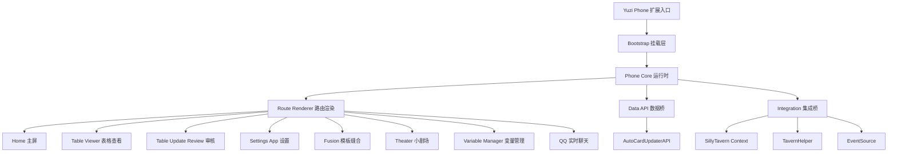
```mermaid
graph TD
  A[Yuzi Phone 扩展入口] --> B[Bootstrap 挂载层]
  B --> C[Phone Core 运行时]
  C --> D[Route Renderer 路由渲染]
  D --> E[Home 主屏]
  D --> F[Table Viewer 表格查看]
  D --> G[Table Update Review 审核]
  D --> H[Settings App 设置]
  D --> I[Fusion 模板缝合]
  D --> J[Theater 小剧场]
  D --> Q[Variable Manager 变量管理]
  D --> R[QQ 实时聊天]
  C --> K[Data API 数据桥]
  K --> L[AutoCardUpdaterAPI]
  C --> M[Integration 集成桥]
  M --> N[SillyTavern Context]
  M --> O[TavernHelper]
  M --> P[EventSource]
```

### 2.1 入口层

[`index.js`](../index.js:12) 是扩展生命周期入口，负责：

- 配置错误处理：[`configureErrorHandler()`](../index.js:503)。
- 绑定全局 window 事件：[`bindPhoneBootstrapWindowEvents()`](../index.js:509)。
- DOM 就绪后执行初始化：[`ensureInitialized()`](../index.js:402)。
- 挂载 bootstrap UI：[`doInitialize()`](../index.js:441)。
- 注册 Slash 命令：[`registerSlashCommands()`](../index.js:472)。
- 卸载清理：[`destroy()`](../index.js:561)。

维护规则：

- [`index.js`](../index.js:12) 不应承载业务页面逻辑。
- 新增全局生命周期资源时，必须能被 [`destroy()`](../index.js:561) 清理。
- 所有初始化失败必须通过 [`handleError()`](../modules/error-handler.js:534) 或 [`Logger`](../modules/error-handler.js:430) 进入统一错误系统。

### 2.2 Bootstrap 层

主要文件：

- [`app-bootstrap.js`](../modules/bootstrap/app-bootstrap.js:13)：创建 root、container、toggle，初始化设置面板与事件监听。
- [`toggle-button.js`](../modules/bootstrap/toggle-button.js:15)：定义 DOM ID、toggle 视觉、位置、拖拽。
- [`event-registry.js`](../modules/bootstrap/event-registry.js:21)：注册 SillyTavern 事件桥。
- [`command-registry.js`](../modules/bootstrap/command-registry.js:224)：注册 phone 相关 Slash 命令 handler。

边界：

- Bootstrap 只负责挂载与入口交互，不直接渲染业务页面。
- 手机开关通过 [`togglePhoneBootstrapVisibility()`](../modules/bootstrap/app-bootstrap.js:54) 调用 [`onPhoneActivated()`](../modules/phone-core/lifecycle.js:215) 或 [`onPhoneDeactivated()`](../modules/phone-core/lifecycle.js:235)。

## 3. Phone Core 生命周期

核心状态在 [`state.js`](../modules/phone-core/state.js:18) 创建，关键字段包括：

- [`currentRoute`](../modules/phone-core/state.js:20)
- [`routeHistory`](../modules/phone-core/state.js:21)
- [`phoneContainer`](../modules/phone-core/state.js:22)
- [`isPhoneUiInitialized`](../modules/phone-core/state.js:24)
- [`isPhoneActive`](../modules/phone-core/state.js:25)
- [`isDestroying`](../modules/phone-core/state.js:26)
- [`routeRenderToken`](../modules/phone-core/state.js:31)
- [`currentViewingSheetKey`](../modules/phone-core/state.js:33)

### 3.1 激活流程

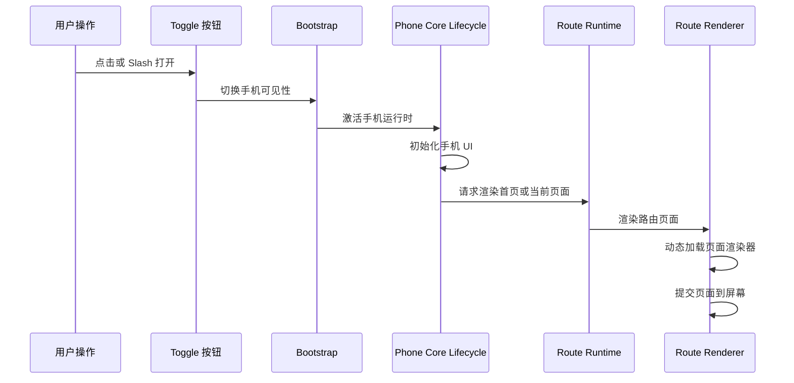
```mermaid
sequenceDiagram
  participant User as 用户操作
  participant Toggle as Toggle 按钮
  participant Bootstrap as Bootstrap
  participant Life as Phone Core Lifecycle
  participant Route as Route Runtime
  participant Renderer as Route Renderer

  User->>Toggle: 点击或 Slash 打开
  Toggle->>Bootstrap: 切换手机可见性
  Bootstrap->>Life: 激活手机运行时
  Life->>Life: 初始化手机 UI
  Life->>Route: 请求渲染首页或当前页面
  Route->>Renderer: 渲染路由页面
  Renderer->>Renderer: 动态加载页面渲染器
  Renderer->>Renderer: 提交页面到屏幕
```

对应代码：

- [`onPhoneActivated()`](../modules/phone-core/lifecycle.js:215)
- [`initPhoneUI()`](../modules/phone-core/lifecycle.js:177)
- [`requestPhoneRuntimeActivationRoute()`](../modules/phone-core/lifecycle.js:124)
- [`requestPhoneRouteRender()`](../modules/phone-core/route-runtime.js:89)
- [`renderPhoneRoute()`](../modules/phone-core/route-renderer.js:390)

### 3.2 后台派生服务生命周期

[`background-services.js`](../modules/phone-core/background-services.js) 统一拥有“纪要今日关系”和“小日历派生字段”两个后台服务的启停与聊天切换屏障。它属于扩展 enabled 生命周期，不属于手机页面可见性生命周期：

- 扩展 enabled 后启动；手机隐藏或关闭 UI 时继续运行。
- 扩展 disabled 或执行 `destroy()` 时停止两侧服务，清理订阅、timer、聊天切换屏障和旧 generation。
- 任一服务启动返回 `false`、抛错或启动期间 generation 失效时，两侧都必须执行幂等 `stop`，不能只回滚报告成功的一侧。
- 日志设施不得打断停止和回滚；清理路径必须在 logger 自身异常时继续执行。
- 聊天切换会先停止旧 generation，忽略第一段 `table-update` 中间态，等待第二段通知后再稳定 250ms；3.5 秒仍未收齐通知时只对最新 generation 执行一次兜底恢复。
- 旧 generation 的回调、Promise 或 timer 晚到时不得重新启动服务，也不得改写新聊天状态。
- [`subscribeTableUpdate()`](../modules/phone-core/callbacks.js:66) 不可用或注册失败时返回 `null`，禁止伪造 noop disposer。底层只注册一个 native callback，并通过 subscriber `Set` 复用；全局注销必须把同一个 native callback 传回数据库 API。
- 派生服务收到无效 disposer 时必须把 `start()` 判为失败并完整回滚；聊天切换屏障允许订阅不可用，此时保持等待并由 3.5 秒 timeout fallback 恢复最新 generation。

### 3.3 路由系统

路由状态由 [`routing.js`](../modules/phone-core/routing.js:39) 管理：

- [`navigateTo()`](../modules/phone-core/routing.js:52)：写入当前 route，并触发 route change callbacks。
- [`navigateToReplacingHistoryTop()`](../modules/phone-core/routing.js:69)：仅用于保留当前页面为返回锚点、同时替换旧浏览锚点的受控 push；失败回滚必须恢复被替换的 history entry。
- [`replaceCurrentRoute()`](../modules/phone-core/routing.js:94)：替换当前 route，不修改 routeHistory。
- [`navigateBack()`](../modules/phone-core/routing.js:107)：从 routeHistory 回退。
- [`onRouteChange()`](../modules/phone-core/routing.js:123)：注册 route change 回调。

渲染由 [`route-runtime.js`](../modules/phone-core/route-runtime.js:84) 和 [`route-renderer.js`](../modules/phone-core/route-renderer.js:30) 执行。

已确认路由：

- home route -> [`renderHomeScreen()`](../modules/phone-home/render.js:139)
- `table:<sheetKey>` 物理表 route -> 通过统一目录按 Theater → Generic 分类，分别进入 [`renderTheaterScene()`](../modules/phone-theater/render.js:118) 或 [`renderTableViewer()`](../modules/table-viewer/render.js:23)。首页普通表、Theater 虚拟 App 与 Slash 都只能由目录生成并使用该 route；这是唯一正常表格入口，也是允许 content preset 尝试渲染的入口。
- `app:<sheetKey>` 兼容 route -> 复用同一目录分类，只为历史链接和 history 保留；它不是跨表循环的目标 route，不参与 content preset 绑定或自动刷新。
- `theater:<sceneId>` 兼容 route -> [`renderTheaterScene()`](../modules/phone-theater/render.js:118) 的历史 scene 入口；正常用户入口必须使用主物理表的 `table:<sheetKey>`，它不参与 content preset 绑定或自动刷新。
- `table-generic:<sheetKey>` -> [`renderTableViewer()`](../modules/table-viewer/render.js:23) with force generic list mode；它只保留给小剧场编辑桥，永久旁路 content preset。
- `qq` / `qq:*` -> 最小安全 fallback。QQ App 图标仍保留，但在 Figma UI 融合前不得加载旧页面、旧路由参数或旧存储模型。
- table-update-review route -> [`renderTableUpdateReview()`](../modules/table-update-review/index.js:112)
- settings route -> [`renderSettings()`](../modules/settings-app/render.js:102)
- fusion route -> [`renderFusion()`](../modules/phone-fusion/render.js:80)
- variable manager route -> [`renderVariableManager()`](../modules/variable-manager/index.js:233)

小剧场编辑桥：

- 小剧场美化页如果声明 `editableTables`，编辑目标统一为 `table-generic:<sheetKey>`。首次编辑以及从首页或审核来源进入后的首次编辑使用 [`navigateTo()`](../modules/phone-core/routing.js:52)，把当前 Theater 美化页保留为编辑页的返回锚点。
- 在 `table:<sheetKey>` 跨表浏览链中再次进入编辑时，通用交互层使用 [`navigateToReplacingHistoryTop()`](../modules/phone-core/routing.js:69)：移除 history 顶部的旧 Theater / 兼容 App / 物理表浏览锚点，再压入当前 Theater。它不得用于审核来源，也不得替代 [`replaceCurrentRoute()`](../modules/phone-core/routing.js:94) 的表级切换语义。
- `table-generic:<sheetKey>` 由 [`loadRouteRenderer()`](../modules/phone-core/route-renderer.js:30) 识别，并调用 [`renderTableViewer()`](../modules/table-viewer/render.js:23) 的强制通用列表模式，绕开小剧场子表重定向和 content preset 查询。
- 编辑页返回必须先通过 [`navigateBack()`](../modules/phone-core/routing.js:107) 回到当前 Theater，再次返回才到初始 Home / Review。最新编辑 route 渲染失败时会撤销当前 Theater 的临时入栈并恢复被替换的旧锚点；过期 `routeRenderToken` 的失败不得改写新 history。

审核 App 跳转桥：

- [`table-update-review`](../modules/table-update-review/constants.js:2) 是系统 App route，由 [`loadRouteRenderer()`](../modules/phone-core/route-renderer.js:30) 动态加载 [`renderTableUpdateReview()`](../modules/table-update-review/index.js:112)。
- Theater 物理表命中可用 scene 时，审核交互在写入 pending navigation intent 之前分流，直接通过标准 [`navigateTo()`](../modules/phone-core/routing.js:52) 进入 `table:<sheetKey>` 美化场景；该分支不创建或清理 Generic intent。
- Generic 表仍先写入 pending navigation intent，再进入 `table:<sheetKey>`；Table Viewer 消费 intent 后进入对应行详情。详情本地返回只回列表，列表路由返回继续依赖 route history 回到审核页。

表级循环切换：

- 唯一顺序来源是 [`getSheetKeys()`](../modules/phone-core/data-api/table-repository.js:645)，统一目录位于 [`table-navigation/catalog.js`](../modules/table-navigation/catalog.js)。禁止在页面层复制 `orderNo` 排序、使用 `Object.keys(rawData)` 或按表名猜测展示类型。
- Generic 列表与 Theater 公共标题栏只共享目录与 [`requestTableNavigationSwitch()`](../modules/table-navigation/controls.js:32)，各自保留现有模板与生命周期。QQ 不参与表级循环切换。
- 两类表格页面都将“上一张、当前标题、下一张”渲染为同一紧凑标题导航组；Theater 编辑/删除保留在第一行 trailing 槽，Generic 批量删除使用独立第二行操作区。任何宽度下都不得把切表按钮移出标题组。
- 切换成功只调用 [`replaceCurrentRoute()`](../modules/phone-core/routing.js:94)，不压入或弹出 `routeHistory`。因此 A→B→C 后执行一次返回，仍回到进入 A 前的页面。
- 路由失败回滚同时校验目标 route 与 `routeRenderToken`，避免 A→B→C→B 的旧 B 请求回滚最新 B；back 失败还会恢复已弹出的 history entry。
- 零表、单表、锚点缺失、非法方向、页面失活及删除/锁定管理态都会阻止切换。按钮 disabled 只是表现层，controller 与共享 controls 仍必须二次 guard。

维护规则：

- 新增 route 必须同步改 [`loadRouteRenderer()`](../modules/phone-core/route-renderer.js:30)。
- 如果希望首开不白屏，还要同步维护 [`ROUTE_MODULES`](../modules/phone-core/preload.js:32)。
- 异步渲染必须尊重 [`routeRenderToken`](../modules/phone-core/state.js:31)，不能绕开现有 token 防护。

### 3.4 全局应用标题栏深模块

[`navigation-ui.js`](../modules/phone-core/navigation-ui.js) 是所有 App 标题栏的共享深模块。它用一个小接口封装三槽布局、Figma chevron、icon-only 可访问按钮、标题省略和字符串/DOM 两种渲染路径：

- [`buildPhoneNavBar()`](../modules/phone-core/navigation-ui.js)：生成 leading / center / trailing 三槽结构。
- [`buildPhoneBackButton()`](../modules/phone-core/navigation-ui.js) 与 [`buildPhoneSwitchButton()`](../modules/phone-core/navigation-ui.js)：生成带 `aria-label` 的共享方向按钮。
- [`buildPhoneNavTitleSwitcher()`](../modules/phone-core/navigation-ui.js)：生成可省略的标题，按需容纳上一张/下一张切换。
- [`createPhoneNavIconElement()`](../modules/phone-core/navigation-ui.js)：供 QQ 等 DOM 构建路径复用同一 SVG glyph。

几何事实只存在于 [`00-phone-tokens.css`](../styles/phone-base/00-phone-tokens.css) 与 [`06-layout-nav-core.css`](../styles/phone-base/06-layout-nav-core.css)。基准来自 Figma `02_设计画板` 的“用户页 / 编辑资料”标题栏（`177:1532`）：内容高度 `54px`、左右内边距 `10px / 12px`、图标 `24px`、方形热区 `32px`。共享 SVG / img 使用 `pointer-events: none`，始终由外层 button 承接完整热区；页面只能覆写标题栏的表面、边框、前景和交互颜色角色，不能重写高度、三列宽度、热区、图标尺寸、字体或省略规则。

标题切换组由共享层按内容宽度紧凑居中，长标题只在按钮之间省略。Theater 编辑/删除等短操作组声明 `.has-inline-actions` 与 `.phone-nav-inline-actions`，使用 `--yuzi-phone-nav-inline-action-*` token 留在第一行；Generic 批量删除等确需整行的宽操作组才声明 `.has-secondary-actions` 与 `.phone-nav-secondary-actions`，第二行网格、换行、间距和 padding 继续由共享层负责。

当前消费者是 Settings、Generic Table 列表与详情、Theater、Variable Manager、Fusion、Table Update Review 审核 App、Content Presets 和 QQ 二级页/聊天页。每个消费者保留自己的路由 action 和页面生命周期，但不能复制标题栏 DOM、字符箭头或可见“返回”文字。

[`01-shell-system.css`](../styles/phone-base/01-shell-system.css) 把 `.yuzi-phone-screen` 声明为 `yuzi-phone-screen` inline-size container。共享标题栏使用 `cqi`，页面操作区需要窄屏重排时使用 `@container yuzi-phone-screen`；浏览器 viewport 的 `@media (max-width: ...)` 不能用于判断小手机标题栏是否变窄。

Shell DOM、CSS 选择器与自定义变量必须使用 Yuzi 独占命名空间：屏幕和 Home Indicator 的公开 class 固定为 `.yuzi-phone-screen`、`.yuzi-phone-home-indicator`，不得暴露 `.phone-screen`、`.phone-home-indicator` 等容易被其他手机扩展全局命中的通用 shell class；新增自定义变量必须使用 `--yuzi-phone-*`。隔离依赖命名空间而不是加载顺序或 `!important` 覆盖。

QQ composer 的 textarea 自动增高属于高频输入路径。input 事件只更新草稿并通过 `requestAnimationFrame` 合并高度工作，同一 textarea 每帧最多测量一次，且仅在目标高度变化时写入 style。Shell 的 `MutationObserver` 不得因 composer textarea 的 style 高度变化刷新 Home Indicator；它只处理页面切换、底栏显隐、主题或其他确实改变 shell 底部结构的 mutation，避免“写高度 → 强制布局 → observer 全量扫描”的每字符放大链。

## 4. SillyTavern 集成层

集成层职责是把宿主环境的不稳定全局对象隔离在少数桥接模块里。

文件职责：

- [`context-bridge.js`](../modules/integration/context-bridge.js:5)：提供可缓存 context 与逐次重新读取的 fresh context；聊天、角色绑定和世界书等会话级操作必须使用 fresh context。
- [`event-bridge.js`](../modules/integration/event-bridge.js:66)：初始化 eventSource，提供 [`onEvent()`](../modules/integration/event-bridge.js:136)、[`triggerEvent()`](../modules/integration/event-bridge.js:193)、[`waitForEvent()`](../modules/integration/event-bridge.js:215)。
- [`tavern-helper-bridge.js`](../modules/integration/tavern-helper-bridge.js:27)：获取 TavernHelper，包装聊天消息、变量、世界书、角色数据等 API。
- [`toast-bridge.js`](../modules/integration/toast-bridge.js:3)：封装 toastr，并注册错误处理通知回调。
- [`cleanup.js`](../modules/integration/cleanup.js:17)：清理 context、event、TavernHelper 缓存。

维护规则：

- 新增对 SillyTavern 全局对象的访问，不要散落到页面模块里，应放入 integration 或 phone-core 数据桥。
- 任何桥接 API 都要返回可降级值，例如空数组、空对象、false，而不是把宿主异常直接抛进 UI。
- 集成层的事件、定时器、订阅与异步等待必须纳入 runtime 或等价 cleanup 机制，不能把宿主事件监听留在页面模块中裸绑。

### 4.1 已确认的 SillyTavern 宿主 API

下列能力已经过 SillyTavern 1.15.0 源码和本项目运行路径确认。业务模块不得复制这些调用，也不得用 DOM、当前角色猜测或手写世界书 REST 请求替代；新增消费者应复用对应桥接层。

| API / 事件 | 本项目入口 | 用途与稳定边界 |
| --- | --- | --- |
| `SillyTavern.getContext()` | [`getFreshSillyTavernContext()`](../modules/integration/context-bridge.js) | 每次取得当前宿主 context。SillyTavern 切换聊天时会替换会话级引用，因此作用域、角色绑定、请求头和世界书读写都必须在每次操作开始时重新读取，不能长期持有旧 context。 |
| `getWorldbookNames()` | [`getWorldbookNames()`](../modules/integration/tavern-helper-bridge.js) | 列出可选择的世界书名称，用于设置下拉框。返回值必须归一化为字符串数组；API 缺失或失败时由桥接层决定 strict 失败或空数组降级。 |
| `getCharWorldbookNames('current')` | [`getCurrentCharacterWorldbooks()`](../modules/integration/tavern-helper-bridge.js) | 读取当前角色卡绑定的主世界书与附加世界书。它同时是 QQ 投影默认目标解析和“读取世界书”候选书目录的事实源；前者只取主书或首个附加书作为写入目标，后者读取主书和全部附加书。不能按角色名或 UI 文案猜绑定关系。 |
| `getWorldbook(name)` | [`st-catalog-adapter.js`](../modules/worldbook-reading/st-catalog-adapter.js) | 按书名读取 TavernHelper 形态的世界书条目，仅用于 `{{世界书内容}}` 的候选目录和扫描。这条读链使用 strict + silent：失败向上抛给 Resolver 降级为空字符串，但不向控制台写 warning。 |
| `context.loadWorldInfo(name)` | [`st-gateway.js`](../modules/qq-v2/worldbook/st-gateway.js) 的 `loadBook()` | 按名称读取完整世界书对象，并复用 SillyTavern 自己的 world-info cache。主动投影和清理非当前聊天投影都走同一入口，不直接请求 `/api/worldinfo/get`。 |
| `context.saveWorldInfo(name, data, true)` | [`st-gateway.js`](../modules/qq-v2/worldbook/st-gateway.js) 的 `saveBook()` | 立即保存完整世界书对象；第三个参数 `true` 表示绕过 debounce，Promise settlement 是本次写入完成边界。调用后不要继续修改传入对象，因为 SillyTavern 会把同一对象放入 cache。QQ 投影保留这条原始 SillyTavern 整书读写链，不改用会规范化并重建整书的 TavernHelper 条目 CRUD。 |
| `context.getRequestHeaders()` + `POST /api/characters/chats` | [`listCharacterChatFiles()`](../modules/qq-v2/host/adapter.js) | 查询指定角色头像 `avatar_url` 下仍存在的聊天文件。请求体使用 `{ avatar_url, simple: true }`；成功响应为 `{ file_name, file_id }[]`，比较前统一去掉 `.jsonl`。它用于跨角色同名聊天的删除消歧，不用于普通聊天列表 UI。 |
| `CHAT_CHANGED` | [`event-registry.js`](../modules/bootstrap/event-registry.js) → QQ runtime | 表示当前宿主聊天已改变。QQ 必须重新读取 fresh context，并执行“只有当前 scope 可以保留世界书投影”的收敛流程。 |
| `CHAT_DELETED` | [`event-registry.js`](../modules/bootstrap/event-registry.js) → [`production-runtime.js`](../modules/qq-v2/application/production-runtime.js) | SillyTavern 只提供被删聊天文件名，不提供可靠角色身份；删除后的当前角色也可能已经改变。必须结合已持久化 host metadata 定位，重名时再用 `/api/characters/chats` 查证，禁止把当前 `hostId` 当成删除事实。 |
| `WORLDINFO_UPDATED` | [`st-catalog-adapter.js`](../modules/worldbook-reading/st-catalog-adapter.js) → [`worldbook-reading.js`](../modules/settings-app/pages/worldbook-reading.js) | 世界书条目变更时只使当前“读取世界书”页重新拉取目录；页面 dispose 时必须解除订阅，不保留旧 DOM 闭包。 |

世界书写入规则：

- 活跃 scope 的普通写入在 `loadWorldInfo()` 与 `saveWorldInfo()` 前后都检查 scope，防止异步等待结束后把旧聊天结果写进新聊天。
- QQ 新版投影的条目名称固定为 `YuziQQ｜私聊｜人物真名｜<完整 conversationId>` 或 `YuziQQ｜群聊｜群名｜<完整 conversationId>`。名称中的完整 `conversationId` 是主身份；仓储记录的 `entryUid` 只用于快速定位，`extensions.yuziPhoneQQV2` marker 只用于辅助校验。
- 外部 TavernHelper 写入可能在规范化、重建整本世界书时丢失 entry 的未知 `extensions`。因此 marker 缺失不表示投影不存在；QQ 仍按新版名称中的完整 `conversationId` 找回并原地更新同一 UID，避免把完整会话再次创建为第二条投影。
- 新版投影的完整正文必须以独立首行 `<yuzi>` 开始、以独立末行 `</yuzi>` 结束。正文保留会话说明并按故事日期分段；每条具有合法故事时分的消息以 `[HH:mm]` 开头。只有日期或故事时间未知、无效时不得伪造 `[00:00]`，应保留对应日期或未知故事时间分段，并输出不带时分前缀的消息正文。
- 已存在的新版投影不执行额外迁移；下一次正常同步时必须按完整 `conversationId` 找回原条目、保持原 UID，并将正文刷新为当前格式。
- `QQ｜私聊｜...` 与 `QQ｜群聊｜...` 旧格式条目不属于新版投影生命周期。QQ 不扫描提醒，也不改名、更新、禁用或删除这些遗留条目，即使它们仍带旧 marker；旧条目也不补写 `<yuzi>` 标签或消息时分。
- 只有清理已知新版投影时可以显式 `allowInactiveScope`；仍然必须按世界书名称读取，并按完整 `conversationId` 精确匹配 `YuziQQ｜` 保留命名空间，不能按人物名、群名、正文前缀或当前聊天猜测条目归属。
- 同一本书中匹配到多条相同 `conversationId` 的新版条目时，投影写入 fail closed：不更新、不删除、不禁用、不任选一条，也不创建第三条；会话保持 pending，等待用户手工清理到只剩一条。
- 世界书读取失败、保存失败、聊天列表查询失败或删除身份仍有歧义时一律 fail closed：保留世界书条目和本地 scope，等待下一次生命周期重试，不猜删、不把失败伪装成成功。
- 宿主 API 调用只能存在于 integration、host adapter 或 worldbook gateway。UI、Facade 和领域仓储不得直接访问 `SillyTavern`、`TavernHelper`、`fetch('/api/...')` 或 world-info cache。

## 5. 数据流与存储契约

### 5.1 表格数据 API

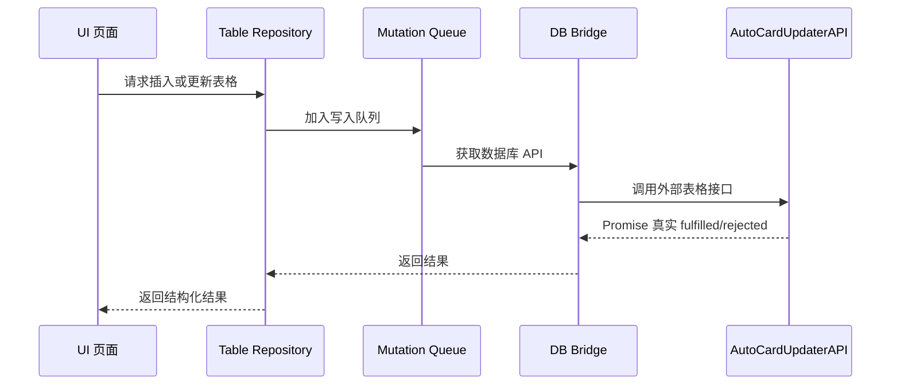
```mermaid
sequenceDiagram
  participant UI as UI 页面
  participant Repo as Table Repository
  participant Queue as Mutation Queue
  participant Bridge as DB Bridge
  participant API as AutoCardUpdaterAPI

  UI->>Repo: 请求插入或更新表格
  Repo->>Queue: 加入写入队列
  Queue->>Bridge: 获取数据库 API
  Bridge->>API: 调用外部表格接口
  API-->>Bridge: Promise 真实 fulfilled/rejected
  Bridge-->>Repo: 返回结果
  Repo-->>UI: 返回结构化结果
```

关键文件：

- [`db-bridge.js`](../modules/phone-core/db-bridge.js:7)：解析 [`AutoCardUpdaterAPI`](../modules/phone-core/db-bridge.js:9)。
- [`table-repository.js`](../modules/phone-core/data-api/table-repository.js:600)：读取、写入、插入、更新、删除表格。
- [`mutation-queue.js`](../modules/phone-core/data-api/mutation-queue.js:9)：串行化表格写入任务。
- [`lock-repository.js`](../modules/phone-core/data-api/lock-repository.js:128)：封装行、列、单元格锁。

等待边界分为两类：

- query 使用 [`callApiWithTimeout()`](../modules/phone-core/db-bridge.js)，保留有界超时，避免只读 UI 永久等待；SQLite runtime 的方法发布状态就是当前就绪信号，不再额外发送 probe SQL。
- mutation 使用 [`callMutationApiToSettlement()`](../modules/phone-core/db-bridge.js)，必须等待底层 Promise 真实 fulfilled/rejected 后才能释放 [`mutation-queue.js`](../modules/phone-core/data-api/mutation-queue.js)。30 秒 watchdog 只输出一次慢调用诊断，不代表失败，也不得提前释放队列。
- 第三方 mutation 永不 settle 时采用 fail-closed：当前队列保持占用，阻止后续写入重叠。没有取消协议时，不能用本地 hard timeout 伪造失败并继续重试。

外部 API 契约来自文档：

完整接口清单见 [`reference/API_DOCUMENTATION.md`](reference/API_DOCUMENTATION.md)。该文档继续记录外部数据库插件本身的能力；小手机删除旧数据库配置、更新频率、选表和预设桥接，不会改写或删减这份外部能力参考。

- [`updateRow()`](reference/API_DOCUMENTATION.md:234) 返回 [`Promise<boolean>`](reference/API_DOCUMENTATION.md:245)，用于行级更新。
- [`insertRow()`](reference/API_DOCUMENTATION.md:269) 成功返回 rowIndex，失败返回 [`-1`](reference/API_DOCUMENTATION.md:279)，用于行级新增。
- [`deleteRow()`](reference/API_DOCUMENTATION.md:301) 返回 [`Promise<boolean>`](reference/API_DOCUMENTATION.md:311)，用于行级删除。
- [`exportTableAsJson()`](reference/API_DOCUMENTATION.md:163) 只允许作为读取、展示、校验与对账入口，不允许作为写入基准再覆盖回数据库。

#### 5.1.1 SQL 只读 runtime 契约

- `querySql`、`executeSqlQuery` 与 `queryTableRows` 只在 SQLite runtime 完整就绪时作为函数发布；方法不存在就是 readiness 信号，调用方返回 `runtime_not_ready` 并稍后重试，禁止执行 `SELECT 1` 或其他探针查询。
- [`queryTableRowsViaApi()`](../modules/phone-core/data-api/sql-repository.js) 只负责透传声明式查询 options 与归一化返回值，不复制数据库侧的表别名、列别名或条件解析逻辑。
- 已发布查询返回 `null` 时才读取 `getLastSqlApiError()`；只有诊断 `method` 与本次底层方法一致，且 `at` 不早于本次调用开始时间，才允许提升为顶层 `code`/`message` 并保存在 `sqlApiError`。sticky 旧诊断和错 method 诊断必须拒绝，统一退回 `query_failed`。

SQL settlement 合同由 [`normalizeSqlMutationSettlement()`](../modules/phone-core/data-api/mutation-settlement.js:30) 集中归一化：

- 原始 settlement 必须是对象，包含数组 `errors` 与非负整数 `changes`；`{ changes: 0, errors: [] }` 只是结构成功，不代表业务目标已经命中。
- `errors` 非空、`saved === false`、`ok === false` 或 `success === false` 都是失败。失败结果的顶层 `changes` 必须为 `null`，原始值只保留在 `result.changes`；顶层不得残留 `code: 'ok'` 或成功文案。
- SQL 批量删除只有 settlement `ok` 且 `changes === 请求数` 时可以直接确认全部成功。其余 settlement 必须按删除前保存的 `row_id` 对账：对账不可用或失败返回 `partial_unknown`；确认零删除返回 `mutation_failed` 或保留底层失败码；确认部分删除返回 `partial_failed`。
- SQL 一旦发出，严禁 fallback 到 `deleteRow`，因为底层可能已经提交、只是在保存或刷新阶段失败。仅 SQL 发出前发现能力缺失、快照不可用、`row_id`/物理表映射失败或参数数量超限时允许进入逐行 fallback。

维护规则：

- 表格写入必须走 [`enqueueTableMutation()`](../modules/phone-core/data-api/mutation-queue.js:9)，不要绕过队列并发写入。
- 正常 CRUD 与 Raw SQL mutation 的保存、merged-data/worldbook 刷新和通知由 shujuku 所有；小手机不得在成功后追加第二次刷新。显式刷新只保留给恢复和对账等现役系统路径，并且同样必须进入 mutation queue 等待真实 settlement。
- 聊天级模板导入只保证底层尝试应用、保存和刷新：shujuku 内部聊天保存与刷新存在 fire-and-forget/异常吞掉路径，仍可能返回 `success: true`，因此不能把返回值写成“聊天持久化和投影已可靠完成”。全局 scope 只保存预设，不改变当前聊天投影。
- Fusion 模板导入不得在 [`importTemplateFromDataViaApi()`](../modules/phone-core/data-api/import-export-repository.js) 返回成功后追加投影刷新。二次刷新不是聊天保存屏障，本身也会产生写入副作用，不能用来补救模板导入的上游完成边界缺口。
- mutation 调用不得传 `skipChatSave` 或 `skipNotify` 绕开一致性；写后聊天、世界书和 UI 必须以底层正式 Promise 为共同完成边界。
- 运行时新增、保存、删除和小剧场级联删除必须使用 [`updateTableRow()`](../modules/phone-core/data-api/table-repository.js:691)、[`insertTableRow()`](../modules/phone-core/data-api/table-repository.js:754)、[`insertTableRowsBatch()`](../modules/phone-core/data-api/table-repository.js:832)、[`deleteTableRowViaApi()`](../modules/phone-core/data-api/table-repository.js:973)、[`deleteTableRowsBatch()`](../modules/phone-core/data-api/table-repository.js:1008) 等行级仓库接口。
- [`importTableAsJson()`](reference/API_DOCUMENTATION.md:177) 是整库覆盖接口，禁止出现在 [`modules/`](../modules) 运行时 CRUD 写入链路中；不能把某次 UI 改动包装成全量快照导入，否则会污染全局表快照，并让数据库误判所有表都更新。
- 成功判定必须严格遵守外部 API 契约：布尔接口只接受 `true`，插入接口只接受有效行号。
- 批量删除的 partial failure 结果必须同时表达 `attemptedRowIndexes`、`failedRowIndexes`、`unattemptedRowIndexes` 与 `notDeletedRowIndexes`；`failedRowIndexes` 只表示已尝试但失败，UI 保留选择和反馈应优先消费 `notDeletedRowIndexes` 或映射后的 view 坐标，不要把“未尝试”伪装成“删除失败”。
- UI 层不要直接调用 [`AutoCardUpdaterAPI`](../modules/phone-core/db-bridge.js:9)，应经 [`data-api.js`](../modules/phone-core/data-api.js:1) 或更具体 repository。
- Raw SQL 派生字段如果需要读取某张表，必须集中维护有序候选表名，并选择第一个“存在且必需字段完整”的表；[`chronicle-today-relation-sql.js`](../modules/phone-core/derived-fields/chronicle-today-relation-sql.js:1) 的日期锚点依次为 `quanjushujubiao`、`global_state`、`current_status`（要求 `row_id`、`cur_time`），纪要目标依次为 `jiyaobiao`、`chronicle`（要求 `row_id`、`time_span`、`today_relation`）；[`small-calendar-derived-fields-sql.js`](../modules/phone-core/derived-fields/small-calendar-derived-fields-sql.js:1) 的小日历目标依次为 `xiaorilibiao`、`small_calendar_days`（要求 `row_id`、`date_text`、`weekday_text`、`month_days`）。候选表缺失必须静默跳过，不得调用会输出缺表诊断的查询接口。
- 候选表是否存在先走 `getTableAvailabilityViaApi()`；快照提供表头时，候选选择器先按共享字段契约做本地字段预检，已明确缺列必须静默跳过且不得调用 `queryTableRowsViaApi()`；字段完整后才用该接口做别名感知的字段检查。无表头快照保留兼容查询路径。禁止再用 `sqlite_master`、`pragma_table_info()` 或字符串字面量检查结构。复杂 signature 与 mutation SQL 只可使用候选选择器给出的表名；不要扫描所有含 `cur_time` 的表猜测锚点。
- Raw SQL mutation 的表名重绑定只应依赖 `UPDATE`、`FROM`、`JOIN` 等表声明位置，禁止使用 `chronicle.row_id`、`small_calendar_days.row_id` 这类“表名 + 行身份”的限定引用关联目标行。批量派生更新应让计算 CTE 输出 `row_id AS target_row_id`，再通过 `UPDATE <候选表名> ... FROM <计算 CTE> WHERE row_id = <计算 CTE>.target_row_id` 对号写回；`row_id` 仍是原表稳定身份，`target_row_id` 只负责消除内外层同名歧义。这样旧版 DDL 名与新版拼音物理表名都可以安全执行，不会留下失效限定符。
- 派生 mutation 的合同测试不得只检查 SQL 字符串；必须至少覆盖原作者 DDL 表名直接执行，以及模拟数据库只重绑定表声明后的拼音物理表执行，防止逻辑表名前缀再次漏进关联条件。

### 5.2 派生字段后台调度契约

[`derived-field-service.js`](../modules/phone-core/derived-fields/derived-field-service.js) 是两个派生器的共享调度器，负责读侧退避、通知合并、签名判定、mutation 预算和完整清理。

- 每次读取必须区分 `source_signature`、完整 `input_signature` 与 `pending_update_count`；`pending_update_count === 0` 时不得调用 mutation。
- 普通 `table-update` 只把服务标记为 dirty，并通过 600ms debounce 合并通知风暴；通知本身不得清空同一 source 的 mutation 预算。
- runtime 未就绪使用独立的 1000ms availability timer 静默等待，不执行 SQL、不记录警告，也不消耗查询失败预算；真正 query 失败仍按 1 秒、2 秒、5 秒有界退避。这两类读侧恢复都不能与 mutation 写入预算混用。
- 服务同时订阅 `table-fill-start` 与 `table-update`：填表开始后立即暂停新的派生查询和写入并清理待执行 timer；数据库主提交发出 table-update 后解除暂停，再经 600ms debounce 读取最新快照、计算并只写变化值。
- 同一 `source_signature` 最多发出两次真实 mutation：首次写入 + 至多一次同源补写；补写可能来自明确失败，也可能来自写后确认仍未 clean。成功确认只清除待确认签名和 retry timer，不返还次数，也不关闭同源熔断预算。
- 只有 source signature、聊天 generation 或 enabled 生命周期发生变化时，才能为新的业务输入重新建立预算。
- `start()` 的任一订阅异常、无效 disposer、同步回调后 generation 失效，以及 `stop()` 的 disposer 异常，都必须完整清理四类 timer、两类订阅、运行状态、签名、读侧重试和 mutation 预算。

### 5.3 QQ v2 独立实时聊天数据流

QQ v2 是系统 App，不属于任何数据库表、Table Viewer 或 Theater scene。它以稳定领域状态和应用意图为边界，Figma UI 只能通过 Facade 查询和执行操作，不能读取宿主私有对象或持久化记录。

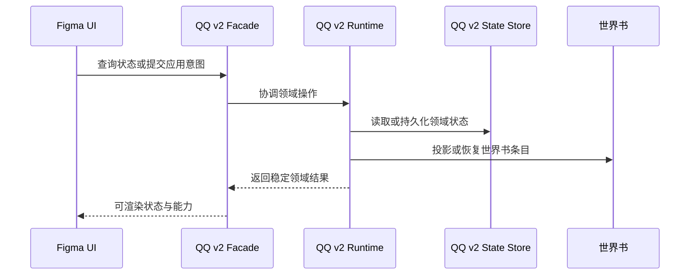
```mermaid
sequenceDiagram
  participant UI as Figma UI
  participant Facade as QQ v2 Facade
  participant Runtime as QQ v2 Runtime
  participant Repo as QQ v2 State Store
  participant WB as 世界书

  UI->>Facade: 查询状态或提交应用意图
  Facade->>Runtime: 协调领域操作
  Runtime->>Repo: 读取或持久化领域状态
  Runtime->>WB: 投影或恢复世界书条目
  Runtime-->>Facade: 返回稳定领域结果
  Facade-->>UI: 可渲染状态与能力
```

关键边界：

- [`facade.js`](../modules/qq-v2/application/facade.js) 是未来 UI 的唯一应用入口，返回领域状态、可执行能力与失败或只读原因。
- [`default-runtime.js`](../modules/qq-v2/runtime/default-runtime.js) 负责扩展级 runtime 生命周期与宿主事件转发；[`production-runtime.js`](../modules/qq-v2/application/production-runtime.js) 组合状态仓储、请求、世界书和主动消息服务。
- [`runtime.js`](../modules/qq-v2/runtime/runtime.js) 通过 [`scope-coordinator.js`](../modules/qq-v2/runtime/scope-coordinator.js) 管理 Scope Session：每次 refresh 请求立即撤销旧 Session，即使 scopeId 相同也创建新 generation；宿主读取、转场与 ready 回调仍在单一 host mutation lane 串行，只有最新请求可发布 ready Session，旧 Session 的异步写入必须以 `scope_inactive` 停止。
- 宿主 `CHAT_CHANGED` 完成新 Scope Session 后，若手机当前可见且 route 为 `qq` 或 `qq:*`，入口层必须重渲当前 route，让旧 QQ lifecycle 销毁并以新 Session 重挂；Facade 订阅故意只接收挂载时的 scope 事件，不能把跨 scope 通知当成普通页面刷新。
- [`state-store.js`](../modules/qq-v2/storage/state-store.js) 保存 v2 领域状态；会话、消息、资源与世界书投影不写回表格。
- [`action-service.js`](../modules/qq-v2/protocol/action-service.js) 解析并原子校验 AI 动作批次，[`projection-service.js`](../modules/qq-v2/worldbook/projection-service.js) 管理真实世界书条目投影与恢复。
- [`conversation-swipe.js`](../modules/qq-v2/ui/conversation-swipe.js) 独立管理消息页会话行的横向拖动、开合吸附和滑动后点击抑制；拖动偏移通过 `--yuzi-qq-swipe-offset` 交给 CSS，删除确认与领域删除仍由 [`app.js`](../modules/qq-v2/ui/app.js) 和 Facade 负责。
- 世界书投影以 `YuziQQ｜私聊｜人物真名｜<完整 conversationId>` / `YuziQQ｜群聊｜群名｜<完整 conversationId>` 作为稳定公开身份。`conversationId` 决定归属，Repository 保存的 `entryUid` 提供快速定位，`extensions.yuziPhoneQQV2 = { version, scopeId, conversationId }` 只作为辅助 marker；人物或群聊改名时在原 UID 更新 comment。外部 TavernHelper 整书重写即使丢失未知 `extensions`，也不会使 QQ 创建第二条投影。
- 旧 `QQ｜...` 条目不进入新版投影的识别、提示或清理范围。新版投影在关闭总闸、关闭单会话注入、硬删除 QQ 会话或删除宿主聊天时，仍按当前及历史受管目标书执行正常清理；同一目标书出现多个相同 `conversationId` 的新版条目时保持 pending 并 fail closed，由用户手工处理。
- QQ 采用“当前聊天唯一投影”模型：每次 scope change 都从仓储列出全部 host metadata，清理所有非当前 scope 的投影；不能只记忆并清理上一个 scope，因为 runtime 重启、跳跃切换和删除事件都可能留下更早的投影。
- `CHAT_CHANGED` 与 `CHAT_DELETED` 在 production runtime 的宿主生命周期队列中串行执行。事件桥可以不阻塞 SillyTavern，但 QQ 内部不能让切换、重建投影和删除 scope 并发交叉。
- 删除酒馆聊天时先解析目标 scope，再取消该 scope 的请求和主动消息，随后删除世界书投影；只有投影明确返回 `removed` 后才能删除 IndexedDB scope。投影失败则把 scope 标为 pending，保留完整元数据供后续重试。
- 文件名唯一时可直接定位历史 scope；跨角色同名时查询每个候选角色的现存聊天，只有唯一一个候选确认“不再存在该文件”时才能删除。查询失败、零个候选消失或多个候选同时消失都属于 unresolved，绝不猜删。
- 图片仓库、表情仓库、API / 指令预设库属于 shared resources，不随聊天 scope 删除。
- 普通 QQ API 预设由 [`resources/service.js`](../modules/qq-v2/resources/service.js) 与 API key store 保存；聊天 scope 只引用稳定预设 ID。`qq-v2.database-current-api` 不属于持久化预设库，而是数据库插件可用时由 [`production-runtime.js`](../modules/qq-v2/application/production-runtime.js) 注入的运行时只读虚拟预设。
- 数据库虚拟预设只允许请求路由调用数据库公开的 `window.AutoCardUpdaterAPI.callAI(messages)`；代理不得读取、复制或重组数据库的 URL、API key、model、temperature 等配置，也不得恢复已弃用的数据库 API 预设管理接口。数据库 API 缺失或返回空结果时必须 fail-closed，不得回退到普通 QQ API。
- 普通预设仍经 SillyTavern 后端代理；虚拟预设经数据库受限代理。两条路径共用 QQ 请求服务、最终提示词观察和动作提交边界，API 预设管理页对虚拟预设只显示禁用项，QQ 运行时选择器可以选中并调用。
- QQ 主设置“图片资料”的导入导出由 [`image-library-pack.js`](../modules/qq-v2/resources/image-library-pack.js) 统一封装，格式固定为 `yuzi-phone-qq-image-library-pack`、`schemaVersion: 1`。`libraries` 必须完整包含 `avatars`、`profileBackgrounds`、`chatBackgrounds` 与 `stickers` 四个数组；每张图片以 Data URL 写入 JSON，保留资源 ID，单资源上限为 8MB，只接受标准 `image/*` MIME。
- 导入图片资料包会在一次 `stateStore.transact()` 中整体替换 `sharedResources.imageLibraryAssets` 与 `sharedResources['qq-v2.resources.stickers']`，不修改 `scopes`、人物、会话、消息、API 预设、AI 指令预设或其他共享资源。格式、数组、MIME、Base64、资源大小、资源 ID 或表情说明任一校验失败时不得开始写入。
- 图片资料页面只能通过 `UI -> Facade -> Production Runtime -> State Store` 调用资源包能力。导入成功后 Production Runtime 撤销全部图片与表情 Blob URL 租约，再通知当前 QQ 视图刷新；页面层禁止直接读取或写入 IndexedDB。
- QQ 主设置中的 API 与各类指令预设选择、主动消息总开关与触发间隔、宿主上下文条数与 QQ 会话历史条数，以及世界书注入总闸、时间跨度、每会话自动注入消息条数、全局灯色、全局深度和全局关键词，统一属于扩展级全局运行设置；切换或删除 SillyTavern 聊天不得重置这些字段。注入条数默认为 `30`，`0` 表示不限；它按每个 QQ 会话分别计算，手动选择的消息不受该上限影响。新增的标签提取与标签排除同样属于扩展级全局运行设置：标签以不带尖括号的规范名称保存，默认提取标签为 `content`，排除标签支持多个名称；`{{正文上下文}}` 在唯一的 prompt materializer 入口中先提取配置标签，再删除排除标签块，未找到提取标签时保留原正文，并且不再添加“角色：”前缀。
- `{{正文上下文}}` 只由当前宿主中成功完成的 AI 楼层正文构造，不包含用户输入、系统消息、隐藏推理或页面渲染文本；手动回复与主动消息共用同一标签处理函数，世界书读取链路不读取这两个设置。
- 世界书注入目标 `bookName` 仍按当前 SillyTavern 宿主聊天保存。当前宿主聊天没有手动目标时，按当前角色卡绑定解析主世界书或首个附加世界书；手动选择具体世界书只覆盖当前宿主聊天，切换到其他宿主聊天后读取该聊天自己的目标或重新执行默认解析。该边界不得改变“当前聊天唯一投影”、切换聊天时清理非当前投影、删除聊天时清理对应 QQ 投影的现有生命周期。
- 世界书投影选择消息时，先按会话独立计算自动时间候选；自动候选超过注入条数时只保留最新消息，不足时不向更早历史补齐，自动候选为空或故事时间无效时在注入条数大于 `0` 的情况下回退到当前会话最新消息。手动选择的消息始终并入最终投影且不消耗自动注入条数；注入条数为 `0` 时保持仅按时间窗口的现有行为。
- QQ 单会话详情中的世界书注入开关、灯色与深度覆盖、关键词等设置继续按 QQ 会话独立保存；全局值只提供默认与跟随来源，不能覆盖已有的会话级选择。
- 主动消息由 `production-runtime.js` 在正文稳定后读取当前聊天可见、成功的 AI 楼层；新增楼层跨过“每隔多少轮”的整数倍时入队一次，所以切换聊天后仍按该聊天自身的总 AI 楼层节奏运行。它只保留运行时楼层基线，不在任何宿主聊天 scope 或 IndexedDB 写入旧的计数或轮换进度。删除聊天只删除该 scope 的会话、消息、媒体引用、宿主聊天级目标 `bookName` 和世界书投影状态，无需删除主动消息进度。主动动作批次只有在新增、删除或修改可投影 QQ 事实时才同步对应会话；`none`、纯已读或空动作不触发世界书保存。

#### 5.3.1 QQ 世界书上下文读取

QQ 的“世界书注入”与 `{{世界书内容}}` 读取是两条独立链路：前者由 [`projection-service.js`](../modules/qq-v2/worldbook/projection-service.js) 把 QQ 事实投影到真实世界书；后者由 [`context-resolver.js`](../modules/worldbook-reading/context-resolver.js) 为手动回复和主动消息构造一次性上下文。关闭或删除投影不得关闭读取栏，读取栏的选择也不得改写会话投影设置。

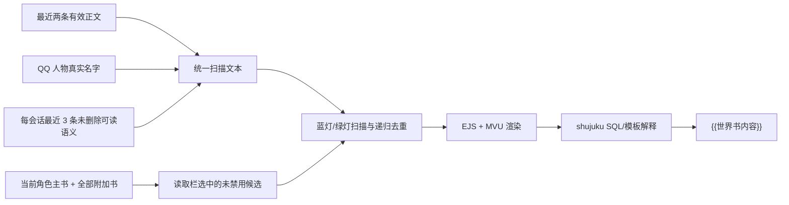
```mermaid
flowchart LR
  A[最近两条有效正文] --> D[统一扫描文本]
  B[QQ 人物真实名字] --> D
  C[每会话最近 3 条未删除可读语义] --> D
  E[当前角色主书 + 全部附加书] --> F[读取栏选中的未禁用候选]
  D --> G[蓝灯/绿灯扫描与递归去重]
  F --> G
  G --> H[EJS + MVU 渲染]
  H --> I[shujuku SQL/模板解释]
  I --> J["{{世界书内容}}"]
```

运行规则：

- [`WorldbookContextResolver.resolve(request)`](../modules/worldbook-reading/context-resolver.js) 是扫描与渲染的唯一边界。它取最近两条非系统、非隐藏、非旁白且成功的正文消息；手动请求仅读当前会话，主动请求读本周期的全部相关会话，每个会话各自截取最近 3 条未删除消息。
- [`production-runtime.js`](../modules/qq-v2/application/production-runtime.js) 在交给 Resolver 前统一调用 `formatQQV2MessageSemantic()`，因此语音、图片、视频、表情、转账和关系系统消息与提示词历史使用同一套可读语义。
- [`WorldbookReadingCatalog`](../modules/worldbook-reading/catalog.js) 只装载当前角色主书和全部附加书。未禁用条目默认全选，设置只稀疏保存 `{ 书名: { UID: false } }`；禁用或未选条目不进入候选集。
- 常驻/蓝灯条目全部激活；选择/绿灯条目支持 TavernHelper 的 `keys`/`filters` 与 `and_any`/`not_all`/`not_any`/`and_all`，并兼容 snake_case、大小写和整词匹配字段。递归最多 10 轮，按书名 + UID 去重；QQ 聊天投影只要带旧 v2 marker 或使用新版 `YuziQQ｜` 保留命名空间就必须排除，外部重写丢失 marker 后也不得读回自身投影。
- 这条链路有意不执行 SillyTavern 的 token 预算、概率、包含组竞争与权重、delay/cooldown、角色/标签过滤或 generation trigger。
- [`st-runtime-adapter.js`](../modules/worldbook-reading/st-runtime-adapter.js) 逐次发现可选 `EjsTemplate` / `Mvu` / `AutoCardUpdaterAPI`，并读取最新 `qrf_plot` / `qrf_plot_tasks`。每次请求会立即捕获当时可用的 `querySql` / `exportTableAsJson` 函数与 receiver，不在执行中重读可能被插件热重载改写的全局方法。EJS 的 `@@activate`/`@@dont_activate`/`@@if`/`@@preprocessing` 在激活前生效，激活后仍逐条渲染正文；所有条目随后合并，只调用一次 [`shujuku-template-renderer.js`](../modules/worldbook-reading/shujuku-template-renderer.js)，因此 `$v` 与 random/calc/max/min store 在同一 `{{世界书内容}}` 内共享请求级作用域。该白名单解释器不使用 `eval` / `new Function`，并处理 random、calc/max/min、db/sql、`$v`、cell 和嵌套条件。
- 世界书目录或条目整体读取失败时，Resolver 静默返回空字符串，QQ 生成继续；单个可选插件或模板能力不可用时，只在对应渲染边界保留原文或跳过依赖它的条件，不恢复旧快照或完整酒馆预设。

维护规则：

- 禁止恢复旧 QQ v1 运行时、存储模型、页面、样式、路由参数、迁移或兼容分支。
- QQ v2 与当前酒馆聊天作用域绑定，但 QQ 内容不是正文表格数据；切换作用域由 v2 runtime 和仓储维护。
- 修改图片资料包格式、覆盖范围或 Facade/Runtime 接线时，必须同步更新并通过 [`check-qq-image-library-pack-contract.cjs`](../scripts/check-qq-image-library-pack-contract.cjs)。
- 世界书列表、角色绑定、世界书读写和聊天文件查证必须使用第 4.1 节登记的宿主 API；遇到新宿主需求先扩展桥接层与本节清单，不在业务代码中临时硬编码。
- Figma UI 融合前，首页 QQ App 只能进入最小安全 fallback，不能借用旧 UI 作为临时回退。
- 不要在 Table Viewer、通用表 CRUD 或 Theater 中补回 QQ 分支；广场、论坛等小剧场仍由 `modules/phone-theater/**` 独立维护。

## 6. UI 模块职责

### 6.1 Home 主屏

- [`renderHomeScreen()`](../modules/phone-home/render.js:139)：主屏入口。
- [`buildHomeScreenViewModel()`](../modules/phone-home/view-model.js:23)：把 rawData 与 settings 转成 app 列表。
- [`patchHomeGrid()`](../modules/phone-home/render.js:88)、[`patchHomeDock()`](../modules/phone-home/render.js:121)：局部更新 DOM。
- [`bindHomeGridInteractions()`](../modules/phone-home/interactions.js:37)、[`bindHomeDockInteractions()`](../modules/phone-home/interactions.js:82)：绑定点击交互。
- [`TABLE_UPDATE_REVIEW_APP_ID`](../modules/table-update-review/constants.js:1) 由 [`buildHomeScreenViewModel()`](../modules/phone-home/view-model.js:23) 作为系统 App 注入 Home，route 固定为 [`TABLE_UPDATE_REVIEW_ROUTE`](../modules/table-update-review/constants.js:2)。
- [`QQ_APP`](../modules/qq-v2/app-definition.js) 是 QQ 在 Home 与外观设置间共享的系统 App 定义；稳定 id 为 `__qq__`、route 为 `qq`，隐藏状态使用 `hiddenTableApps.__qq__`，自定义图标使用 `appIcons.__qq__`。

维护规则：

- 新增系统 App 应进入 view-model，并提供 route。
- home 渲染应继续使用 view-model 与 patch 模式，不要退回整页重建。
- 主页不得使用固定整屏黑色遮罩压暗用户上传的壁纸；用户提供的背景图应由 `.phone-home` 原样显示。
- 无背景图时由 `.phone-home` 自身提供默认背景，不得依赖 `.phone-shell` 深色底透出形成“默认黑幕”。
- App 名称等前景可读性应使用局部 `text-shadow` 或局部 UI 背板处理，不得恢复整屏黑幕作为可读性兜底。
- 首页 App 名称颜色由 `homeAppLabelColorMode` 控制，只允许 `white` / `black` 两档，不要把任意用户输入直通 CSS。
- Home 渲染应通过 `--phone-home-app-label-color` 与 `--phone-home-app-label-shadow` 两个局部 CSS 变量驱动 `.phone-app-label`，覆盖主屏与 Dock 标签。
- 首页存在时，全局应用状态栏的时间、信号、Wi-Fi 和电池颜色也必须由 `homeAppLabelColorMode` 驱动；离开首页后恢复由 `phoneThemeMode` 驱动。
- 如果后续需要更强可读性，应新增局部背板或对比方案；不要恢复 `.phone-home-overlay` 或其他整屏黑幕兜底。

### 6.2 Table Viewer 表格查看器

- [`renderTableViewer()`](../modules/table-viewer/render.js:23)：根据 sheetKey 解析上下文，并进入通用表列表或详情页。
- [`createViewerRuntime()`](../modules/table-viewer/runtime.js:64)：管理 viewer 生命周期、外部表更新监听、草稿预览。
- [`renderGenericListPage()`](../modules/table-viewer/list-page-renderer.js:473)：通用表列表页渲染和局部 patch。
- [`bindGenericListPageController()`](../modules/table-viewer/list-page-controller.js:521)：通用表列表事件委托。

#### 6.2.1 Table Viewer 入口分流

[`renderTableViewer()`](../modules/table-viewer/render.js:23) 是 Table Viewer 唯一入口。流程固定为：

1. 创建 viewer runtime：[`createViewerRuntime()`](../modules/table-viewer/runtime.js:64)。
2. 解析表格上下文：[`resolveTableViewerContext()`](../modules/table-viewer/context.js:4)。
3. 启动 viewer session：[`startViewerSession()`](../modules/table-viewer/runtime.js:211)。
4. 调用 [`detectGenericTemplateForTable()`](../modules/phone-beautify-templates/matcher.js:144) 解析通用模板。
5. 进入 [`renderGenericTableViewer()`](../modules/table-viewer/generic-viewer.js:6)。

新增表格视觉能力时，必须扩展通用模板或 generic runtime；不要在 [`renderTableViewer()`](../modules/table-viewer/render.js:23) 内按表名堆业务条件。实时聊天属于 QQ，不是表格视觉能力。

#### 6.2.2 Viewer runtime 生命周期

[`createViewerRuntime()`](../modules/table-viewer/runtime.js:64) 会在 container 上挂载当前 viewer 的 cleanup 与 runtime 引用：

- cleanup key：[`VIEWER_INSTANCE_CLEANUP_KEY`](../modules/table-viewer/runtime.js:11)。
- runtime key：[`VIEWER_RUNTIME_INSTANCE_KEY`](../modules/table-viewer/runtime.js:12)。
- 草稿预览 cleanup key：[`DRAFT_PREVIEW_CLEANUP_KEY`](../modules/table-viewer/runtime.js:13)。

创建新 viewer 前会先执行旧实例 cleanup；dispose 时会释放 runtime scope、清理新增行 modal、清理模板草稿预览，并把当前 viewing sheet 置空。

viewer runtime 对外提供：

- DOM 事件：[`addEventListener()`](../modules/table-viewer/runtime.js:245)。
- cleanup：[`registerCleanup()`](../modules/table-viewer/runtime.js:248)。
- DOM 断连观察：[`observeDisconnection()`](../modules/table-viewer/runtime.js:251)。
- RAF 与 timeout：[`requestAnimationFrame()`](../modules/table-viewer/runtime.js:254)、[`setTimeout()`](../modules/table-viewer/runtime.js:260)。
- 外部表更新监听：[`bindExternalTableUpdate()`](../modules/table-viewer/runtime.js:188)。
- 本地写入期间抑制外部刷新：[`setSuppressExternalTableUpdate()`](../modules/table-viewer/runtime.js:266)。
- 通用详情页处于 edit dirty 状态时，外部表更新只记录 `pendingExternalTableUpdate`，不覆盖当前 draft；退出编辑、进入字段锁管理或保存成功后再同步真实 sheet 并校验当前行是否仍存在。

页面内事件、modal、局部 controller 应优先使用 viewer runtime；裸 `addEventListener` 只应作为无 runtime fallback。

#### 6.2.3 通用表 runtime 与状态

通用表 runtime 由 [`createGenericTableViewerRuntime()`](../modules/table-viewer/generic-runtime.js:92) 创建。它接收 sheetKey、tableName、headers、rawHeaders、rows 和 genericMatch，并创建 [`createTableViewerState()`](../modules/table-viewer/state.js:559)。

通用表 state 字段包括：

- 页面模式：[`mode`](../modules/table-viewer/state.js:561)，值为 `list` 或 `detail`。
- 当前详情行：[`rowIndex`](../modules/table-viewer/state.js:562)。
- 编辑态：[`editMode`](../modules/table-viewer/state.js:563)、[`draftValues`](../modules/table-viewer/state.js:565)、[`saving`](../modules/table-viewer/state.js:567)。
- 锁管理：[`lockState`](../modules/table-viewer/state.js:566)、[`lockManageMode`](../modules/table-viewer/state.js:568)、[`cellLockManageMode`](../modules/table-viewer/state.js:564)。
- 删除管理：[`deleteManageMode`](../modules/table-viewer/state.js:569)、[`deletingRowIndex`](../modules/table-viewer/state.js:570)、[`selectedDeleteRowIndexes`](../modules/table-viewer/state.js:571)、[`deletingSelection`](../modules/table-viewer/state.js:572)。
- 列表 UI：[`listScrollTop`](../modules/table-viewer/state.js:573)、[`listSearchQuery`](../modules/table-viewer/state.js:575)、[`listSortDescending`](../modules/table-viewer/state.js:576)。

[`TableViewerState`](../modules/table-viewer/state.js:86) 通过 allowedKeys 限制未知字段写入，并通过 [`subscribe()`](../modules/table-viewer/state.js:229) 通知局部刷新。列表模式下 [`createGenericTableViewerRuntime()`](../modules/table-viewer/generic-runtime.js:92) 只对搜索、排序、锁、删除等列表相关字段触发局部刷新。

#### 6.2.4 通用表列表页

[`renderGenericListPage()`](../modules/table-viewer/list-page-renderer.js:473) 使用 [`buildGenericListPageViewModel()`](../modules/table-viewer/list-page-renderer.js:58) 构建列表视图模型。核心规则：

- 每行由 [`buildGenericRowViewModel()`](../modules/table-viewer/row-view-model.js:221) 生成标题、状态、时间、摘要、搜索索引。
- 模板字段绑定来自 [`createGenericTemplateStylePayload()`](../modules/table-viewer/generic-style-payload.js:96) 输出的 `fieldBindings`。
- 列表 patch 使用 `rowKey` 与 `rowVersion`，见 [`buildGenericListRowRenderVersion()`](../modules/table-viewer/list-page-renderer.js:264)。删除选择态会进入 `rowVersion`，否则圆圈勾选变化不会触发行节点替换。
- 搜索基于 [`searchText`](../modules/table-viewer/row-view-model.js:262)，排序通过 [`listSortDescending`](../modules/table-viewer/state.js:576) 控制。删除态下搜索变化必须把 [`selectedDeleteRowIndexes`](../modules/table-viewer/state.js:571) 约束到当前可见且未锁定行，防止隐藏行被误删。
- 新增、锁定、删除按钮是否显示由模板 `structureOptions.bottomBar` 影响，最终进入 [`buildGenericListBottomBarHtml()`](../modules/table-viewer/list-page-template.js:313)。删除态下右侧单行删除按钮会替换为圆形选择控件，标题栏右侧由 [`buildGenericListNavHtml()`](../modules/table-viewer/list-page-template.js:117) 渲染全选、清空、批量删除按钮。

列表页事件由 [`bindGenericListPageController()`](../modules/table-viewer/list-page-controller.js:521) 委托处理。新增行弹窗入口是 [`showGenericAddRowModal()`](../modules/table-viewer/add-row-modal.js:223)。删除入口由 [`createRowDeleteController()`](../modules/table-viewer/row-delete-controller.js:80) 生成。通用表批量删除通过 [`deleteRowsFromList()`](../modules/table-viewer/row-delete-controller.js:97) 调用 [`deleteSheetRows()`](../modules/phone-core/table-support.js:122)，底层进入 [`deleteTableRowsBatch()`](../modules/phone-core/data-api/table-repository.js:1008)。成功删除后保留删除管理态并清空本次选择，方便连续清理；部分失败时将失败行索引按成功删除结果重映射后继续选中。

#### 6.2.5 通用表详情页与编辑保存

[`renderGenericDetailPage()`](../modules/table-viewer/detail-page-renderer.js:53) 会先同步锁状态，再通过 [`buildGenericDetailRowPayload()`](../modules/table-viewer/detail-row-payload.js:36) 生成字段详情 payload，最后调用 [`bindGenericDetailEditController()`](../modules/table-viewer/detail-edit-controller.js:46) 绑定详情页交互。

详情页编辑规则：

- [`setEditMode()`](../modules/table-viewer/state.js:341) 进入或退出编辑态。
- [`updateDraftValue()`](../modules/table-viewer/state.js:405) 按列索引记录草稿。
- [`setCellLockManageMode()`](../modules/table-viewer/state.js:356) 进入字段锁管理态，并关闭编辑态。
- 保存时 [`handleSaveRow()`](../modules/table-viewer/detail-edit-controller.js:275) 从 draftValues 构造 updateData，通过 runtime 注入的 [`getLiveTableName()`](../modules/table-viewer/generic-runtime.js:204) 取得当前表名，并调用 [`updateTableRow()`](../modules/phone-core/data-api/table-repository.js:691) 行级更新目标数据行；详情保存禁止克隆整库快照后全量覆盖。
- 保存期间会开启外部表更新 suppress，并在 finally 释放；保存成功后必须调用 [`syncRowsFromSheet()`](../modules/table-viewer/generic-runtime.js:172) 对账真实 sheet。若刷新失败或当前行已不存在，详情页返回列表并提示；保存失败时保持 edit mode 与 draft。
- 用户退出编辑或进入字段锁管理时，如果此前存在 pending external update，controller 会消费该 pending、同步真实 sheet 并重新渲染，避免把外部更新静默丢弃。

详情页 controller 每次绑定前会执行旧 cleanup，标识是 [`DETAIL_CONTROLLER_CLEANUP_KEY`](../modules/table-viewer/detail-edit-controller.js:5)。这是通用表详情页避免 per-render 事件泄漏的基本机制。

#### 6.2.6 通用模板 style payload

[`createGenericTemplateStylePayload()`](../modules/table-viewer/generic-style-payload.js:96) 是 generic 模板进入 DOM 的桥：

- 若没有有效 generic template，返回默认 layoutOptions 和默认字段绑定。
- 若有模板，则读取 `styleTokens` 生成 CSS 变量、读取 `fieldBindings` 生成字段绑定、读取 `layoutOptions` 生成 data attributes。
- data attributes 包括 [`data-layout-page-mode`](../modules/table-viewer/generic-style-payload.js:171)、[`data-layout-nav-mode`](../modules/table-viewer/generic-style-payload.js:172)、[`data-layout-list-container-mode`](../modules/table-viewer/generic-style-payload.js:173)、[`data-layout-detail-field-layout`](../modules/table-viewer/generic-style-payload.js:177)、[`data-layout-density`](../modules/table-viewer/generic-style-payload.js:182) 等。
- 自定义 CSS 通过 [`buildScopedCustomCss()`](../modules/table-viewer/template-runtime.js:72) 包裹到 `.phone-generic-template-*` 作用域下。

CSS 层读取这些 data attributes 和 CSS 变量，见 [`styles/05-phone-generic-template.css`](../styles/05-phone-generic-template.css:7)。

#### 6.2.7 模板草稿预览与自定义 CSS

[`bindTemplateDraftPreviewForViewer()`](../modules/table-viewer/template-runtime.js:260) 为 Table Viewer 接收模板草稿预览事件。草稿模板会先经过 [`resolveTemplateWithDraftForViewer()`](../modules/table-viewer/template-runtime.js:50) 去掉 annotated wrapper，并把 advanced customCss 合并到运行时结构。

自定义 CSS 统一走 [`buildScopedCustomCss()`](../modules/table-viewer/template-runtime.js:72)：先调用 [`sanitizeCSS()`](../modules/utils/sanitize.js:54)，再把普通 selector 加上模板 scope；`:root` 会被替换为当前 scope。

维护规则：

- 所有表格都走 generic runtime；不要为单张表创建专属 viewer 分支。
- 列表页 patch 依赖 rowKey 和 rowVersion，改 row view model 时要维护版本字段；新增批量操作状态也必须进入对应 patch 计划和 nav/content region，否则标题栏数量或行选择态会停留在旧 DOM。
- 通用表批量删除只能删除当前可见且未锁定行；搜索、排序、锁状态变化后必须重新计算可选集合，不能把隐藏行或锁定行留在 [`selectedDeleteRowIndexes`](../modules/table-viewer/state.js:571)。
- 通用表批量删除必须走 [`deleteRowsFromList()`](../modules/table-viewer/row-delete-controller.js:97) 与行级仓库接口，并在成功删除后调用 [`remapTableLockStateAfterRowsDelete()`](../modules/phone-core/data-api/lock-repository.js:169) 一次性重排锁状态；禁止逐个调用单行重排后再叠加索引偏移。
- 通用表新增字段展示能力时，应优先扩展模板 fieldBindings 和 row view model，不要硬编码某个表头。
- 所有表格数据写入都应经 phone-core data-api 或 [`table-support.js`](../modules/phone-core/table-support.js:1)，不要在 UI 控制器里直接访问宿主全局 API。
- 运行时表格 CRUD 只能使用行级数据库接口；新增、保存、删除和小剧场级联删除都不得调用 [`importTableAsJson()`](reference/API_DOCUMENTATION.md:177) 或等价整库覆盖流程。
- 任何异步写入、AI 调用、删除或导入完成后，都必须确认 viewer runtime 仍有效再写 DOM 或 state。

### 6.3 Settings App

- [`renderSettings()`](../modules/settings-app/render.js:102)：设置 App 总入口。
- [`createSettingsAppState()`](../modules/settings-app/state-machine.js:18)：集中定义设置页 state。
- [`createPageRuntimeManager()`](../modules/settings-app/page-runtime.js:30)：管理每个 mode 的页面 runtime。
- [`createSettingsPageRenderers()`](../modules/settings-app/page-renderers.js:120)：组合 personalization、preset、editor 三类渲染器。

#### 6.3.1 Settings App 渲染主循环

[`renderSettings()`](../modules/settings-app/render.js:102) 的主流程是：创建 state、创建 page runtime 管理器、创建 renderer 依赖、执行按 mode 分发的页面渲染。外部路由只需要调用 [`renderSettings()`](../modules/settings-app/render.js:102)，不要直接调用设置页子页面。

页面切换时，设置 App 采用“页面对象 + page runtime”的生命周期模型：

1. [`render()`](../modules/settings-app/render.js:182) 读取 [`state.mode`](../modules/settings-app/state-machine.js:21)。
2. 若当前页面不能原地更新，则 [`disposeCurrentPageSession()`](../modules/settings-app/render.js:122) 先调用旧页面的 [`dispose()`](../modules/settings-app/render.js:124)，再释放旧 page runtime。
3. [`createCurrentPageRuntime()`](../modules/settings-app/page-runtime.js:41) 为新 mode 创建新的 runtime scope。
4. 页面定义通过 [`createPage()`](../modules/settings-app/page-renderers/preset-renderers.js:24) / [`createPage()`](../modules/settings-app/page-renderers/editor-renderers.js:19) / [`createPage()`](../modules/settings-app/page-renderers/personalization-renderers.js:43) 返回页面对象。
5. 页面对象可提供 [`mount()`](../modules/settings-app/render.js:119)、[`update()`](../modules/settings-app/render.js:119)、[`dispose()`](../modules/settings-app/render.js:119) 三类生命周期入口。

#### 6.3.2 Settings state 契约

[`createSettingsAppState()`](../modules/settings-app/state-machine.js:18) 是设置页 state 的默认事实源。当前 state 包括：

- 页面 mode：[`mode`](../modules/settings-app/state-machine.js:21)。
- 各页面滚动位置：[`apiPresetsScrollTop`](../modules/settings-app/state-machine.js:4)、[`appearanceScrollTop`](../modules/settings-app/state-machine.js:5)、[`beautifyScrollTop`](../modules/settings-app/state-machine.js:6)、[`buttonStyleScrollTop`](../modules/settings-app/state-machine.js:7)、[`aiInstructionPresetsScrollTop`](../modules/settings-app/state-machine.js:8)。

- QQ API 预设地址由 [`modules/qq-v2/api-endpoint-policy.js`](../modules/qq-v2/api-endpoint-policy.js) 统一规范化：HTTPS 地址可用；HTTP 仅允许回环地址或 RFC1918 私有 IPv4（`10/8`、`172.16/12`、`192.168/16`），保存边界与请求边界必须复用同一策略。地址仍按 OpenAI 兼容 base URL 处理，并自动收敛到 `/v1`。
- API 预设页面收到 `readOnly: true` 的运行时虚拟预设时，只渲染禁用的“数据库当前 API（只读）”选项；编辑区及保存、删除、加载模型操作必须保持不可用。该虚拟预设不应写入 shared resource storage。QQ v2 的 `activeApiPresetId` 解析器仍须识别其稳定虚拟 ID，并把请求交给数据库受限代理。

新增 state 字段时，必须先进入 [`createSettingsAppState()`](../modules/settings-app/state-machine.js:18)，再同步 context builder、页面 renderer 和类型声明。不要在某个页面局部临时塞匿名字段，否则下一次切页或滚动保留会找不到它。

#### 6.3.3 AI 指令预设

[`ai-instruction-presets.js`](../modules/settings-app/pages/ai-instruction-presets.js:1) 只负责维护 QQ 可复用的 AI 指令预设。QQ 的 API 预设、会话运行设置和世界书投影状态均由 QQ v2 runtime 与 Facade 管理。设置 App 不恢复旧“API 与世界书”工作台；新 [`worldbook-reading.js`](../modules/settings-app/pages/worldbook-reading.js) 只管理 `{{世界书内容}}` 的候选条目，不管理 QQ 投影目标和注入开关。

#### 6.3.4 Page runtime 稳定代理

[`createPageRuntimeManager()`](../modules/settings-app/page-runtime.js:30) 返回的 [`pageRuntime`](../modules/settings-app/page-runtime.js:63) 是稳定代理对象。页面 renderer 可以长期持有它，因为每个方法都会转发到当前 mode 对应的 runtime scope。

稳定代理提供以下能力：

- 定时器：[`setTimeout()`](../modules/settings-app/page-runtime.js:64)、[`setInterval()`](../modules/settings-app/page-runtime.js:76)。
- 动画帧：[`requestAnimationFrame()`](../modules/settings-app/page-runtime.js:88)。
- 事件委托：[`addEventListener()`](../modules/settings-app/page-runtime.js:100)。
- DOM 观察：[`observeMutation()`](../modules/settings-app/page-runtime.js:103)、[`observeDisconnection()`](../modules/settings-app/page-runtime.js:109)。
- 清理注册：[`registerCleanup()`](../modules/settings-app/page-runtime.js:115)。
- 生命周期判断：[`isDisposed()`](../modules/settings-app/page-runtime.js:118)。

页面内异步回调在 await、FileReader、图片裁剪、外部 API 读取之后，应读取 [`isDisposed()`](../modules/settings-app/page-runtime.js:118) 决定是否继续写 state 或 DOM。

#### 6.3.5 Renderer 分组与依赖注入

[`createSettingsPageRenderers()`](../modules/settings-app/page-renderers.js:120) 先通过 [`validateSettingsRendererDeps()`](../modules/settings-app/page-renderers.js:21) 校验依赖，再构造 services 与 page contexts。页面分为三组：

- Personalization：[`createPersonalizationPageRenderers()`](../modules/settings-app/page-renderers/personalization-renderers.js:16)，包含 home、appearance、button style 和 worldbook reading。
- Preset：[`createPresetPageRenderers()`](../modules/settings-app/page-renderers/preset-renderers.js:11)，包含 API 预设、AI 指令预设。
- Editor：[`createEditorPageRenderers()`](../modules/settings-app/page-renderers/editor-renderers.js:17)，包含 beautify。

[`createSettingsPageContexts()`](../modules/settings-app/page-renderers/page-context-builders.js:153) 是页面上下文聚合入口。各子 context 只暴露页面需要的 service 子集，例如 [`buildApiPresetsPageContextFromServices()`](../modules/settings-app/page-renderers/page-context-builders.js:137) 与 [`buildAiInstructionPresetsPageContextFromServices()`](../modules/settings-app/page-renderers/page-context-builders.js:128) 只暴露 QQ v2 预设服务，worldbook reading context 则只暴露 [`WorldbookReadingCatalog`](../modules/worldbook-reading/catalog.js)。旧数据库配置和“API 与世界书”工作台仍没有对应 context。

维护规则：

- 新增设置页面 mode 时，需要同步 state、page renderer、layout builder、入口导航和 context builder。
- 页面内部事件要通过 [`pageRuntime.addEventListener()`](../modules/settings-app/page-runtime.js:100) 或 [`pageRuntime.registerCleanup()`](../modules/settings-app/page-runtime.js:115) 注册。
- 页面 renderer 不直接 import 顶层 phone-core service；应通过 [`page-context-builders.js`](../modules/settings-app/page-renderers/page-context-builders.js:1) 注入所需能力。
- 兼容型页面可以保留旧函数式 renderer 出口，但新增页面应优先提供页面对象生命周期。
- “读取世界书”搜索只局部替换条目与状态区，不替换正在输入的搜索框；每次条目 DOM 替换前必须释放旧 checkbox listener。页面 lifecycle epoch 与 load generation 必须分开，刷新不得使建立中的 `WORLDINFO_UPDATED` 订阅失效。
- 扩展设置面板由 [`createPhoneSettingsPanel()`](../modules/settings-panel.js:37) 创建前清理旧 listener，卸载时通过 [`destroyPhoneSettingsPanel()`](../modules/settings-panel.js:31) 移除面板与事件绑定，避免重复初始化后旧闭包继续响应。
- 设置持久化 flush 只承诺清理本扩展的 debounce/maxWait/pending ctx 并触发宿主 [`saveSettingsDebounced()`](../modules/settings/persistence.js:51)；当前文档和日志不得写成“同步落盘”或“立即持久化”。该计时器边界由 [`scripts/check-settings-flush-timer-behavior.cjs`](../scripts/check-settings-flush-timer-behavior.cjs) 守护。

#### 6.3.6 Appearance 外观资源与字体库

Appearance 页面服务统一由 [`appearance-settings.js`](../modules/settings-app/services/appearance-settings.js:1) 聚合，不允许页面直接绕过 facade import 子服务。当前外观页新增两类持久设置：

- [`appearanceResourcePool`](../modules/settings/schema.js:124)：legacy compatibility 字段，仅用于旧设置归一化与旧数据清理；当前外观包导入导出业务不得再读取或写入资源池内容，导入成功后会清空为 `wallpapers: []` 与 `icons: []`。
- [`appearanceFontLibrary`](../modules/settings/schema.js:128)：保存当前启用字体 id 和用户导入字体列表，内置字体 id 由 [`font-library-service.js`](../modules/settings-app/services/appearance-settings/font-library-service.js:1) 与 schema 白名单共同约束。
- `appIconOrigins`：只记录通过“从当前美化包选择”入口设置的 App 图标来源包 id；本地上传与整包应用都会清除此来源关系。

资源包链路：

1. UI 入口由 [`buildAppearancePageHtml()`](../modules/settings-app/layout/page-builders/appearance-builders.js:27) 输出，事件绑定在 [`bindAppearanceResourcePackActions()`](../modules/settings-app/pages/appearance.js:199)。
2. 导入导出实现位于 [`resource-pack-service.js`](../modules/settings-app/services/appearance-settings/resource-pack-service.js:1)，格式常量为 `yuzi-phone-appearance-pack`；导出只包含当前 [`backgroundImage`](../modules/settings/schema.js:107) 与当前 [`appIcons`](../modules/settings/schema.js:108)，`iconPool` 仅保留为空数组兼容旧格式。
3. 图标位枚举必须复用 [`collectAppearanceIconSlots()`](../modules/settings-app/services/appearance-settings/icon-slots.js:43)，不要在资源包服务和图标上传 UI 中各写一套 key 枚举。
4. 图标导入先全局按资源项 `name` 与当前图标位 `name` 精准匹配并锁定所有完全同名图标位；剩余图标再按名称相似度打分，从高到低匹配剩余图标位；仍未命中的图标按剩余图标位顺序补位，直到当前图标位填满或美化包图标耗尽。`slotKey` 只作为历史字段保留，不参与导入分配。
5. 导入使用替换语义写入 [`appIcons`](../modules/settings/schema.js:108)：分配成功的图标写入当前 slot 的真实 key，包内多余图标直接丢弃，包内图标不足的位置不保留旧图标，首页自然回退默认文字图标。
6. 导入保存使用 [`savePhoneSettingsPatch()`](../modules/settings/persistence.js:171) 的布尔返回值判断是否成功；失败时必须回滚旧 [`backgroundImage`](../modules/settings/schema.js:107)、[`appIcons`](../modules/settings/schema.js:108)、`appIconOrigins` 与 legacy [`appearanceResourcePool`](../modules/settings/schema.js:124)。整包应用使用既有名称匹配和顺序补位语义，但不会把分配结果登记成逐图标来源。

美化包仓库链路：

1. settings 只保存轻量激活标记 [`appearanceActivePackId`](../modules/settings/schema.js:122)，不保存多个完整外观包；该字段由 schema 归一化为最长 160 字符的字符串。
2. 本地仓库由 [`appearance-pack-repository.js`](../modules/settings-app/services/appearance-settings/appearance-pack-repository.js:1) 封装，使用独立 IndexedDB 数据库 `yuzi-phone-appearance-packs`、object store `appearancePacks`、`keyPath: 'id'`。
3. 仓库容量边界固定为最多 20 个包、单包 20MB、总量 100MB；写入前会校验外观包格式、数量、单包容量和总容量，IndexedDB quota/access/unknown 错误会被结构化返回。
4. [`listAppearancePacks()`](../modules/settings-app/services/appearance-settings/appearance-pack-repository.js:219) 只返回 metadata，不把完整 `pack` 复制给 UI；完整包只在应用时通过 [`getAppearancePack()`](../modules/settings-app/services/appearance-settings/appearance-pack-repository.js:234) 读取。
5. 页面只能通过 [`appearance-settings.js`](../modules/settings-app/services/appearance-settings.js:1) facade 暴露的 `importAppearancePackToRepository()`、`listAppearancePacks()`、`applyAppearancePackFromRepository()` 与 `deleteAppearancePackFromRepository()` 操作仓库，不允许页面裸用 IndexedDB。
6. 导入 JSON 美化包只保存到仓库，不自动应用；应用仓库包时才写入当前 [`backgroundImage`](../modules/settings/schema.js:107)、[`appIcons`](../modules/settings/schema.js:108)，并更新 `appearanceActivePackId`。
7. 删除当前激活仓库包会清空 `appearanceActivePackId`，但不撤销整包应用留下的背景和图标；只有通过图标选择器登记在 `appIconOrigins` 中、来源正是该包的图标会恢复默认。设置补丁必须先成功持久化，再删除仓库包；仓库删除失败时恢复原设置。

自定义图标选择链路：

1. 上传按钮仍是唯一入口；没有当前美化包或当前包不含图标时，直接进入原本的本地上传与裁剪。
2. 当前包有图标时，来源菜单和图标网格统一挂载到小手机临时层；图标列表只读取 `appearanceActivePackId` 对应包，并合并 `pack.icons` 与 `pack.iconPool`，按图片内容去重且保持原始顺序。
3. 包内图标点击后直接写入目标 `appIcons` 和 `appIconOrigins`，不进入裁剪；本地上传替换同一图标时清除其来源记录。

图片上传与裁剪链路：

1. 背景图、自定义 App 图标、悬浮按钮封面等图片上传入口必须统一走 [`media-upload.js`](../modules/settings-app/services/media-upload.js:1) façade；页面和业务服务不得绕过 façade 直接拼接 FileReader、canvas 或裁剪 DOM。
2. 裁剪弹窗实现位于 [`crop.js`](../modules/settings-app/services/media-upload/crop.js:1)，由 [`picker.js`](../modules/settings-app/services/media-upload/picker.js:1) 在读取图片后调用；弹窗挂载到 `document.body`，是全局 modal，不是小手机内部弹窗。
3. 裁剪 overlay 层级必须高于小手机容器 `9991` 与悬浮按钮 `10000`；当前样式在 [`08-image-crop.css`](../styles/phone-base/08-image-crop.css:1) 固定为 `z-index: 10020`。这里如果降回普通设置页层级，手机端会再次被小手机和 toggle 遮住，漏洞明显得像是故意写给事故看的。
4. [`openImageCropDialog()`](../modules/settings-app/services/media-upload/crop.js:245) 支持 `showCropFullImageButton?: boolean` 与 `cropFullImageButtonText?: string`；`showCropFullImageButton` 默认启用，点击 `全图` 将裁剪框设置为整张图片归一化区域 `{ x: 0, y: 0, w: 1, h: 1 }`。
5. 上传链路的异步节点必须检查生命周期：FileReader 读取后、裁剪弹窗返回后、压缩 canvas 返回后，都要通过 `runtime/pageRuntime.isDisposed()` 短路；页面销毁后继续压缩、弹窗或触发保存回调，都是状态污染。

字体库链路：

1. 字体视图模型、导入、选择、删除和运行时应用集中在 [`font-library-service.js`](../modules/settings-app/services/appearance-settings/font-library-service.js:1)。
2. [`appearanceFontLibrary`](../modules/settings/schema.js:128) 同时承载两类用户字体来源：本地 `data-url` 字体保存 `dataUrl` 并计入本地容量；远程 `css-url` 字体只保存 `cssUrl` 与 `family`，固定 `bytes: 0`，不下载、不缓存远程 CSS 或字体文件，也不把远程资源改写成 data URL。
3. `css-url` 来源只允许 `https://...` 字体 CSS URL；`http://`、相对路径、`javascript:`、`file:`、`data:`、`blob:` 与任意 CSS 片段都不在支持范围内。这里的边界必须由 schema 与 service 双层维持，不能只靠 UI 提示碰运气。
4. 运行时动态样式顺序固定为：远程字体 `@import` 列表 → `buildBuiltinFontFaceCss(activeFont)` → 本地用户字体 `@font-face` 列表 → [`buildScopedFontOverrideCss(activeFont)`](../modules/settings-app/services/appearance-settings/font-library-service.js:217)。`@import` 必须位于动态 style 顶部，早于任何 `@font-face`，否则浏览器会安静地把错误顺序当成你自找的故障。
5. 作用域字体应用继续通过动态 `@font-face` / `@import` 与 [`--yuzi-phone-font-family`](../styles/phone-base/01-shell-system.css:1) 注入，并用 `#yuzi-phone-standalone[data-yuzi-phone-font-id]` 作用域规则压过 SillyTavern 主题字体；不允许把用户提供的任意 CSS（例如 `body { font-family: ... }`）原样注入到全局页面。
6. 本地用户字体容量限制已提升为单文件 15MB、总计 30MB；远程 `css-url` 字体仍计入 `userFonts` 数量上限 `12`，但不占用本地 `totalFontBytes`。别把“数量限制”和“本地字节容量”混为一谈，那会直接把 schema 和 UI 说明写坏。
7. 内置字体入口固定为 `builtin.system-ui`、`builtin.modern-sans`、`builtin.chill-round`、`builtin.basic-sans`；`builtin.chill-round` 的 ChillRoundF OTF 文件只从 [`assets/fonts/chill-round-f/`](../assets/fonts/chill-round-f/) 正式资源目录加载，不依赖临时解压目录。
8. ChillRoundF 使用 SIL Open Font License 1.1，发布包必须保留 [`LICENSE.txt`](../assets/fonts/chill-round-f/LICENSE.txt)；不要把 `ChillRoundF_Update.pdf` 或 `.ttf` 文件放进运行资源，也不要擅自转换 `woff2` 制造派生字体风险。
9. 旧内置 ID（`builtin.system`、`builtin.rounded`、`builtin.serif`、`builtin.handwriting`）不做迁移映射；旧设置或非法 `activeFontId` 由 `normalizeAppearanceFontLibrarySettings()` 回退到 `builtin.system-ui`。这不是兼容遗漏，而是避免书面型/手写型旧语义继续污染当前 UI 字体库。
10. 字体选择、本地字体导入、URL 字体导入、字体删除和资源包导入成功后的重渲染都应走 [`rerenderAppearanceKeepScroll`](../modules/settings-app/render.js:219)，异步 FileReader 回调必须先检查 [`pageRuntime.isDisposed()`](../modules/settings-app/page-runtime.js:118)。这里如果裸调用 `render()`，设置页回顶和销毁后 DOM 写入会一起回来，能跑但不能交付。

### 6.4 Beautify 模板系统

Beautify 现在包含两套职责严格隔离的系统：

1. 旧 [`phone-beautify-templates`](../modules/phone-beautify-templates/) 继续负责内置模板与历史用户配置的兼容读取；旧用户写入 API 保持禁用，旧数据不得被新工坊迁移、覆盖或删除。
2. 新 [`content-presets`](../modules/content-presets/) 负责玉子美化完整预设、独立 IndexedDB、真实表匹配、动态运行实例与模板工坊操作。产品端“模板工坊”只写入新数据库，不得重新连接旧 Beautify store。

两套系统可以同时存在于 Table Viewer 的分派链中，但存储、写入、绑定和页面管理入口不得混用。

#### 6.4.1 内置默认与历史兼容

核心常量在 [`constants.js`](../modules/phone-beautify-templates/constants.js:1)：

- 通用模板类型：[`PHONE_TEMPLATE_TYPE_GENERIC`](../modules/phone-beautify-templates/constants.js:1)，值为 `generic_table_template`。
- 内置通用表模板：`builtin.generic.table.v1`。

用户模板 store 使用设置字段 [`PHONE_BEAUTIFY_STORE_KEY`](../modules/phone-beautify-templates/constants.js:8)。[`readTemplateStore()`](../modules/phone-beautify-templates/store.js:93) 从 settings 读取并归一化；[`saveTemplateStore()`](../modules/phone-beautify-templates/store.js:86) 会重新 normalize、写入 [`schemaVersion`](../modules/phone-beautify-templates/store.js:79)、更新时间戳，并保存到 settings。

旧用户的 `templates`、`bindings`、`user` source mode 和用户 active template 仍会被读取。这条链路只用于方案 A 的历史兼容：用户没有主动恢复时，升级、启动、打开设置或打开表格都不得自动清理旧配置。`bindings` 是 sheetKey → templateId 的表级绑定，优先级高于 active 模板；它和内置模板中的 `render.fieldBindings` 完全不同，恢复操作不得删除后者。

#### 6.4.2 读取与匹配优先级

缓存由 [`cache.js`](../modules/phone-beautify-templates/cache.js:1) 管理 store、内置模板和派生读取结果。匹配入口在 [`matcher.js`](../modules/phone-beautify-templates/matcher.js:37)：

1. 历史表级 binding 命中后返回 `manual_binding`。
2. active template 次之。
3. matcher score 最后，并按 score、sourcePriority、updatedAt 排序。

[`getBeautifyTemplateSourceModeRuntime()`](../modules/phone-beautify-templates/repository.js:329) 继续支持历史 `user` source mode：有用户模板时读取用户模板，没有时回退内置模板。不要把“产品端禁写”误实现成 matcher 或 repository 禁读，否则旧用户会在没有确认的情况下丢失外观。

#### 6.4.3 旧 Beautify 用户写入退役策略

稳定错误码由 [`policy.js`](../modules/phone-beautify-templates/policy.js:1) 定义为 `BEAUTIFY_USER_TEMPLATE_WRITE_DISABLED`。以下兼容 API 保留函数签名，但只返回统一拒绝结果，不再写 settings 或失效缓存：

- `savePhoneBeautifyUserTemplate()`
- `deletePhoneBeautifyUserTemplate()`
- `importPhoneBeautifyPackFromData()`
- `setBeautifyTemplateSourceMode()`
- `setActiveBeautifyTemplateIdByType()`
- `bindSheetToBeautifyTemplate()`
- `clearSheetBeautifyBinding()`

底层 [`saveTemplateStore()`](../modules/phone-beautify-templates/store.js:86) 没有删除，因为历史读取归一化和受控系统维护仍依赖 store 模型；它不是产品端重新开放旧用户模板管理的许可。新模板工坊的导入导出由 `content-presets` 独立实现，不得调用旧 import/export API。

#### 6.4.4 旧 Beautify 恢复内置默认兼容 API

[`restorePhoneBeautifyTemplatesToBuiltinDefaults()`](../modules/phone-beautify-templates/reset.js:76) 作为旧系统的受控兼容清理 API 保留，但不再是当前模板工坊页面入口。它只调用一次 `savePhoneSettingsPatch()`，把旧设置收敛为：

- store：`templates=[]`、`bindings={}`；
- generic active：`builtin.generic.table.v1`。

写入成功后用例统一调用 [`invalidatePhoneBeautifyTemplateCache()`](../modules/phone-beautify-templates/cache.js:121)，并回读原始 settings、规范化 store、source runtime 和两个 matcher。任一验证失败都返回失败结果；固定目标允许调用方幂等重试。这里的 settings patch 只表示内存设置已更新并已调度宿主保存，不得声称获得磁盘事务 durability ack。

#### 6.4.5 模板工坊页面

[`beautify.js`](../modules/settings-app/pages/beautify.js:1) 通过注入的 [`contentPresetWorkshopService`](../modules/content-presets/workshop-service.js:47) 读取预设 ViewModel、真实表候选与当前绑定，并订阅 content preset index 更新。页面生命周期负责重渲染、取消旧交互、解除订阅和阻止销毁后的异步提交。

[`beautify-behavior.js`](../modules/settings-app/pages/beautify-behavior.js:1) 使用容器级 `[data-action]` 事件委托提供：

- `import`：读取 JSON 文件文本，调用 `prepareImport()`，由 Bundle 的 `format`、`formatVersion`、`apiVersion` 与结构合同判定是否接受，不按文件名或扩展名识别格式；同 ID 覆盖必须二次确认，再由 `importPrepared()` 原子替换并清除旧绑定。
- `export`：调用 `exportPreset()` 下载完整 Bundle。
- `delete`：二次确认后调用 `deletePreset()`，在同一事务删除预设和所有引用绑定。
- `activate` / `clear`：设置或清除单张真实表的当前预设项。
- `clear-all`：清除全部新工坊表级绑定，但保留已导入预设。

执行期间使用页面级 busy 锁阻止重复提交；失败后必须释放按钮以允许重试；页面销毁后不得继续 toast、刷新或提交旧回调。页面不得出现旧 `phone-beautify-restore-defaults-btn`，也不得导入 `phone-beautify-templates/`。

新写入链固定为 `beautify page → contentPresetWorkshopService → mutation-coordinator → content-presets/repository`。repository 只有在 IndexedDB transaction `oncomplete` 后才报告成功；提交后再更新内存索引、失效运行实例并收敛当前路由。

维护规则：

- 启动阶段只允许 [`repairActiveBeautifyTemplateSettings()`](../modules/phone-beautify-templates/repository.js:290) 修复无效 active 引用，禁止调用恢复用例或强制清理有效历史用户配置。
- 恢复只清 store 的表级 `bindings`，绝不能删除内置模板的 `render.fieldBindings`。
- 新工坊覆盖、删除或清绑定只允许修改 `yuzi-phone-template-workshop-v2`，不得写入旧 `yuziPhoneBeautifyTemplates` settings。
- 不在 Table Viewer 内复制第二套模板选择或默认渲染架构。
- 物理通用表可以成为 content preset item 的匹配与激活目标，并经 `table:<sheetKey>` 尝试新预设；提交前失败时精确回 generic renderer。`table-generic:<sheetKey>` 永久旁路新预设查询。Theater 与 Generic 运行失败时必须精确回到各自原 renderer，不得互相降级。

### 6.5 Fusion 模板缝合

- [`renderFusion()`](../modules/phone-fusion/render.js:80)：页面入口。
- [`createFusionPageRuntime()`](../modules/phone-fusion/runtime.js:40)：页面 runtime 与下载 URL 清理。
- [`createFusionInteractionController()`](../modules/phone-fusion/interactions.js:87)：交互控制器。

维护规则：

- Object URL 必须通过 [`revokeFusionDownloadUrl()`](../modules/phone-fusion/runtime.js:7) 清理。
- 页面切换前必须走 [`cleanupFusionPageResources()`](../modules/phone-fusion/runtime.js:27)。
- [`setFusionDownloadUrl()`](../modules/phone-fusion/runtime.js:19) 设置新下载 URL 前会 revoke 旧 URL；空合并分支在写入空结果前调用 [`clearFusionResult()`](../modules/phone-fusion/runtime.js:114)，避免旧下载入口和 Object URL 泄漏。该行为由 [`scripts/check-fusion-object-url-behavior.cjs`](../scripts/check-fusion-object-url-behavior.cjs) 守护。
- 新增 Fusion 输出路径必须继续覆盖“先有旧 URL、再生成空结果”的行为测试，不能只验证成功合并路径。
- 模板导入结果只接受旧版布尔 `true` 或普通对象且 `success === true`；`{ success:false, message }` 必须按真实失败透传，null、undefined、数组、字符串和缺少严格 success 的对象必须拒绝。
- 导入成功提示优先使用底层 `message`；底层未提供时再使用 scope 与 presetName 生成本地文案。Fusion 不拥有数据库投影刷新职责。

### 6.6 Theater 小剧场

Theater 是“把表格数据投影成场景页面”的子系统。它不是 Table Viewer 的换皮，也不是给每张表单独写页面分支；它通过 scene registry 把一张或多张固定表组合成一个虚拟 App。正常 Home/Slash 入口以主物理表的 `table:<sheetKey>` 进入对应场景，裸 `theater:<sceneId>` 仅保留历史兼容。当前内置 `square` / `forum` / `live` / `calendar` / `diary` 均为单表 scene，但架构仍保留未来扩展多表 scene 的能力。

核心入口：

- [`renderTheaterScene()`](../modules/phone-theater/render.js:118)：场景页面入口，负责读取当前场景状态、拉取 raw table data、构建 view model、生成页面 HTML 并绑定交互。
- [`buildTheaterSceneViewModel()`](../modules/phone-theater/data.js:151)：把 raw data 和 scene definition 转成渲染用 view model。
- [`bindTheaterSceneInteractions()`](../modules/phone-theater/interactions.js:408)：绑定通用删除管理态，并把 scene 专属交互委托给 scene definition。
- [`deleteTheaterEntities()`](../modules/phone-theater/delete-service.js:341)：执行跨表级联删除计划，调用 [`deleteTableRowsBatch()`](../modules/phone-core/data-api/table-repository.js:1008) 做行级批量删除，等待底层真实 settlement，再派发小手机本地 UI 更新事件。
- [`theaterRenderKit`](../modules/phone-theater/core/render-kit.js:62)：提供 scene 渲染共享 helper，例如转义、标签、meta line、删除选择按钮。
- 场景扩展规范参考 [`theater-scene-extension-spec.md`](reference/theater-scene-extension-spec.md:1)。

#### 6.6.1 scene registry 与路由

scene registry 位于 [`modules/phone-theater/scenes/index.js`](../modules/phone-theater/scenes/index.js:1)。注册表当前聚合内置 scene：[`squareScene`](../modules/phone-theater/scenes/square.js:232)、[`forumScene`](../modules/phone-theater/scenes/forum.js:158)、[`liveScene`](../modules/phone-theater/scenes/live.js:354)、[`calendarScene`](../modules/phone-theater/scenes/calendar.js:365)、[`diaryScene`](../modules/phone-theater/scenes/diary.js:294)。

注册流程：

1. [`RAW_THEATER_SCENES`](../modules/phone-theater/scenes/index.js:9) 收集原始 scene definition。
2. [`normalizeSceneDefinition()`](../modules/phone-theater/scenes/index.js:67) 补齐并校验 `id`、`appKey`、`route`、`tables`、`primaryTableRole`、hook 等字段。
3. [`buildRegistry()`](../modules/phone-theater/scenes/index.js:114) 构建按 `id`、`appKey`、`route`、`tableName` 查询的索引，并强制唯一。
4. [`buildTheaterRoute()`](../modules/phone-theater/scenes/index.js:28) 生成历史兼容 `theater:${id}` 路由；[`isTheaterRoute()`](../modules/phone-theater/scenes/index.js:33) 用于兼容路由识别。首页虚拟 App 必须通过主物理表的目录 route 进入。

注册表公开查询函数：

- [`getTheaterSceneDefinition()`](../modules/phone-theater/scenes/index.js:151)：按 scene id 查询。
- [`getTheaterSceneDefinitionByAppKey()`](../modules/phone-theater/scenes/index.js:156)：按首页虚拟 app key 查询。
- [`getTheaterSceneDefinitionByRoute()`](../modules/phone-theater/scenes/index.js:160)：按路由查询。
- [`getTheaterSceneDefinitionByTableName()`](../modules/phone-theater/scenes/index.js:164)：按真实表名反查 scene。
- [`getTheaterChildTableNames()`](../modules/phone-theater/scenes/index.js:168)：列出所有被 theater 接管的表名。

维护规则：

- 新增 scene 必须加入 [`RAW_THEATER_SCENES`](../modules/phone-theater/scenes/index.js:9)，不要在路由渲染器、数据层或模板层加 scene id 分支。把分支塞进核心层，漏洞明显得像是故意写给事故看的。
- `id`、`appKey`、`route`、真实表名必须全局唯一；同一真实表不能同时属于两个 scene。
- `appKey` 是首页虚拟 App 的标识，不能与真实 sheetKey 混用。

#### 6.6.2 scene definition 契约

每个 scene definition 是冻结对象，至少应包含：

- `id`：scene 唯一标识，会映射到历史兼容 `theater:${id}`；正常入口使用主物理表的 `table:<sheetKey>`。
- `appKey`：Home 主屏使用的虚拟 App key。
- `name`、`title`、`subtitle`、`emptyText`、`iconText`、`iconColors`、`orderNo`：展示元数据。
- `styleScope`：写入页面根节点 [`data-theater-style-scope`](../modules/phone-theater/templates.js:96)。
- `primaryTableRole`：主表 role，决定 scene 是否可用。
- `tables`：role 到真实表名的映射。
- `fieldSchema`：字段身份与外键说明，用于文档、契约检查和维护者理解。
- `contract`：样式文件与关键 class 契约。
- [`buildViewModel`](../modules/phone-theater/scenes/square.js:98)：把 resolved tables 转成 scene 内容模型。
- [`collectDeletableKeys`](../modules/phone-theater/scenes/square.js:124)：返回当前页面所有可删除实体的 typed delete key。
- [`deleteEntities`](../modules/phone-theater/scenes/square.js:219)：按 scene 自身业务关系收集逐表删除计划；当前 `square` 只收集 `posts` 主表计划。
- [`renderContent`](../modules/phone-theater/scenes/square.js:209)：只渲染 scene 内容区，不渲染导航栏、删除管理条或页面根节点。
- 可选 [`bindInteractions`](../modules/phone-theater/scenes/live.js:345)：绑定 scene 专属交互。

当前内置 scene 的表组合：

| scene | appKey | primaryTableRole | tables |
|---|---|---|---|
| square | `__theater_square` | `posts` | `广场表` |
| forum | `__theater_forum` | `threads` | `论坛表` |
| live | `__theater_live` | `rooms` | `直播表` |
| calendar | `__theater_calendar` | `days` | `小日历表` |
| diary | `__theater_diary` | `entries` | `小日记表` |

维护规则：

- `renderContent` 只能返回内容区 HTML；核心 shell 属于 [`buildTheaterScenePageHtml()`](../modules/phone-theater/templates.js:91)。
- 用户数据进入 HTML 前必须使用 [`escapeHtml`](../modules/utils/dom-escape.js:36) 或 [`escapeHtmlAttr`](../modules/utils/dom-escape.js:54)。
- 辅助表缺失时 scene 应降级为空数组；主表缺失由 [`resolveTheaterSceneTables()`](../modules/phone-theater/data.js:34) 判定 scene 不可用。

#### 6.6.3 表索引与 view model 构建

Theater 数据流固定为：

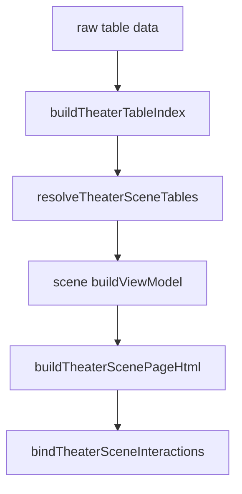
```mermaid
graph TD
  A[raw table data] --> B[buildTheaterTableIndex]
  B --> C[resolveTheaterSceneTables]
  C --> D[scene buildViewModel]
  D --> E[buildTheaterScenePageHtml]
  E --> F[bindTheaterSceneInteractions]
```

[`buildTheaterTableIndex()`](../modules/phone-theater/core/table-index.js:15) 从 rawData 构建两个索引：

- `tableByName`：真实表名到 table descriptor。
- `tableBySheetKey`：sheetKey 到 table descriptor。

table descriptor 包含 `sheetKey`、`tableName`、`sheet`、`headers`、`rows`、`rowCount`、`orderNo`。scene 读取字段时使用：

- [`getCellByHeader()`](../modules/phone-theater/core/table-index.js:53)：按表头取值。
- [`mapTheaterRows()`](../modules/phone-theater/core/table-index.js:77)：遍历数据行并过滤空结果。
- [`resolveRowIdentity()`](../modules/phone-theater/core/table-index.js:72)：按身份字段生成主实体 identity。
- [`splitSemicolonText()`](../modules/phone-theater/core/table-index.js:62)：把分号分隔文本转成列表。

[`buildTheaterSceneViewModel()`](../modules/phone-theater/data.js:151) 会把 helpers 冻结后传给 scene，并返回统一结构：

- `available`：scene 是否有可用主表。
- `scene`：标准化后的 scene definition。
- `title`、`subtitle`、`emptyText`：页面展示元数据。
- `rowCount`：scene 关联表总行数。
- `childSheetKeys`：scene 关联子表 sheetKey。
- `tables`：按 role 解析出的 table descriptor。
- `content`：scene 自己构造的渲染模型。

维护规则：

- view model 只能表达渲染需要的数据，不应把 DOM selector、事件状态、toast 文案塞进 content。
- scene 的跨表关联应在 `buildViewModel` 阶段完成，渲染阶段只消费已经归并好的对象。
- 如果新增场景依赖非唯一外键，必须在 `fieldSchema` 和参考规范中写明限制。你现在缺的不是排版，是事实；这种约束不写，后续 AI 会把非唯一字段当唯一键用。

#### 6.6.4 删除管理态与级联删除契约

页面删除 UI 状态保存在 container 私有字段 [`__phoneTheaterSceneState`](../modules/phone-theater/render.js:62)，核心字段包括：

- `sceneId`
- `deleteManageMode`
- `selectedKeys`
- `deleting`

删除 key 使用 typed delete key：`role:rowIndex:encodedIdentity`。

- 构建：[`buildTheaterDeleteKey()`](../modules/phone-theater/core/delete-key.js:3)。
- 解析：[`parseTheaterDeleteKey()`](../modules/phone-theater/core/delete-key.js:10)。
- 按 role 提取目标：[`buildDeleteTargets()`](../modules/phone-theater/core/delete-key.js:29)。
- 精确匹配：[`hasDeleteTarget()`](../modules/phone-theater/core/delete-key.js:39)。

删除流程：

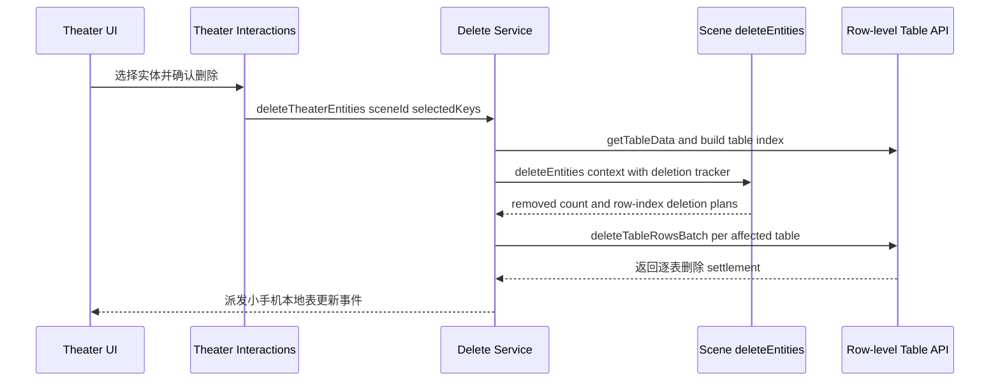
```mermaid
sequenceDiagram
  participant UI as Theater UI
  participant Interaction as Theater Interactions
  participant Service as Delete Service
  participant Scene as Scene deleteEntities
  participant Data as Row-level Table API

  UI->>Interaction: 选择实体并确认删除
  Interaction->>Service: deleteTheaterEntities sceneId selectedKeys
  Service->>Data: getTableData and build table index
  Service->>Scene: deleteEntities context with deletion tracker
  Scene-->>Service: removed count and row-index deletion plans
  Service->>Data: deleteTableRowsBatch per affected table
  Data-->>Service: 返回逐表删除 settlement
  Service-->>UI: 派发小手机本地表更新事件
```

[`deleteTheaterEntities()`](../modules/phone-theater/delete-service.js:341) 会读取当前 rawData，构建 table index，并把 `filterTableRows`、`buildDeleteTargets`、`hasDeleteTarget` 等 helper 注入 scene 的 [`deleteEntities`](../modules/phone-theater/scenes/square.js:219)。scene 只负责根据自身业务关系标记逐表待删行；当前 `square` 只收集 `posts` 主表计划，不创建附表计划。[`createDeletionPlanTracker()`](../modules/phone-theater/delete-service.js:24) 汇总每张表的 UI rowIndex 删除计划，保存执行由 delete service 统一转换为 [`deleteTableRowsBatch()`](../modules/phone-core/data-api/table-repository.js:1008) 行级删除。这里禁止回退到整表快照保存，运行时全量覆盖会绕过 mutation queue 并污染其他表的并发写入状态。

小剧场 scene 只收集删除计划，不拼 SQL。delete service 仍按表调用 `deleteTableRowsBatch()`；仓库层可以在单表多行删除时使用 SQLite `executeSqlMutation` 快路径。当前不做跨表单条 SQL，不承诺跨表事务原子性。未来如需跨表事务删除，必须另开设计，不能把跨表事务语义偷塞进 scene 或 delete service。

内置 scene 删除关系：

- square：删除 `posts` 主贴时，只删除 `广场表` 中匹配行；主贴身份字段兼容 `帖子ID` 与 `帖子唯一标识`，事实源在 [`SQUARE_POST_ID_HEADERS`](../modules/phone-theater/scenes/square.js:9) 和 [`fieldSchema.posts.identityAliases`](../modules/phone-theater/scenes/square.js:253)；删除服务通过 [`getIdentityAliases()`](../modules/phone-theater/delete-service.js:140) 读取同一协议。修改广场主表 ID 表头时必须同步这里，不允许只改渲染读取点。
- forum：删除 `threads` 主贴时，只删除 `论坛表` 中匹配行。
- live：删除 `rooms` 直播间时，只删除 `直播表` 中匹配行；不再依赖 `所属直播间名` 或弹幕副表级联。
- calendar：不可删除，`collectDeletableKeys` 返回空集合，`deleteEntities` 返回 `removed: 0`。
- diary：删除 `entries` 日记时，只删除 `小日记表` 中匹配行；UI delete role 使用 `entry`，identity 由 `row_id` 或 `entry_${rowIndex + 1}` fallback 生成，以匹配 delete-service 可复算协议。

维护规则：

- 主实体删除必须同时匹配 role、rowIndex、identity，不允许只按标题、名称或自然键删除。
- 如果 scene 存在附表级联，必须使用 scene 明确记录的外键字段；当前内置 `square` / `forum` / `live` 不再依赖副表级联。
- scene 的 `deleteEntities` 返回删除数量，不直接调用保存 API。
- 删除按钮、选择按钮和删除态样式依赖 [`data-theater-delete-key`](../modules/phone-theater/scenes/square.js:175)，新增 scene 必须在可删除实体根节点输出这个属性。

#### 6.6.5 通用 shell、scene 内容与交互边界

[`buildTheaterScenePageHtml()`](../modules/phone-theater/templates.js:91) 负责通用 shell：

- 页面根节点 `.phone-app-page.phone-theater-page`。
- [`data-theater-scene`](../modules/phone-theater/templates.js:96) 与 [`data-theater-style-scope`](../modules/phone-theater/templates.js:96)。
- 返回按钮，以及按“上一张、标题、下一张”排列的标题导航组。
- 与标题导航组分离的编辑、删除操作区。
- 删除管理条。
- scene 内容区。

[`bindTheaterSceneInteractions()`](../modules/phone-theater/interactions.js:408) 负责通用点击委托：

- `theater-table-navigation-previous`
- `theater-table-navigation-next`
- `toggle-theater-edit-menu`
- `theater-open-edit-table`
- `toggle-theater-delete-mode`
- `theater-select-all`
- `theater-clear-selection`
- `theater-toggle-select`
- `theater-confirm-delete`

表级切换复用共享 `requestTableNavigationSwitch()`，并受删除管理态与 lifecycle active guard 约束；编辑入口统一经过 `navigateToEditableTable()` 的受控 history 策略。scene 专属交互通过 [`bindSceneSpecificInteractions()`](../modules/phone-theater/interactions.js:397) 调用 scene definition 的 [`bindInteractions`](../modules/phone-theater/scenes/live.js:345)。当前直播 scene 使用 dataset 标记避免重复绑定弹幕暂停按钮。

维护规则：

- 通用交互层不写 scene 专属 selector。
- scene 专属交互应绑定在 scene 自己渲染的 DOM 内，且必须幂等。
- 如果交互持有定时器、异步任务、外部事件或对象 URL，就不能只靠 DOM 替换“自然释放”，必须设计 cleanup 契约。

#### 6.6.6 样式边界

Theater 样式入口是 [`styles/06-phone-theater.css`](../styles/06-phone-theater.css:7)，它只导入 [`styles/phone-theater/index.css`](../styles/phone-theater/index.css:1)。scene 样式 registry 当前顺序为：

1. [`00-core.css`](../styles/phone-theater/00-core.css:1)：通用 shell、删除态、通用标签与空态。
2. [`square.css`](../styles/phone-theater/square.css:1)：广场 scene。
3. [`forum.css`](../styles/phone-theater/forum.css:1)：论坛 scene。
4. [`live.css`](../styles/phone-theater/live.css:1)：直播 scene。
5. [`calendar.css`](../styles/phone-theater/calendar.css:1)：日历 scene。
6. [`diary.css`](../styles/phone-theater/diary.css:1)：小日记 scene。

通用选择器根必须是 `.phone-app-page.phone-theater-page`。scene 专属样式必须进一步收窄到 `data-theater-scene` 或 scene 专属 class；新增 scene 不应修改 [`00-core.css`](../styles/phone-theater/00-core.css:1) 来塞视觉细节。

维护规则：

- 删除态、通用按钮、通用标签属于 [`00-core.css`](../styles/phone-theater/00-core.css:1)。
- scene 视觉、布局、动画属于对应 scene css 文件。
- 新增 scene css 必须在 [`styles/phone-theater/index.css`](../styles/phone-theater/index.css:1) 登记 import。
- CSS 选择器应以 `.phone-theater-page[data-theater-scene="newScene"]` 或更窄作用域开头。

#### 6.6.7 新增 Theater scene 最短规范

新增 scene 时只允许沿扩展点接入：

1. 新增 scene module，例如 `modules/phone-theater/scenes/new-scene.js`。
2. 定义冻结 scene object，并实现 metadata、`tables`、`primaryTableRole`、`fieldSchema`、`contract`。
3. 实现 `buildViewModel`，把跨表关联收敛成渲染模型。
4. 实现 `collectDeletableKeys`，只返回 typed delete key。
5. 实现 `deleteEntities`，主表精确删除，附表按明确外键级联。
6. 实现 `renderContent`，只输出内容区，全部用户数据必须转义。
7. 如有专属交互，实现幂等 `bindInteractions`，并说明 cleanup 边界。
8. 新增 scene css，并在 [`styles/phone-theater/index.css`](../styles/phone-theater/index.css:1) 登记。
9. 在 [`modules/phone-theater/scenes/index.js`](../modules/phone-theater/scenes/index.js:1) 导入并加入 registry。
10. 如契约变化，同步更新 [`theater-scene-extension-spec.md`](reference/theater-scene-extension-spec.md:1) 和契约检查脚本。

这套边界的意义很简单：Theater 核心层只认识 scene contract，不认识具体业务页面。只要新增 scene 需要改 [`data.js`](../modules/phone-theater/data.js:1)、[`templates.js`](../modules/phone-theater/templates.js:1)、[`interactions.js`](../modules/phone-theater/interactions.js:1) 或 [`delete-service.js`](../modules/phone-theater/delete-service.js:1)，就说明扩展点不够用，应该先补 contract，而不是把硬编码悄悄塞进去。

### 6.7 Variable Manager

Variable Manager 是系统 App，不依赖表格 sheet。它从 SillyTavern 当前聊天的楼层变量读取数据，把嵌套变量拍平成手机内的卡片视图，并提供新增、编辑、删除能力。

核心入口：

- [`renderVariableManager()`](../modules/variable-manager/index.js:233)：变量管理器路由入口。
- [`VARIABLE_MANAGER_APP`](../modules/variable-manager/index.js:361)：Home 主屏系统 App 定义，route 固定为 `variable-manager`。
- [`buildHomeScreenViewModel()`](../modules/phone-home/view-model.js:23)：把 `VARIABLE_MANAGER_APP` 注入 Home App 列表。
- [`loadRouteRenderer()`](../modules/phone-core/route-renderer.js:30)：识别 `variable-manager` route 并动态加载页面渲染器。
- [`createVariableManagerPageInstance()`](../modules/variable-manager/index.js:44)：创建页面实例、runtime、页面状态和 dispose 逻辑。
- [`getFloorVariables()`](../modules/variable-manager/variable-api.js:191)：读取楼层变量。
- [`flattenToGroups()`](../modules/variable-manager/flat-view.js:11)：把嵌套对象转换为分组卡片模型。
- [`bindVariableManagerInteractions()`](../modules/variable-manager/interactions.js:111)：绑定刷新、编辑、新增、删除、长按进入删除态等交互。

#### 6.7.1 页面实例与生命周期

Variable Manager 每次渲染都会先清理旧实例：[`renderVariableManager()`](../modules/variable-manager/index.js:233) 调用 [`disposeVariableManagerPageInstance()`](../modules/variable-manager/index.js:33)，再创建新实例并挂载到 container 私有字段。

页面实例包含：

- `runtime`：由 [`createRuntimeScope()`](../modules/runtime-manager.js:48) 创建，用于事件、定时器、动画帧和断连观察清理。
- `state.currentMessageId`：当前展示的楼层号，初始化自 [`getLastMessageId()`](../modules/variable-manager/variable-api.js:34)。
- `mount()`：构建页面 HTML、同步底栏 inset、渲染变量内容并绑定交互。
- `refreshView()`：重新解析最新楼层、刷新 MVU badge、重渲染内容并同步底栏高度。
- `dispose()`：释放 runtime，并从 container 移除实例引用。

生命周期流程：

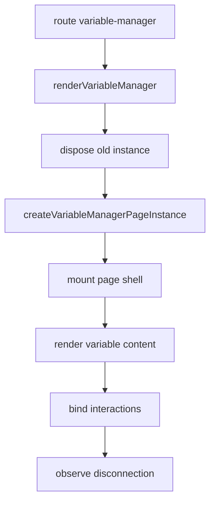
```mermaid
graph TD
  A[route variable-manager] --> B[renderVariableManager]
  B --> C[dispose old instance]
  C --> D[createVariableManagerPageInstance]
  D --> E[mount page shell]
  E --> F[render variable content]
  F --> G[bind interactions]
  G --> H[observe disconnection]
```

维护规则：

- 新增页面级事件、定时器、动画帧、ResizeObserver 或弹窗资源，必须注册进页面 runtime。
- 页面刷新只更新当前楼层内容；不要在交互函数里绕过 `refreshView()` 手动拼接整页 shell。
- 页面断连由 [`observePageDisconnectionAfterMount()`](../modules/variable-manager/index.js:187) 兜底清理，新增资源不能依赖全局泄漏后“下次刷新覆盖”。这不是方案，只是把事故延后。

#### 6.7.2 变量 API 双路径

变量读写封装在 [`variable-api.js`](../modules/variable-manager/variable-api.js:1)。它优先检测 MVU，可用时走 MVU；MVU 失败或不可用时降级到 TavernHelper。

读取路径：

1. [`getLastMessageId()`](../modules/variable-manager/variable-api.js:34) 通过 TavernHelper 获取最新楼层号。
2. [`getFloorVariables()`](../modules/variable-manager/variable-api.js:191) 把 `latest` 解析成实际 message id。
3. [`isMvuAvailable()`](../modules/variable-manager/variable-api.js:20) 检测 `window.Mvu.getMvuData`。
4. MVU 路径读取 `window.Mvu.getMvuData({ type: 'message', message_id })` 的 `stat_data`。
5. TavernHelper 路径读取 [`getVariables()`](../modules/integration/tavern-helper-bridge.js:81) 对应的楼层变量。

写入路径：

- 编辑变量：[`setFloorVariable()`](../modules/variable-manager/variable-api.js:301)。
- 新增变量：[`addFloorVariable()`](../modules/variable-manager/variable-api.js:403)，当前复用 `setFloorVariable`。
- 删除变量：[`deleteFloorVariable()`](../modules/variable-manager/variable-api.js:360)。

MVU 写入流程：

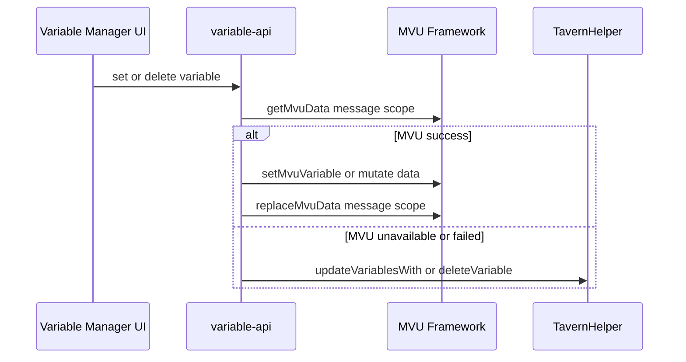
```mermaid
sequenceDiagram
  participant UI as Variable Manager UI
  participant API as variable-api
  participant MVU as MVU Framework
  participant TH as TavernHelper

  UI->>API: set or delete variable
  API->>MVU: getMvuData message scope
  alt MVU success
    API->>MVU: setMvuVariable or mutate data
    API->>MVU: replaceMvuData message scope
  else MVU unavailable or failed
    API->>TH: updateVariablesWith or deleteVariable
  end
```

维护规则：

- 页面层只能调用 Variable Manager 的 API 封装，不直接访问 `window.Mvu` 或 TavernHelper。
- MVU 路径写入后必须调用 `replaceMvuData`，否则只是改了内存对象，不等于提交到楼层变量。
- TavernHelper fallback 是兼容路径，不应拥有和 MVU 不同的 UI 语义。
- [`getFloorVariablesAsync()`](../modules/variable-manager/variable-api.js:224) 在 MVU 初始不可用且 `waitMvu !== false` 时会 bounded wait，再复检 `isMvuAvailable()`；返回 meta 必须区分 `waitedMvu`、`mvuInitiallyAvailable`、`mvuAvailableAfterWait` 与 `source`，方便排查首开时序问题。
- 路径参数当前采用点号路径语法，例如 `角色.络络.好感度`；新增 UI 能力时必须尊重这个路径契约。

#### 6.7.3 扁平化视图与值类型

[`renderVariableContent()`](../modules/variable-manager/index.js:262) 的渲染顺序固定为：

1. 无有效 message id 时显示“当前没有聊天消息”。
2. [`getFloorVariables()`](../modules/variable-manager/variable-api.js:191) 读取变量数据。
3. 空数据时显示“当前楼层没有变量数据”。
4. [`flattenToGroups()`](../modules/variable-manager/flat-view.js:11) 生成分组结构。
5. [`renderGroupsHtml()`](../modules/variable-manager/flat-view.js:343) 生成卡片 HTML。

扁平化规则：

- 顶层对象字段会成为一级分组。
- 顶层非对象值进入 `__misc__` 分组，显示名为“其他”。
- 嵌套对象继续递归生成对象节点，叶子节点成为卡片；非空对象节点默认展开，并可独立折叠或展开任意深度的直属子树。
- 空对象会作为可展示对象卡片保留。
- 数组与对象显示时通过 [`formatDisplayValue()`](../modules/variable-manager/flat-view.js:191) JSON 化。
- 用户输入通过 [`parseInputValue()`](../modules/variable-manager/flat-view.js:205) 解析 `null`、布尔值、数字、JSON 数组和 JSON 对象。

渲染结构：

- 页面 shell：[`buildVariableManagerPageHtml()`](../modules/variable-manager/templates.js:11)。
- 编辑卡片：[`buildEditCardHtml()`](../modules/variable-manager/templates.js:56)。
- 新增变量弹窗：[`buildAddVariableDialogHtml()`](../modules/variable-manager/templates.js:74)。
- 确认弹窗：[`buildConfirmDialogHtml()`](../modules/variable-manager/templates.js:103)。

维护规则：

- 卡片 `data-var-path` 是编辑和删除的路径事实源，渲染层必须保证路径和展示值一致。
- 新增值类型时必须同步 [`getValueTypeClass()`](../modules/variable-manager/flat-view.js:222)、[`formatDisplayValue()`](../modules/variable-manager/flat-view.js:191)、[`parseInputValue()`](../modules/variable-manager/flat-view.js:205) 和样式。
- 变量内容进入 HTML 前必须转义；当前卡片渲染使用 [`escapeHtml()`](../modules/utils/dom-escape.js:36)，属性值路径也必须保持转义。

#### 6.7.4 交互模型

[`bindVariableManagerInteractions()`](../modules/variable-manager/interactions.js:111) 使用容器级事件委托，避免每张卡片单独持有监听器。主要交互：

- 返回：`data-vm-action="nav-back"` 调用路由返回。
- 刷新：`data-vm-action="refresh"` 调用 `refreshView()`。
- 点击一级分组标题或任意非空对象标题：复用 [`toggleVariableSectionCollapse()`](../modules/variable-manager/interactions.js) 切换当前节点的展开状态；折叠状态只属于当前 DOM 渲染周期，不写入变量数据。
- 点击变量卡片：进入编辑态。
- 编辑保存：[`handleSaveEdit()`](../modules/variable-manager/interactions.js:366) 解析输入并弹出确认框。
- 新增变量：[`showAddVariableDialog()`](../modules/variable-manager/interactions.js:665) 打开弹窗，确认后调用 [`addFloorVariable()`](../modules/variable-manager/variable-api.js:403)。
- 长按删除：[`bindLongPressDelete()`](../modules/variable-manager/interactions.js:421) 在 500ms 后进入删除态。
- 删除确认：[`doDeleteVariables()`](../modules/variable-manager/interactions.js:636) 逐个调用 [`deleteFloorVariable()`](../modules/variable-manager/variable-api.js:360)。

删除态选择器由 [`SELECTABLE_DELETE_SELECTOR`](../modules/variable-manager/interactions.js:14) 定义，支持变量卡片、一级分组标题和任意深度的对象标题。删除模式优先于折叠交互，对象标题在删除模式中只负责选择删除目标。删除目标会经 [`normalizeDeleteTargets()`](../modules/variable-manager/interactions.js:563) 按 path 去重，并优先保留父路径，避免同一分支重复删除。

维护规则：

- 新增交互优先走容器级委托；只有需要局部状态的 DOM 才单独处理。
- 弹窗和 toast 必须挂在 `.vm-page` 内，避免脱离手机容器层级。
- 异步写入完成后统一通过 `refreshView()` 重读数据，不要只改当前 DOM 卡片制造“看起来成功”的假象。
- 删除、保存、新增都以 message id 和 path 为最小操作单位；如果未来支持跨楼层变量，必须先扩展 API 契约，再改 UI。

#### 6.7.5 样式边界与能力边界

Variable Manager 样式集中在 [`styles/12-variable-manager.css`](../styles/12-variable-manager.css:1)，作用域根是 `.vm-page` 与 `.vm-*` 类。页面布局包含导航栏、滚动主体、底部新增栏、删除栏、弹窗和 toast。

样式关键点：

- `.vm-page` 定义底栏高度变量 `--vm-bottom-bar-height`。
- [`syncBottomBarInset()`](../modules/variable-manager/index.js:313) 根据 `.vm-footer` 与 `.vm-delete-bar` 实测高度更新底部留白。
- `.vm-body.phone-app-body` 使用 `padding-bottom` 和 `scroll-padding-bottom` 避免底栏遮挡内容。
- `.vm-group-collapsed` 与 `.vm-object-collapsed` 分别控制一级分组和递归对象节点的视图折叠，箭头跟随对应折叠 class 表达当前状态。
- `.vm-dialog-overlay` 和 `.vm-toast` 都在 `.vm-page` 内呈现。

当前能力边界：

- 当前页面操作的是最新楼层变量，而不是任意楼层浏览器。
- 变量路径使用点号分隔层级。
- 数组和对象按 JSON 字符串展示与编辑。
- 页面展示的是变量数据视图，不直接展示 MVU 的完整 `display_data` 或 `delta_data`。

维护规则：

- 新增样式应继续挂在 `.vm-page` 或更窄作用域下，不要写裸 `.vm-*` 之外的全局选择器。
- 如果新增跨楼层切换、搜索、过滤、批量编辑或 MVU 高级字段展示，必须先扩展 `variable-api` 的返回结构和 page state，再改模板。
- 能力边界必须写成契约，不要把“当前碰巧这样工作”当成隐含规则。隐含规则最擅长在下一次功能追加时变成屎山入口。

### 6.8 Table Update Review 审核 App

Table Update Review 是系统 App，不绑定单张 sheet。它负责监听表格数据净变化，把变更聚合成审核列表，并提供从审核项跳转到通用表详情页的入口。

核心入口：

- [`TABLE_UPDATE_REVIEW_APP_ID`](../modules/table-update-review/constants.js:1)：Home 主屏系统 App id，当前为 `table-update-review`。
- [`TABLE_UPDATE_REVIEW_ROUTE`](../modules/table-update-review/constants.js:2)：审核页 route，当前为 `table-update-review`。
- [`buildHomeScreenViewModel()`](../modules/phone-home/view-model.js:23)：把审核 App 作为 `isSystemApp` 注入 Home App 列表。
- [`loadRouteRenderer()`](../modules/phone-core/route-renderer.js:30)：识别 `table-update-review` route 并动态加载审核页渲染器。
- [`ROUTE_MODULES`](../modules/phone-core/preload.js:32)：包含 `../table-update-review/index.js`，确保审核页入口参与 route module preload。
- [`renderTableUpdateReview()`](../modules/table-update-review/index.js:112)：审核页路由入口。
- [`startTableUpdateReviewService()`](../modules/table-update-review/service.js:155)：启动表格净变化监听与审核状态更新。
- [`bindTableUpdateReviewInteractions()`](../modules/table-update-review/interactions.js:37)：绑定审核页交互，包括进入对应表格行详情。

#### 6.8.1 页面实例与生命周期

[`renderTableUpdateReview()`](../modules/table-update-review/index.js:112) 每次渲染都会先清理旧页面实例，再通过 `createTableUpdateReviewPageInstance()` 创建新实例。页面实例持有由 [`createRuntimeScope()`](../modules/runtime-manager.js:48) 创建的 runtime，用于事件、订阅和断连观察清理。

生命周期流程：

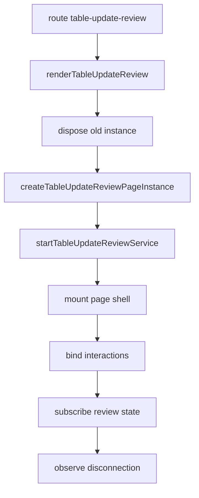
```mermaid
graph TD
  A[route table-update-review] --> B[renderTableUpdateReview]
  B --> C[dispose old instance]
  C --> D[createTableUpdateReviewPageInstance]
  D --> E[startTableUpdateReviewService]
  E --> F[mount page shell]
  F --> G[bind interactions]
  G --> H[subscribe review state]
  H --> I[observe disconnection]
```

维护规则：

- 页面事件、订阅、动画帧和断连观察必须注册进页面 runtime；不要把监听器挂成全局泄漏后等下一次渲染覆盖。
- 页面渲染必须尊重 `renderToken`，过期 route 渲染不能继续 patch 当前屏幕。
- 审核服务由 [`startTableUpdateReviewService()`](../modules/table-update-review/service.js:155) 统一启动；页面层不要绕过服务直接改 store。

#### 6.8.2 审核到物理表页面的跳转合同

审核页不是 Table Viewer 或 Theater 的内部模式。审核项点击更新内容时先按物理 `sheetKey` 查询统一表目录：

- 命中可用 Theater 时，在写 intent 之前调用 [`navigateTo()`](../modules/phone-core/routing.js:52) 进入 `table:<sheetKey>`，保留物理锚点并展示 scene；该分支不定位单条记录。
- Generic 表写入 pending navigation intent，再进入 `table:<sheetKey>`。Table Viewer 的 generic runtime 消费 intent 后定位目标行并进入详情页。
- Theater resolver 不可用或主表缺失时，目录会把该物理表降级为 Generic，审核流程也随之进入 `table:<sheetKey>`，不会让表从目录消失。

返回语义分两层：

- 详情页本地返回只退出详情模式，回到当前通用表列表。
- 列表页路由返回走 [`navigateBack()`](../modules/phone-core/routing.js:107)，利用 route history 回到 `table-update-review`。

维护规则：

- 不要为了审核返回链路修改 [`navigateBack()`](../modules/phone-core/routing.js:107) 的全局语义；历史 `app:<sheetKey>` 与小剧场编辑 `table-generic:<sheetKey>` 仍依赖同一套 route history。
- 不要在 Theater 分流前写 Generic intent，也不要为该分支无条件清理全局 pending intent。
- 详情本地返回和列表路由返回必须保持不同 action 语义，不能重新让一个泛用返回选择器同时承担两种行为。
- 审核字段摘要属于审核模板职责；不要把审核字段裁剪或展示规则塞进 Table Viewer。

## 7. 基础设施：Slash、Storage、Cache、Window

这一层不是业务页面，但它决定扩展能不能被可靠地打开、关闭、缓存、拖拽、调整尺寸和通过命令控制。这里如果边界乱掉，页面模块写得再漂亮也只是裱糊。助手，别把基础设施当“杂项”，那是屎山最喜欢钻出来的缝。

### 7.1 Slash Commands

Slash 命令入口由 [`registerSlashCommands()`](../modules/slash-commands.js:46) 管理，初始化阶段在 [`doInitialize()`](../index.js:441) 中注册，随后通过 [`setupSlashCommandHandlers()`](../index.js:365) 把 Bootstrap 的运行时动作注入命令系统。

模块分层：

- [`slash-commands.js`](../modules/slash-commands.js:1)：对外 facade，负责注册、注销、handler map 管理入口。
- [`command-registration.js`](../modules/slash-commands/command-registration.js:6)：声明命令清单并逐项注册。
- [`command-actions.js`](../modules/slash-commands/command-actions.js:6)：实现命令动作，包括手机开关、状态、表格命令和设置命令。
- [`host-adapter.js`](../modules/slash-commands/host-adapter.js:5)：解析 SillyTavern Slash 注册函数，提供 fallback 命令宿主。
- [`state.js`](../modules/slash-commands/state.js:1)：保存注册状态、已注册命令名和命令 handler。
- [`command-registry.js`](../modules/bootstrap/command-registry.js:224)：把业务动作注册成 `phone-action`、`open-table`、`list-tables`、`reset-settings`、`export-settings` handler。

命令清单来自 [`SLASH_COMMAND_DEFINITIONS`](../modules/slash-commands/command-registration.js:6)：

| 命令 | 入口动作 | 当前职责 |
|---|---|---|
| `/yuziphone` | [`handlePhoneCommand()`](../modules/slash-commands/command-actions.js:6) | open、close、toggle、reset、status、help |
| `/yuziphone-open` | [`handlePhoneCommand()`](../modules/slash-commands/command-actions.js:6) | 打开手机 |
| `/yuziphone-close` | [`handlePhoneCommand()`](../modules/slash-commands/command-actions.js:6) | 关闭手机 |
| `/yuziphone-toggle` | [`handlePhoneCommand()`](../modules/slash-commands/command-actions.js:6) | 切换手机显示状态 |
| `/yuziphone-table` | [`handleTableCommand()`](../modules/slash-commands/command-actions.js:166) | 按表名触发表格打开事件 |
| `/yuziphone-tables` | [`handleListTablesCommand()`](../modules/slash-commands/command-actions.js:187) | 触发表格列表事件并展示结果 |
| `/yuziphone-settings` | [`handleSettingsCommand()`](../modules/slash-commands/command-actions.js:206) | reset、export、import 帮助入口 |

注册路径：

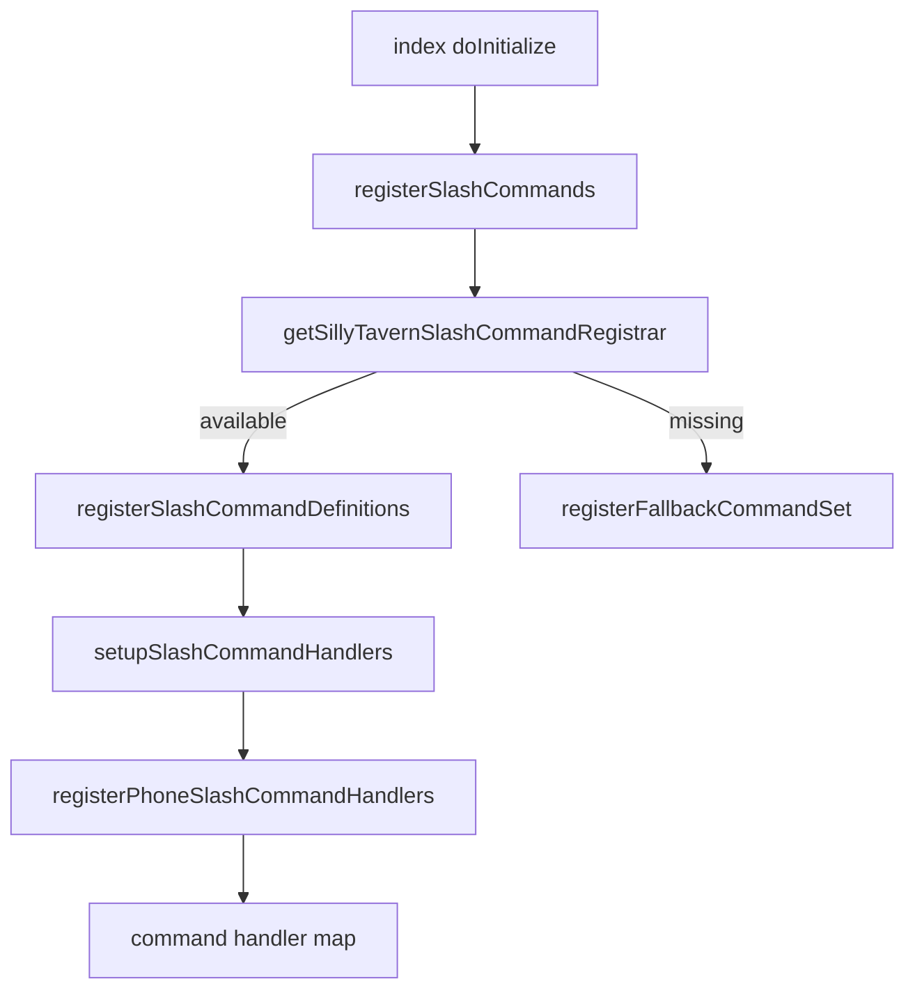
```mermaid
graph TD
  A[index doInitialize] --> B[registerSlashCommands]
  B --> C[getSillyTavernSlashCommandRegistrar]
  C -->|available| D[registerSlashCommandDefinitions]
  C -->|missing| E[registerFallbackCommandSet]
  D --> F[setupSlashCommandHandlers]
  F --> G[registerPhoneSlashCommandHandlers]
  G --> H[command handler map]
```

维护规则：

- 新增命令必须先写入 [`SLASH_COMMAND_DEFINITIONS`](../modules/slash-commands/command-registration.js:6)，再在 [`command-actions.js`](../modules/slash-commands/command-actions.js:1) 实现动作，不要在 [`index.js`](../index.js:12) 里塞命令逻辑。
- 命令需要访问 UI 生命周期时，必须通过 [`registerPhoneSlashCommandHandlers()`](../modules/bootstrap/command-registry.js:224) 注入 handler，而不是直接碰 Phone Core 内部状态。
- Fallback 命令挂在 [`yuziPhoneCommands`](../modules/slash-commands/host-adapter.js:3)，它是降级入口，不是主协议。
- 注销时通过 [`unregisterSlashCommands()`](../modules/slash-commands.js:101) 清理宿主命令、fallback 命令、registered commands 和 handler map。

### 7.2 localStorage Storage Manager

[`createStorageManager()`](../modules/storage-manager/manager.js:16) 是 localStorage 包装层，适合保存小型、可过期、可淘汰的数据。它使用固定前缀 [`STORE_PREFIX`](../modules/storage-manager/core.js:3) 和索引 key [`INDEX_KEY`](../modules/storage-manager/core.js:4)，实际数据 key 由 [`toStorageKey()`](../modules/storage-manager/core.js:78) 生成。

核心能力：

- [`set()`](../modules/storage-manager/manager.js:30)：写入 `{ v, expiresAt }` payload，更新索引并执行 LRU 淘汰。
- [`get()`](../modules/storage-manager/manager.js:114)：读取 payload，处理过期、坏 JSON 和索引刷新。
- [`remove()`](../modules/storage-manager/manager.js:158)：删除指定 namespace/key。
- [`clearNamespace()`](../modules/storage-manager/manager.js:178)：清理某个 namespace。
- [`maintenance()`](../modules/storage-manager/manager.js:22)：清理过期项并按容量淘汰。
- [`estimate()`](../modules/storage-manager/manager.js:194)：返回当前估算容量和条目数。
- [`getSessionStorageNamespace()`](../modules/storage-manager/manager.js:214)：生成当前运行会话 namespace。

索引结构由 [`loadIndex()`](../modules/storage-manager/core.js:82) 和 [`saveIndex()`](../modules/storage-manager/core.js:111) 管理，容量策略来自 [`DEFAULT_OPTIONS`](../modules/storage-manager/core.js:6)：默认 `maxEntries` 为 600、`maxBytes` 为 512KB、`defaultTTL` 为 14 天。

维护规则：

- localStorage 管理器只适合小型结构化数据；图片、模板快照、较大媒体应优先走 IndexedDB cache 或设置系统明确预算。
- 新增 namespace 必须稳定命名，避免把用户数据和会话临时数据混在同一 namespace。
- 写入路径必须考虑 `QuotaExceededError`，不能把“写入失败返回 false”包装成业务成功。
- 清理策略以 TTL 和 LRU 为核心；不要新增无索引的裸 localStorage key，否则容量估算和维护会失效。

### 7.3 IndexedDB Cache Manager

[`cache-manager.js`](../modules/cache-manager.js:1) 是 IndexedDB 缓存层，数据库名为 [`yuzi-phone-cache`](../modules/cache-manager.js:6)，版本为 [`DB_VERSION`](../modules/cache-manager.js:7)。当前 object store：

- [`templates`](../modules/cache-manager.js:8)
- [`images`](../modules/cache-manager.js:9)
- [`settings`](../modules/cache-manager.js:10)

公开 API：

- [`cacheSet()`](../modules/cache-manager.js:118)：写入 `{ v, expiresAt }` payload。
- [`cacheGet()`](../modules/cache-manager.js:127)：读取 payload，过期时调用 [`cacheRemove()`](../modules/cache-manager.js:138)。
- [`cacheRemove()`](../modules/cache-manager.js:138)：删除指定 key。
- [`cacheClear()`](../modules/cache-manager.js:143)：清空指定 store。
- [`CACHE_STORES`](../modules/cache-manager.js:148)：导出 store 名常量。

当前主要使用场景：

- 背景图预览读取与缓存：[`setupBgUpload()`](../modules/settings-app/services/appearance-settings/background-service.js:11) 中使用 [`cacheGet()`](../modules/cache-manager.js:127) 和 [`cacheSet()`](../modules/cache-manager.js:118)。
- App 图标持久设置与可再生缓存：[`savePhoneSetting('appIcons', nextIcons)`](../modules/settings-app/services/appearance-settings/icon-upload-service.js:149) 保存设置事实源，随后 [`cacheSet()`](../modules/settings-app/services/appearance-settings/icon-upload-service.js:150) 把同一 data URL 写入 `images` cache store。

维护规则：

- cache 层只保存可再生缓存，不作为唯一事实源；真正设置仍在 settings 系统中。
- 新增 store 需要更新 [`openDb()`](../modules/cache-manager.js:32) 的 upgrade 逻辑和 [`CACHE_STORES`](../modules/cache-manager.js:148)。
- 写入大对象必须先确认业务预算，例如背景图和图标已有 [`STORAGE_BUDGETS`](../modules/settings-app/constants.js:4)。
- 读取缓存必须能接受 `undefined` 并降级渲染；缓存不存在不是错误。
- 外观美化包仓库不是 cache-manager 的 store；[`appearance-pack-repository.js`](../modules/settings-app/services/appearance-settings/appearance-pack-repository.js:1) 使用独立 IndexedDB 保存用户导入的持久本地资产，不能被可再生缓存清理语义覆盖。
- 玉子美化预设由 [`content-presets/repository.js`](../modules/content-presets/repository.js:1) 使用独立数据库 `yuzi-phone-template-workshop-v2` 持久化；`presets` 与 `activeByTable` 的覆盖、删除和清绑定必须在同一 readwrite transaction 内完成，页面只能经 workshop service 操作。
- 裸 `indexedDB.open()` 只允许出现在 [`cache-manager.js`](../modules/cache-manager.js:1)、[`appearance-pack-repository.js`](../modules/settings-app/services/appearance-settings/appearance-pack-repository.js:1) 与 [`content-presets/repository.js`](../modules/content-presets/repository.js:1)；页面层和普通业务模块新增 IndexedDB 入口必须先扩展存储边界契约及事务行为检查。

### 7.4 Window 交互：拖拽、缩放与 runtime 重建

Window 子系统负责手机容器本身的拖拽和缩放，不负责页面内部滚动或业务交互。

关键文件：

- [`runtime.js`](../modules/window/runtime.js:1)：维护 `phone-window` runtime，并导出 [`getWindowInteractionRuntime()`](../modules/window/runtime.js:8) 与 [`destroyPhoneWindowInteractions()`](../modules/window/runtime.js:12)。
- [`drag.js`](../modules/window/drag.js:15)：绑定手机 shell 的 notch/status bar 拖拽。
- [`resize.js`](../modules/window/resize.js:15)：绑定 `.yuzi-phone-resize` 手柄缩放。
- [`lifecycle.js`](../modules/phone-core/lifecycle.js:90)：Phone shell 初始化后延迟调用拖拽与缩放初始化。
- [`destroyPhoneRuntime()`](../modules/phone-core/lifecycle.js:245)：销毁 Phone Core 时调用 [`destroyPhoneWindowInteractions()`](../modules/window/runtime.js:12)。

拖拽规则：

- [`initPhoneShellDrag()`](../modules/window/drag.js:15) 查找 [`yuzi-phone-standalone`](../modules/window/drag.js:16) 与 `.phone-shell`。
- 可拖拽区域是 `.phone-notch` 与 `.phone-status-bar`。
- 拖动中通过 [`constrainPosition()`](../modules/settings/layout.js:23) 限制位置。
- 松手后保存 [`phoneContainerX`](../modules/settings/schema.js:103) 与 [`phoneContainerY`](../modules/settings/schema.js:104)。
- 已绑定节点用 [`DRAG_BOUND_ATTR`](../modules/window/runtime.js:3) 防重复。

缩放规则：

- [`initPhoneShellResize()`](../modules/window/resize.js:31) 绑定 `.yuzi-phone-resize` 手柄。
- 支持按 `data-dir` 判断 east/south 方向。
- 宽高根据 viewport 限制，并在松手后通过 [`constrainPosition()`](../modules/settings/layout.js:23) 修正位置。
- 松手后保存 [`phoneContainerX`](../modules/settings/schema.js:103)、[`phoneContainerY`](../modules/settings/schema.js:104)、[`phoneContainerWidth`](../modules/settings/schema.js:105)、[`phoneContainerHeight`](../modules/settings/schema.js:106)。
- 已绑定节点用 [`RESIZE_BOUND_ATTR`](../modules/window/runtime.js:4) 防重复。

生命周期规则：

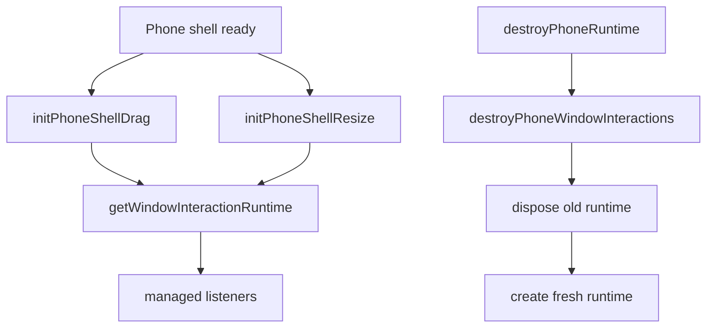
```mermaid
graph TD
  A[Phone shell ready] --> B[initPhoneShellDrag]
  A --> C[initPhoneShellResize]
  B --> D[getWindowInteractionRuntime]
  C --> D
  D --> E[managed listeners]
  F[destroyPhoneRuntime] --> G[destroyPhoneWindowInteractions]
  G --> H[dispose old runtime]
  H --> I[create fresh runtime]
```

维护规则：

- Window runtime 被 dispose 后必须重建；[`destroyPhoneWindowInteractions()`](../modules/window/runtime.js:12) 是当前正确模式。
- 拖拽和缩放只保存容器位置与尺寸，不应触发业务页面刷新。
- 新增容器级 pointer 交互必须使用 [`getWindowInteractionRuntime()`](../modules/window/runtime.js:8)，不要裸绑 window 或 document。
- 尺寸约束要同时检查 [`settings/schema.js`](../modules/settings/schema.js:159) 的设置校验范围和 [`resolveResizeBounds()`](../modules/window/resize.js:10) 的运行时范围，两个事实源不一致会制造保存值与运行行为分裂。

### QQ 视图刷新状态

- [`createPhoneViewScrollState()`](../modules/phone-core/view-scroll-state.js) 是跨 App 复用入口。页面必须显式注册页面 key、滚动根和恢复模式；动态列表使用稳定内容锚点，设置表单使用受限的 `scrollTop`。
- 滚动快照同时绑定作用域 key、页面 key 和注册 key。切换 SillyTavern 聊天、QQ 根 Tab、会话或设置二级页后，旧快照必须失效，禁止把滚动位置串到另一个视图。
- [`createViewSnapshotCache()`](../modules/qq-v2/ui/view-snapshot-cache.js) 只为消息根页、私聊页和会话设置页保留有限的上一帧 DOM，当前容量为 4；切换时必须先恢复目标快照，没有快照则立即提交固定页面框架，再从 Facade 后台读取事实数据并原子替换。图片资料等媒体密集页面不进入 DOM 快照缓存，禁止把该机制扩展成全页面常驻缓存。
- [`createRenderLeaseCoordinator()`](../modules/qq-v2/ui/render-lease-coordinator.js) 管理 QQ 渲染期 Blob URL。新 DOM 完成替换前保留旧画面的租约；相同资源跨刷新复用，只有后继画面确认不再使用或 QQ 销毁时才释放。
- 普通媒体保持零空闲缓存；聊天/资料背景、头像和表情分别使用独立的有限租约缓存，当前上限为 8、48、96。删除图片资料时必须同步失效头像与背景缓存，恢复 DOM 快照时不得引用已释放的 Blob URL。
- Facade 高频通知由 QQ route lifecycle 合并为“一个进行中刷新 + 一个最新待刷新”。保存动作仍以运行时状态为事实源，但同一波通知不得并发重建多份页面。
- 小手机 resize start 只关闭临时交互层并恢复当前视图锚点，不得为了响应 CSS 尺寸变化重建业务页面。

## 8. 样式组织规则

样式入口：

- [`style.css`](../style.css:15)：总入口，只按层级 import。
- [`styles/00-phone-shell.css`](../styles/00-phone-shell.css:6)：独立容器和 toggle。
- [`styles/01-phone-base.css`](../styles/01-phone-base.css:14)：modern base 聚合。
- [`styles/02-phone-nav-detail.css`](../styles/02-phone-nav-detail.css:5)：通用导航与详情补层。
- [`styles/05-phone-generic-template.css`](../styles/05-phone-generic-template.css:7)：通用模板 token 层。
- [`styles/06-phone-theater.css`](../styles/06-phone-theater.css:7)：theater 样式入口。
- [`styles/12-variable-manager.css`](../styles/12-variable-manager.css:6)：变量管理器。
- [`styles/13-content-presets.css`](../styles/13-content-presets.css:1)：美化预设运行 shell 与工坊补层。

维护规则：

- 新增通用基础样式放入 [`styles/phone-base/`](../styles/phone-base/README.md:3)，并由 [`styles/01-phone-base.css`](../styles/01-phone-base.css:14) 聚合。
- 通用模板样式必须以 [`phone-generic-template-scope`](../styles/05-phone-generic-template.css:7) 为根。
- 通用模板 token 优先级必须保持 `payload inline > --_gt-* > --yuzi-theme-* > fallback`，不要为了“统一”把 `--_gt-*` 抹掉，否则会直接破坏模板内联样式覆盖链。
- Theater 样式必须以 [`phone-theater-page`](../styles/phone-theater/00-core.css:7) 和 `data-theater-scene` 为根。
- QQ v2 Figma UI 接入前不新增 QQ 页面样式层；现有安全 fallback 不依赖旧聊天样式。
- 新增页面样式必须先确认作用域根，再决定是否进入 base、template、scene 或 page-specific 层。
- `!important` 只能用于压制宿主输入控件样式等明确场景；新增前必须确认普通作用域、token 或 import 顺序无法解决。
- 设置页/变量管理/缝合反馈等基础页面颜色统一走 `--yuzi-settings-*` 或 `--vm-* -> --yuzi-theme-*` 映射链路；允许保留 `--yuzi-phone-*` 仅用于布局语义变量（如安全宽度、radius、文本缩放倍率），不要把布局变量和主题颜色变量混为一谈。
- 颜色收口检查必须区分“硬编码颜色入口”与“token fallback”：`var(--token, #hex/rgba)` 属于可接受 fallback，裸 `#hex` / `rgba(...)` 且不经 token 才是需要优先收口的风险入口。

主题调度运行契约：

- 主题设置字段为 `phoneThemeMode`，仅允许 `'light' | 'dark'`，默认 `'light'`，由 [`modules/settings/schema.js`](../modules/settings/schema.js:111) 校验与回退。
- 主题服务入口为 [`applyPhoneThemeMode()`](../modules/settings-app/services/appearance-settings/theme-settings.js)，职责仅为同步 DOM 主题属性，不负责保存。
- 主题属性必须双挂载到：
  - `#yuzi-phone-standalone[data-yuzi-phone-theme="light|dark"]`
  - `html[data-yuzi-phone-theme="light|dark"]`
- 主题模式控件必须放在外观设置页“主题与背景”区，禁止新增独立主题页或单独导航入口。
- 主题调度目标仅覆盖设置页、通用表、缝合页、变量 app；小剧场（Theater）不纳入该主题调度链路，避免跨域样式污染。
- 禁止新增并行主题开关约定（如 `data-theme`、`data-phone-theme`、`.dark`、`.theme-dark`），避免多事实源导致主题分裂。
- 主题 token 分层保持：`--yuzi-theme-*`（语义层）→ `--yuzi-settings-*` / `--vm-*` / `--_gt-*`（页面适配层）；不要在页面层绕过语义层直接扩散硬编码颜色。
- `setupPhoneThemeModeSettings(container)` 必须满足幂等绑定：同一容器重复 setup 不得重复注册 `change` 监听。

## 9. 新增功能前检查清单

- 新增 route：是否更新 [`loadRouteRenderer()`](../modules/phone-core/route-renderer.js:30) 和 [`ROUTE_MODULES`](../modules/phone-core/preload.js:32)。
- 新增页面：是否有 runtime、dispose、容器移除清理。
- 新增表格写入：是否走 [`enqueueTableMutation()`](../modules/phone-core/data-api/mutation-queue.js:9)。
- 新增数据库 query：是否使用有界超时，并明确方法未发布、null、异常和超时的降级结果；禁止增加 probe SQL，底层 `null` 诊断必须校验 method 与调用时间。
- 新增数据库 mutation：是否使用 [`callMutationApiToSettlement()`](../modules/phone-core/db-bridge.js)，确认 watchdog 只告警、不会释放队列，且永不 settle 时保持 fail-closed。
- 新增 SQL mutation：是否验证 settlement 为对象、`errors` 为数组、`changes` 为非负整数，并把 `errors`、`saved:false`、`ok:false`、`success:false` 统一归一化为失败。
- 新增 SQL 批删：是否只在 `ok && changes === 请求数` 时直接确认成功，其余结果按 `row_id` 对账；SQL 发出后是否彻底禁止 `deleteRow` fallback。
- 新增 mutation 成功路径：是否确认保存、merged-data/worldbook 刷新和通知只有一个所有者；正常 CRUD 与 Raw SQL 后不得追加第二次刷新，也不得传 `skipChatSave` / `skipNotify`。
- 新增模板导入：是否避免把 `success:true` 夸大为聊天保存和刷新已可靠完成；Fusion 是否保持不追加刷新，也不拿刷新冒充保存屏障。
- 新增派生字段：是否定义 source/input/pending 签名，保证同一 source 最多两次真实写入、普通通知不返还预算，并覆盖 600ms 合并与 1s/2s/5s 读侧退避。
- 新增 table-update 订阅：不可用时是否返回 `null`，是否复用一个 native callback + subscriber `Set`，注销时是否使用同一 callback；派生服务是否拒绝无效 disposer。
- 新增后台服务：是否接入 enabled/hidden/disabled/destroy 生命周期，覆盖部分启动回滚、logger/disposer 异常、聊天切换第二次通知 + 250ms 和 3.5 秒兜底；屏障订阅不可用时是否仍保留 timeout fallback。
- 新增字段：是否更新共享字段契约，而不是复制数组。
- 新增 SillyTavern API 调用：是否放入 bridge 或 repository。
- 新增样式：是否有明确作用域根，是否避免扩大宿主覆盖规则。
- 新增 AI 输出格式：是否同步解析器、提示词、表格字段、UI 展示。
- 新增 Slash 命令：是否登记 [`SLASH_COMMAND_DEFINITIONS`](../modules/slash-commands/command-registration.js:6)，并通过 [`registerPhoneSlashCommandHandlers()`](../modules/bootstrap/command-registry.js:224) 注入业务 handler。
- 新增缓存：是否选择正确存储层，settings、localStorage manager、IndexedDB cache 的事实源边界是否清楚。
- 新增或修改持久 IndexedDB 用户资产仓库：是否有专用 repository、容量限制、页面层禁用裸 IndexedDB，并确认 [`check-p1-storage-boundary-contract.cjs`](../scripts/check-p1-storage-boundary-contract.cjs:1) 与对应业务契约脚本，例如 [`check-appearance-pack-repository-contract.cjs`](../scripts/check-appearance-pack-repository-contract.cjs:1)，已在 `npm run check` 中通过。
- 新增窗口交互：是否使用 [`getWindowInteractionRuntime()`](../modules/window/runtime.js:8)，并确认销毁后可重建。
- 新增发布前改动：是否执行 [`npm run lint`](../package.json:13)、[`npm run check`](../package.json:11)、[`npm run check:ci`](../package.json:12)、[`npm run build`](../package.json:8)，并确认 [`manifest.json`](../manifest.json:6) 指向的 `dist/yuzi-phone.bundle.js` 与 `dist/yuzi-phone.bundle.css` 已由构建产物更新。源码、样式、版本字段或 loader 变化后，`dist/` 如有差异必须纳入交付。
- 新增文档事实：是否放入 [`docs/`](README.md) 或 [`docs/reference/`](reference)，并确认所有相对链接可跳转；未实施计划只能放入 [`plans/`](../plans)。
- 新增或修改表格模板事实源：是否优先修改 [`tables/sources/`](../tables/sources) 下的 Markdown 文件，并通过 [`npm run tables:check`](../package.json:17) 与 [`npm run tables:build`](../package.json:18) 生成 [`tables/generated/`](../tables/generated) 产物；不要手工修改 generated JSON 伪装成事实源。
- 当前正式表源是 [`tables/sources/小剧场2.1`](../tables/sources/小剧场2.1) 与 [`tables/sources/纪要`](../tables/sources/纪要)；[`tables/sources/恋爱特化参考`](../tables/sources/恋爱特化参考) 是参考源，必须保留在 source contract 中，但不要把参考源误写成运行时正式表。
- 新增或修改脚本版 loader、版本字段、发布链路或表源清单时，必须确认 [`check-script-loader-contract.cjs`](../scripts/check-script-loader-contract.cjs:1)、[`check-extension-version-contract.cjs`](../scripts/check-extension-version-contract.cjs:1)、[`check-release-chain-contract.cjs`](../scripts/check-release-chain-contract.cjs:1)、[`check-table-sources-contract.cjs`](../scripts/check-table-sources-contract.cjs:1) 都在 `npm run check` / `npm run check:ci` 中通过。

## 10. 当前文档边界

这份文档记录当前已落地、可维护、可验证的稳定事实，覆盖启动链路、核心运行时、集成层、数据链路、主要 UI 模块、基础设施、样式分层和发布前检查清单。审查台账保存在 [`review-issue-ledger.md`](review-issue-ledger.md:1)，演进规划保存在 [`plans/`](../plans)；未实施计划不写入本架构说明，已实施且影响后续维护的结论必须同步进入本文件或 [`reference/`](reference)。
